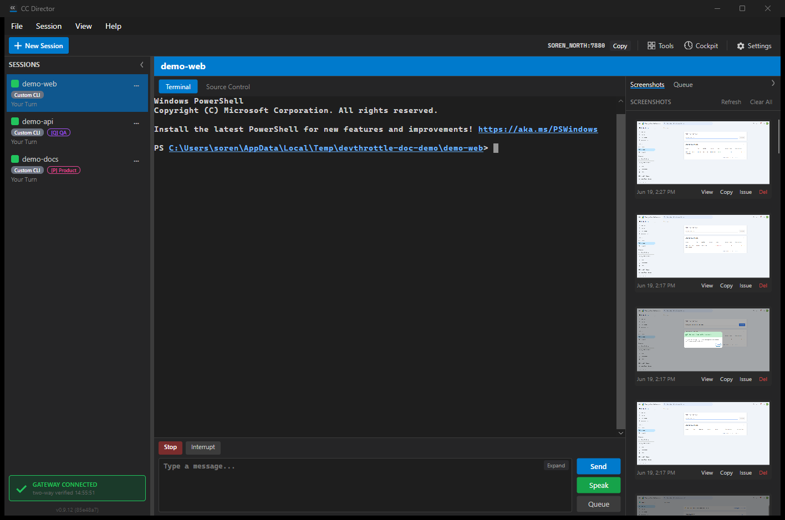
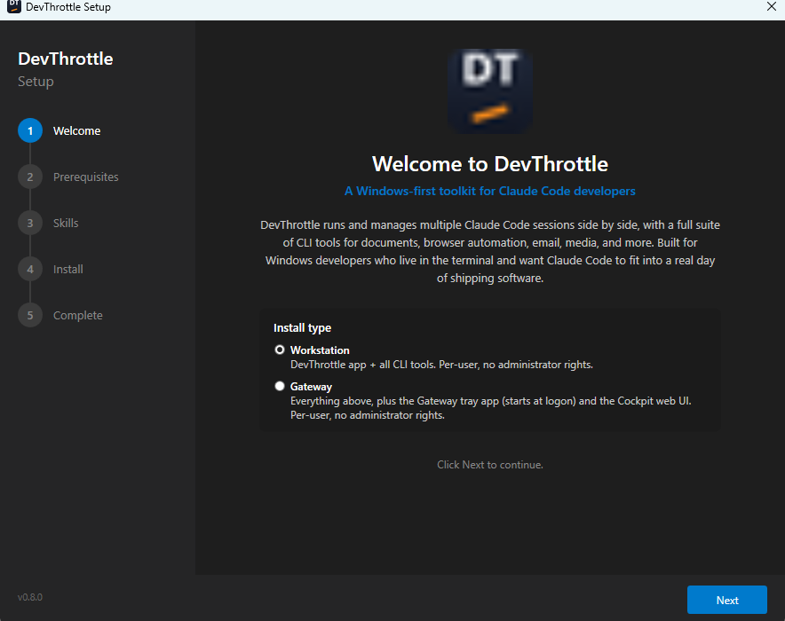
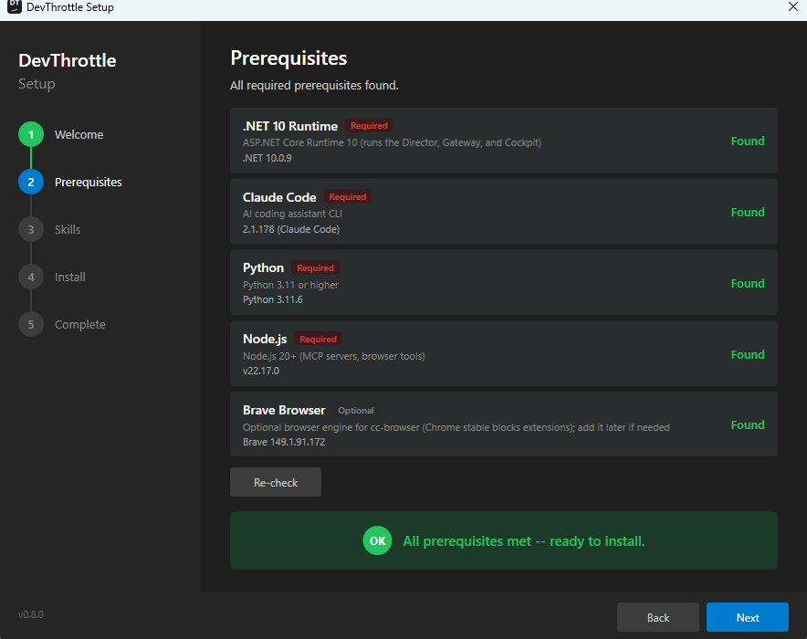
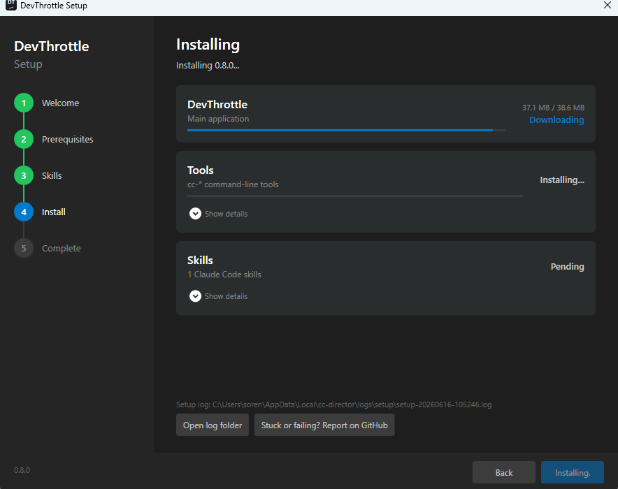

# CC Director

A desktop application for managing multiple [Claude Code](https://docs.anthropic.com/en/docs/claude-code) sessions simultaneously. Run, monitor, and switch between independent Claude Code instances -- each working on its own repository -- from a single unified interface.

I built CC Director because I was running 5+ Claude Code sessions at once and nothing fit. Terminal programs were missing features I needed -- file browsing, GitHub integration, easy screenshot handling. VS Code had too many things I didn't want getting in the way. So I built my own Claude Code session manager. I use it every day as my primary development environment. It ships with 35+ purpose-built CLI tools and 14 Claude Code skills that handle everything from document generation to browser automation to email management.

> **Status:** I'm currently cleaning up the codebase and preparing a release that will be ready for enterprise use this week. The application is fully functional and I use it daily, but expect rough edges if you build from source today.

> **Live Training:** I'm running a 2-day hands-on course in Toronto covering CC Director and the full Claude Code toolchain. Details and registration at [sorenfrederiksen.com/training](https://sorenfrederiksen.com/training).

> **Mac/Linux Support (Experimental):** Cross-platform backend support has been added but is largely untested -- I don't have a Mac to test on. If you'd like to see CC Director running on Mac, I'd love your help. See [Help Wanted: Mac Testers](#help-wanted-mac-testers) below.




## Download

Pre-built binaries for both Windows and macOS are built automatically on every release. Grab the latest:

### Windows

| Download | Description |
|----------|-------------|
| **[cc-director-setup-win-x64.exe](https://github.com/thefrederiksen/cc-director/releases/latest/download/cc-director-setup-win-x64.exe)** | Installer wizard (recommended -- downloads and installs everything) |
| **[cc-director-win-x64.exe](https://github.com/thefrederiksen/cc-director/releases/latest/download/cc-director-win-x64.exe)** | Main application (self-contained, no .NET runtime needed) |

### macOS (Apple Silicon)

| Download | Description |
|----------|-------------|
| **[cc-director-setup-mac-arm64](https://github.com/thefrederiksen/cc-director/releases/latest/download/cc-director-setup-mac-arm64)** | Installer wizard (recommended) |
| **[cc-director-mac-arm64](https://github.com/thefrederiksen/cc-director/releases/latest/download/cc-director-mac-arm64)** | Main application (self-contained, no .NET runtime needed) |

After downloading on macOS, make the binary executable and clear the quarantine flag:

```bash
chmod +x cc-director-mac-arm64
xattr -d com.apple.quarantine cc-director-mac-arm64
./cc-director-mac-arm64
```

> The macOS build is experimental -- the backend is cross-platform but the Avalonia UI is still maturing. See [Help Wanted: Mac Testers](#help-wanted-mac-testers).

Or browse [all releases](https://github.com/thefrederiksen/cc-director/releases) to pick a specific version or grab individual CLI tools (`cc-pdf`, `cc-html`, `cc-word`, etc.).

## Setup

The installer walks you through setup in 4 steps:

### 1. Choose your profile

Pick **Standard** for core document tools, email, media, and vault, or **Developer** for the full suite including browser automation, LinkedIn, Reddit, social media, and code generation.



### 2. Prerequisites check

The installer verifies that Claude Code, Python 3.11+, Node.js 20+, and Brave Browser are installed and available. If anything is missing, it tells you exactly what to install.



### 3. Install tools and skills

CC Director installs itself, 15+ CLI tools, and 14 Claude Code skills. Everything is placed on your PATH so tools are immediately available from any terminal or Claude Code session.



### 4. Done

Launch CC Director and start creating sessions.

## Features

### Multi-Session Management
- Run multiple Claude Code sessions side-by-side, each in its own embedded console
- Switch between sessions instantly from the sidebar
- Drag-and-drop to reorder sessions
- Name and color-code sessions for easy identification
- Right-click context menu: Rename, Open in Explorer, Open in VS Code, Close

### Embedded Console
- Claude Code runs in a native Windows console window overlaid directly onto the WPF application
- Full interactive terminal — no emulation, no limitations
- Send prompts from a dedicated input bar at the bottom (Ctrl+Enter to submit)

### Real-Time Activity Tracking
- Monitors each session's state in real-time: **Idle**, **Working**, **Waiting for Input**, **Waiting for Permission**, **Exited**
- Color-coded status indicators on each session in the sidebar
- Powered by Claude Code's hook system — every tool call, prompt, and notification is captured

### Session Persistence
- Sessions survive app restarts — CC Director reconnects to running Claude processes on launch
- "Reconnect" button scans for orphaned `claude.exe` processes and reclaims them
- Recent sessions are remembered with their custom names and colors

### Git Integration
- **Source Control tab** shows staged and unstaged changes for the active session's repository
- File tree with status indicators (Modified, Added, Deleted, Renamed, etc.)
- Current branch display with ahead/behind sync status
- Click a file to open it in VS Code

### Repository Management
- **Repositories tab** for registering, cloning, and initializing Git repositories
- Clone from URL or browse your GitHub repos
- Quick-launch a new session from any registered repository

### Hook Integration
- Automatically installs hooks into Claude Code's `~/.claude/settings.json`
- Captures 14 hook event types: session start/end, tool use, notifications, subagent activity, task completion, and more
- Named pipe IPC (`CC_ClaudeDirector`) for fast, async event delivery
- Optional pipe message log panel (toggle from sidebar) for debugging and observability

### Logging & Diagnostics
- File logging to `%LOCALAPPDATA%\CcDirector\logs\`
- "Open Logs" button in the sidebar for quick access

## Bundled CLI Tools

CC Director ships with 35+ command-line tools that are installed on your PATH and available from any terminal or Claude Code session. Every tool follows the `cc-*` naming convention.

| Category | Tools | Description |
|----------|-------|-------------|
| **Documents** | `cc-pdf`, `cc-html`, `cc-word`, `cc-excel`, `cc-powerpoint` | Convert Markdown to PDF, HTML, Word, Excel, and PowerPoint with 7 built-in themes |
| **Email** | `cc-gmail`, `cc-outlook` | Read, search, and manage Gmail and Outlook (calendar, attachments, labels) |
| **Browser** | `cc-browser` | Persistent browser automation with named workspaces and connection management |
| **Social** | `cc-reddit`, `cc-spotify` | Reddit automation with human-like delays, Spotify playback control |
| **Web** | `cc-crawl4ai`, `cc-websiteaudit`, `cc-brandingrecommendations` | AI-ready web crawling, SEO/security audits, branding action plans |
| **Desktop** | `cc-click`, `cc-trisight`, `cc-computer` | Windows UI automation, 3-tier element detection (UIA + OCR + pixel), AI desktop agent |
| **Media** | `cc-image`, `cc-voice`, `cc-whisper`, `cc-video`, `cc-transcribe`, `cc-photos` | Image generation/OCR, text-to-speech, transcription, video processing, photo organization |
| **Data** | `cc-vault`, `cc-youtube-info`, `cc-personresearch`, `cc-docgen` | Personal vault (contacts/tasks/goals), YouTube transcripts, person research, C4 diagrams |
| **System** | `cc-hardware`, `cc-comm-queue`, `cc-director-setup` | Hardware info, communication approval queue, installer/updater |

All tools work standalone from the command line and are also designed to be called by Claude Code during sessions.

## Architecture

```
CcDirector.sln
├── CcDirector.Core        # Session management, hooks, pipes, git, config (no UI dependencies)
├── CcDirector.Wpf         # WPF desktop application
└── CcDirector.Core.Tests  # xUnit test suite
```

**How it works:**

1. CC Director spawns Claude Code with a pseudo-terminal (ConPTY on Windows, PTY on Mac/Linux)
2. A relay script is installed as a Claude Code hook — it forwards hook events (JSON) over IPC
3. An IPC server inside CC Director receives events, routes them to the correct session, and updates the activity state
4. The UI reflects state changes in real-time via data binding

```
                          Windows                              Mac/Linux
                          -------                              ---------
Claude Code ──hook──▶ PowerShell relay               Python relay script
                            │                                   │
                      Named pipe                         Unix domain socket
                      (CC_ClaudeDirector)              (~/.cc-director/director.sock)
                            │                                   │
                            └──────────────┬────────────────────┘
                                           ▼
                                     CC Director
                                           │
                               ┌───────────┴───────────┐
                           EventRouter          Session UI
                         (maps session_id)    (activity colors,
                                                status badges)
```

## Requirements

### Windows
- Windows 10/11
- .NET 10 SDK (or Desktop Runtime for pre-built exe)
- [Claude Code CLI](https://docs.anthropic.com/en/docs/claude-code) installed and available on PATH
- **Windows Console Host** as default terminal (not Windows Terminal — a warning dialog will guide you if needed)

### Mac/Linux (Experimental)
- macOS 12+ or Linux with glibc
- .NET 10 SDK
- [Claude Code CLI](https://docs.anthropic.com/en/docs/claude-code) installed and available on PATH
- Python 3 (for hook relay script)

## Building

```bash
dotnet build src/CcDirector.Wpf/CcDirector.Wpf.csproj
```

## Running

```bash
dotnet run --project src/CcDirector.Wpf/CcDirector.Wpf.csproj
```

Or open `CcDirector.sln` in Visual Studio and run the `CcDirector.Wpf` project.

## Running Tests

```bash
dotnet test src/CcDirector.Core.Tests/CcDirector.Core.Tests.csproj
```

## Configuration

Edit `src/CcDirector.Wpf/appsettings.json` to configure:

- **ClaudePath** — path to the `claude` executable (default: `"claude"`)
- **DefaultClaudeArgs** — CLI arguments passed to each session (default: `"--dangerously-skip-permissions"`)
- **Repositories** — seed list of repository paths to register on first launch

Session state and repository registry are persisted in `~/Documents/CcDirector/`.

## Help Wanted: Mac Testers

I've added experimental cross-platform support for macOS and Linux, but **it's largely untested because I don't have a Mac available**. If you're interested in running CC Director on Mac, I'd really appreciate your help getting it working. Even basic "does it build and run" feedback would be valuable.

### What's Been Implemented

| Component | Windows | Mac/Linux |
|-----------|---------|-----------|
| Terminal backend | ConPTY | Unix PTY (openpty) |
| IPC for hooks | Named pipes | Unix domain sockets |
| Hook relay | PowerShell | Python |
| UI | WPF | Avalonia (planned) |

The core backend (`CcDirector.Core`) is now cross-platform. The UI layer (`CcDirector.Wpf`) is Windows-only, but we plan to add an Avalonia UI for Mac/Linux.

### How to Help Test

1. **Clone and build on Mac:**
   ```bash
   git clone https://github.com/thefrederiksen/cc-director.git
   cd cc-director
   dotnet build src/CcDirector.Core/
   ```

2. **Run the unit tests:**
   ```bash
   dotnet test src/CcDirector.Core.Tests/
   ```

3. **Test the Unix PTY manually** (if you're comfortable with C#):
   - The `UnixPtyBackend` should spawn processes with proper terminal emulation
   - The `UnixSocketServer` should accept connections at `~/.cc-director/director.sock`
   - The Python hook relay should send JSON to the socket

4. **Report issues:**
   - Open an issue with your macOS/Linux version, .NET version, and any error messages
   - Bonus points for stack traces and reproduction steps

### Known Limitations (Mac/Linux)

- **No GUI yet** — only the backend is cross-platform; UI requires Avalonia port
- **Embedded console mode** (`SessionBackendType.Embedded`) is Windows-only
- **Untested on Apple Silicon** — should work but needs verification

See [docs/plan-mac-support.md](docs/plan-mac-support.md) for the full implementation plan.

## Stay Updated

This project is actively developed. To stay in the loop:

- **Watch this repo** (click "Watch" at the top) to get notified of new releases
- **Join the [Discussions](https://github.com/thefrederiksen/cc-director/discussions)** to ask questions, share your setup, or request features
- **Follow along** at [sorenfrederiksen.com](https://sorenfrederiksen.com)

## License

MIT
