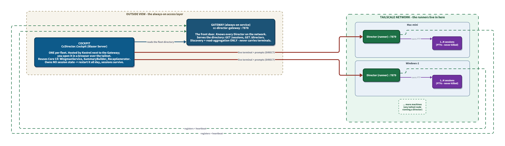

# The Cockpit - Design (TARGET / PLANNED v1)

**Status:** PLANNED
**Date:** 2026-05-31
**Audience:** Anyone building the Cockpit, or deciding where a session-driving feature should live going forward.

## Related documents

- `cockpit-topology.d2` / `cockpit-topology.png` - the fleet topology (read first)
- [../gateway/GATEWAY_DIRECTOR_ARCHITECTURE.md](../gateway/GATEWAY_DIRECTOR_ARCHITECTURE.md) - CURRENT Gateway/Director split this builds on
- [../gateway/GATEWAY_SESSION_VIEW_PLAN.md](../gateway/GATEWAY_SESSION_VIEW_PLAN.md) - the shipped fleet-wide `GET /sessions` aggregation the Cockpit consumes
- [../wingman/SESSION_VIEW_MERGE_PLAN.md](../wingman/SESSION_VIEW_MERGE_PLAN.md) - the wingman/agent-feed view the Cockpit replaces
- `playground/wingman-briefing/PLAN-v1-cockpit.md` + `cockpit.html` - the working prototype this doc formalizes

---

## Topology at a glance

On the left, on the **always-on box**, sits the access layer: the **Gateway** (the front door) and the **Cockpit** - **one** Blazor Server web app hosted by Kestrel right next to the Gateway. You reach the Cockpit from a **browser** on whatever machine you happen to be at, over the tailnet; there is exactly one Cockpit for the whole fleet, not one per machine. On the right, **inside the Tailscale network**, are the runner machines - each a Director that owns the live session PTYs. The Cockpit reads the fleet directory from the Gateway, then reaches straight into the network to each owning Director for the live terminal and prompts. The Gateway never carries terminal traffic, and there is no Director on the always-on box - it is purely the access layer.



---

## 1. The idea in one sentence

> **The Cockpit is the single place you drive every Claude session on your tailnet. Directors become dumb, long-lived runners that own the PTY and nothing opinionated. The thing you restart constantly (the Cockpit) is no longer the thing that owns sessions - so sessions never die.**

Everything below is a consequence of that sentence.

## 2. Why this exists (the driver)

The PTY wrapping `claude.exe` is the running session. Today the opinionated UI - the rich `session-view.html`, the Avalonia terminal tab, the wingman views - lives **inside or beside** the process that owns that PTY. So iterating on a UI feature means restarting `cc-director`, which kills every session. That is disruptive and lossy, and there is no clean session-restart story.

The Cockpit fixes this **structurally, not by discipline**: it owns no session state, reaches the PTY only over a network stream, and can be rebuilt and relaunched all day without touching a single running session.

A secondary win: today **three** frontends reimplement the same UI (Avalonia desktop XAML, Director web HTML/JS, Gateway web HTML/JS), sharing only Core C# over REST. The Cockpit consolidates toward one.

## 3. Scope of v1

- **Desktop-first.** Built for a large screen (desktop, possibly a large tablet, but a desktop-class experience). The existing Android app is a **separate track** handled later. Prove it on a large screen first.
- **Tech is locked: Blazor Server.** Chosen so the view tier is C# and reuses `CcDirector.Core` + `CcDirector.Gateway.Contracts` directly (no JS re-modeling of DTOs). Note: "share with the desktop" realistically means **share Core C#**, not views - Avalonia XAML cannot be reused by any web tier.
- **Directors keep working as they do today** until the Cockpit is proven. Then their opinionated UI is retired and they shrink to runners. No big-bang switch.

Out of scope for v1: mobile/phone layout, replacing the Avalonia desktop app, multi-user identity, remote Director spawn.

## 4. How it connects (the phone book + direct dial)

There are only two ideas in the topology, and the diagram above shows both:

### 4.1 The Gateway is a phone book, used once

The Cockpit can't know, on its own, every machine on the tailnet or which one is running which session. The Gateway already solves that: every Director registers with it, so the Gateway can answer **"which sessions exist across the whole fleet, and which machine owns each one"** (`GET /sessions`, `GET /directors`). The Cockpit asks the Gateway that question and gets back a list, each entry carrying its home Director's address (`tailnetEndpoint`).

That is the Gateway's *entire* role for the Cockpit: discovery and read-aggregation. **It never carries terminal traffic and is never in the write path.** It's a switchboard that tells you the number to dial, not the line you talk over.

### 4.2 Everything real is dialed direct to the owning Director

Once the Cockpit knows a session lives on, say, Mac-mini, it talks to **that Director directly**:

- **Live terminal** - the xterm.js view opens a WebSocket straight to the Director's `/sessions/{sid}/stream`. This high-frequency byte stream goes machine-to-machine over the tailnet and **never passes through the Gateway**. That is why the remoted terminal is as fast as opening the Director's own page today - it answers your terminal-latency concern directly.
- **Prompts, interrupt, escape, rename** - REST calls straight to the owning Director.

So: **one call to the Gateway to find sessions; direct calls to each Director to use them.** This matches the already-shipped principle - *reads aggregate through the Gateway, writes/streams go direct-to-Director.*

## 5. "Why is there a Cockpit *server*?" (the Blazor Server model)

Blazor Server means the app's C# logic runs server-side under Kestrel, and the **browser is the client**, connected over SignalR. So the Cockpit is **one web app, hosted once** (next to the Gateway - see section 7), that you open in a browser. There is no native wrapper and no per-OS shell: Kestrel is cross-platform .NET, so it just serves the page.

- The **C# server** is where the smarts live - `WingmanService` (opus briefing), `SummaryBuilder` (the turn rail), `RecapGenerator` - reused directly from `CcDirector.Core`. This is the concrete meaning of "dumb runners": the enrichment the external harness (`playground/wingman-briefing/`) does today from outside the Director becomes a permanent, built-in part of the Cockpit.
- The **browser** renders the page (xterm.js terminal + the panels) and talks to the C# server over SignalR.

We chose Blazor Server precisely so that smart layer is **C# we share with the rest of the stack** instead of re-implemented in JavaScript. The terminal is the one thing that deliberately bypasses the SignalR channel - the browser's xterm.js opens a WebSocket straight to the Director (section 4.2), not through the C# render channel, so the terminal stays fast.

The briefing is **async enrichment layered over the live view** - it catches up; you never wait on opus to see reality. The live terminal and the cheap fleet reads are always current regardless of briefing latency.

## 6. Project shape

`CcDirector.Cockpit` - a Blazor Server project referencing:

- `CcDirector.Core` - `WingmanService`, `SummaryBuilder`, `RecapGenerator`, and the agent/session domain types.
- `CcDirector.Gateway.Contracts` - `SessionDto`, `DirectorDto`, and the fleet-wide field set (`MachineName`, `TailnetEndpoint`, `ViewUrl`, `LastActivityAt`).
- A typed REST client to Directors and the Gateway (lift/extract from the Gateway's existing `DirectorEndpointClient`).

### Components (from the prototype `cockpit.html`, formalized as Razor components)

```
+--------------------------------------------------------------+------------------+
|  Header: SessionPicker (fleet-wide) | branch | dirty | state |  TurnRail        |
+--------------------------------------------------------------+  one card per    |
|  TerminalPane  (xterm.js, DIRECT WS to the owning Director) |  turn, newest    |
|                                                              |  highlighted;    |
|                                                              |  the arc of the  |
+--------------------------------------------------------------+  session at a    |
|  BriefingDock  (opus enrichment, async, never blocks)        |  glance          |
|   Claude is asking: "..."  Claude recommends: "..."  Wingman |                  |
+--------------------------------------------------------------+                  |
|  ReplyBar  [ reply ............... ] [Send]                  |                  |
|            [Yes proceed] [Use B] ...   [Interrupt] [Esc]     |                  |
+--------------------------------------------------------------+------------------+
```

- `SessionPicker` - fed by Gateway `GET /sessions`; selecting a session targets every pane below it.
- `TerminalPane` - JS-interop wrapper around xterm.js; opens the direct WebSocket to the owning Director.
- `BriefingDock` - renders the latest `WingmanService` briefing for the selected session.
- `ReplyBar` - writes (prompt / interrupt / escape) direct to the owning Director.
- `TurnRail` - renders `GET /sessions/{sid}/turn-summaries`, newest highlighted.

## 7. Hosting

**There is one Cockpit. It is a Blazor Server web app hosted by Kestrel on the always-on box, right next to the Gateway, and you open it in a browser** from whatever machine you are at, over the tailnet. No native wrapper, no WebView2, no per-machine copy - the browser is the client, and Kestrel runs the same on Windows, Mac, or Linux.

It is **desktop-first** in the sense of *form factor* - laid out for a large screen, not a phone. The existing Android app is the phone form factor and a separate track. "Desktop" here never meant a packaged native app.

How the connections fall out:

- **Browser <-> Cockpit** - SignalR over the tailnet. This is the UI. Fine on a tailnet.
- **Browser -> Director** - the xterm.js terminal opens its WebSocket straight to the owning Director (still direct, still off the Gateway).
- **Cockpit server -> Gateway / Directors** - reads the fleet directory; sends prompts / interrupt / rename.

The one real implementation choice, and it is small: does the Cockpit run **inside the Gateway service** (one Kestrel host serving both the discovery API and the Blazor UI) or as **its own process on the same box, next to the Gateway**? **Recommendation: its own process**, so you can rebuild and restart the Cockpit UI without bouncing the always-on discovery service. Both are stateless; neither restart ever touches a session.

The Cockpit is **never a service** - unlike the Gateway. It is the UI, it should be freely restartable, and that restartability is the whole point: rebuild and relaunch it all day while every session keeps running on the Directors.

## 8. What this buys you, restated

The PTY lives only on the Director and is reached by a direct WebSocket. The Cockpit owns no session state. Kill it, rebuild it, relaunch it as often as you like; every session keeps running untouched. The "never restart the session" property becomes structural.

## 9. Build order (by risk, front-loading the uncertain part)

1. **Scaffold `CcDirector.Cockpit`** (Blazor Server) referencing `Core` + `Gateway.Contracts`, hosted by Kestrel on the always-on box next to the Gateway (section 7).
2. **TerminalPane first (Lane A).** xterm.js JS-interop component, direct WebSocket to a live Director's `/sessions/{sid}/stream`. This is the only genuinely uncertain piece - does a remoted terminal feel good enough to abandon the in-Director one? Learn that cheaply, before building anything pretty.
3. **ReplyBar (Lane C).** Prove a human can answer a real pending question from the Cockpit.
4. **SessionPicker (Lane B).** Fleet-wide list from the Gateway's `GET /sessions`.
5. **TurnRail.** From `/sessions/{sid}/turn-summaries`.
6. **BriefingDock.** `WingmanService` opus enrichment, async, never blocking the live view.
7. **Prove on a real desktop session with a real pending question** before declaring it works.

## 10. Open questions

1. **Cockpit process vs Gateway process** - run the Cockpit Blazor app inside the Gateway service's Kestrel host, or as its own process on the same box. Leaning to its own process so the UI can restart without bouncing the always-on Gateway.
2. **Director-side trims** - which opinionated routes/pages get retired, and when. Keep a barebones raw-terminal page on the Director as an emergency fallback?
3. **Reuse vs extract** - does the Director REST client get extracted from `CcDirector.Gateway` into a shared library both Gateway and Cockpit reference, or copied?
4. **Briefing ownership** - does the Cockpit server run opus side-calls itself, or call a Director endpoint that does? v1 leans Cockpit-server-side to keep Directors dumb.

---

## Document History

| Date | Author | Change |
|---|---|---|
| 2026-05-31 | claude (cc-director assistant) | Initial PLANNED design. Locks Blazor Server, desktop-first, the phone-book + direct-dial topology, smarts-in-Cockpit. Formalizes the `playground/wingman-briefing` prototype. |
| 2026-05-31 | claude (cc-director assistant) | **Hosting corrected.** One Cockpit, hosted by Kestrel on the always-on box next to the Gateway, browser-accessed over the tailnet. Removed the wrong per-machine native-shell (WebView2/Photino) model. Gateway becomes a Windows service; Cockpit is never a service. |
