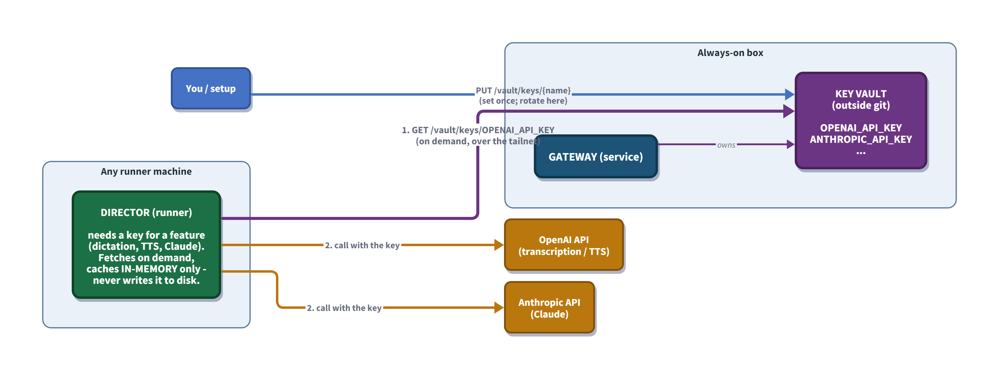

# Gateway Key Vault (PLANNED)

**Status:** PLANNED
**Date:** 2026-05-31
**Audience:** Anyone implementing centralized API-key storage + handout on the Gateway.

## Related documents

- [GATEWAY_DIRECTOR_ARCHITECTURE.md](GATEWAY_DIRECTOR_ARCHITECTURE.md) - the Gateway/Director split this extends
- `../cockpit/COCKPIT_DESIGN.md` - the always-on Gateway service this lives in

## Key-handout flow at a glance



---

## 1. Why

Directors need API keys to do their work: **OpenAI** for dictation / transcription / TTS, **Anthropic** for Claude, and others over time. Today each machine carries its own copy (env vars / local config / `credentials.env`), which drifts across machines and is painful to rotate.

The Gateway is already the one always-on service the whole fleet talks to. Make it the **single home for these keys**: set a key once on the Gateway, and every Director fetches it as needed. No Director stores keys on its own disk.

This is **distinct from cc-vault** (personal data / contacts). The Key Vault holds only fleet **API keys/secrets**.

## 2. What it stores

Named secrets, opaque string values, e.g.:

- `OPENAI_API_KEY`
- `ANTHROPIC_API_KEY`
- (any future provider key)

## 3. Where

On the always-on Gateway box, in a store **outside git** (same principle as today's `credentials.env`). The Gateway service owns it; it is read at request time, not baked into any build.

## 4. API (on the Gateway)

| Route | Purpose |
|---|---|
| `GET /vault/keys` | list key **names** present (never values) - discovery |
| `GET /vault/keys/{name}` | return one key's value, for a Director that needs it |
| `PUT /vault/keys/{name}` `{ value }` | set / update a key |
| `DELETE /vault/keys/{name}` | remove a key |

## 5. How Directors get keys

**Pull on demand.** When a Director feature needs a key (dictation -> `OPENAI_API_KEY`), it `GET`s it from the Gateway and **caches it in memory only** - never writes it to local disk. On a cache miss (or a provider rejecting the key), it re-fetches.

Pull-on-demand beats push: keys live in exactly one place, and a rotation (`PUT`) propagates to every Director on its next fetch, with nothing to re-deploy.

```
Director (dictation needs OpenAI)
   -> GET https://<gateway>/vault/keys/OPENAI_API_KEY
   -> use the value in-memory for the OpenAI call
```

## 6. Trust

The **tailnet is the boundary**, as everywhere else in this system: keys travel Tailscale-encrypted between the Gateway and a Director, and the existing Gateway token gates the endpoints. No additional auth layer.

## 7. Open questions

1. **At-rest format** - a plain file outside git (simplest, matches `credentials.env`) vs OS-level encryption (DPAPI / Keychain). Default to the simple file; revisit only if wanted.
2. **Rotation freshness** - `PUT` updates immediately; Directors pick it up on next fetch. Add a short in-memory TTL (or a `key.changed` signal) if a faster pickup is ever needed.
3. **Migration** - seed the vault from the existing per-machine `credentials.env` / env vars, then have Directors stop reading local copies.
4. **Cockpit** - likely does **not** need keys (they're for Directors/agents); keep the vault Director-facing unless a concrete Cockpit need appears.

---

## Document History

| Date | Author | Change |
|---|---|---|
| 2026-05-31 | claude (cc-director assistant) | Initial PLANNED design: central API-key vault on the Gateway, pull-on-demand handout to Directors. |
