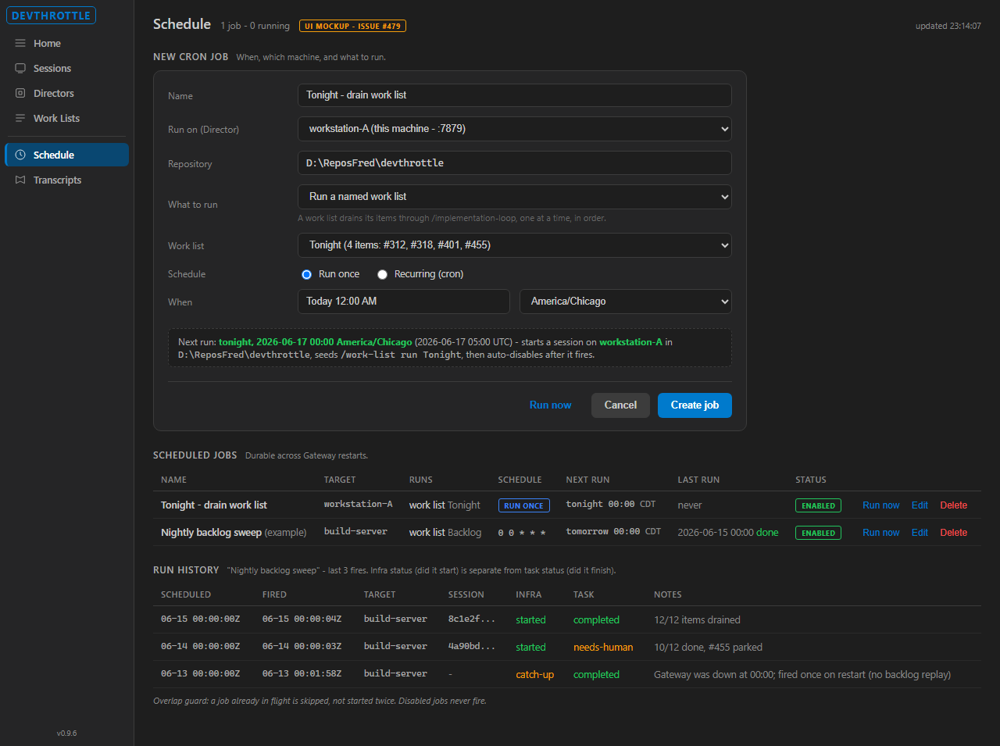

# Cron Jobs on the Gateway

## A scheduled-job engine for the DevThrottle fleet

**Status:** Design proposal (GitHub issue [#479])
**Author:** Product Agent research pass
**Date:** 2026-06-16
**Tracker:** thefrederiksen/devthrottle issue #479 (label flow:ready-dev)

---

## 1. Executive Summary

The Gateway is the one component in the fleet that is **always running**. Today it can discover Directors, proxy sessions, and aggregate fleet state, but it cannot do anything **on a schedule**. This proposal adds a first-class, self-hosted cron engine that lives inside the Gateway and can, at a chosen time, **start a Claude Code session on a chosen Director (machine) and run a skill or prompt there** - unattended, durable across restarts, and observable through run history.

The headline use case: **at midnight, run the implementation loop over a named list of work items**, with no human at the keyboard.

This is deliberately the self-hosted equivalent of Claude Code's cloud "Routines" feature (a saved prompt + repo + trigger that fires autonomously), but pointed at our own fleet of Directors instead of Anthropic's cloud. We are not inventing a novel pattern - we are adopting a proven one and wiring it to the machinery we already ship.

---

## 2. The Headline Use Case

> "Start at 12 o'clock tonight, take a list of work items, and run the implementation loop over all of them."

Here is how that reads once the feature exists:

1. You already maintain a **named work list** (the shipped feature #274/#273) - an ordered queue of work-item refs (`{source, id}`), for example a "Tonight" list of GitHub issues.
2. You create **one cron job**: *"At 00:00 America/Chicago, on Director `workstation-A`, in repo `D:\ReposFred\devthrottle`, run the named work list 'Tonight'."*
3. At midnight the Gateway fires the job. It starts a session on `workstation-A` and seeds the existing **named-work-list runner (#274)**, which drains the list - one `/implementation-loop <id>` per item, in order, each emitting the machine-readable terminal signal (Section 7a of the development method) so the runner knows when to advance.
4. In the morning you read the **run history**: which job fired, when, which session it started, and the per-item outcomes.

Crucially, the cron engine does **not** re-implement work-item iteration. It schedules **when** the already-shipped runner drains an already-defined list. The new surface is purely: *the clock, the target, and the trigger.*

---

## 3. How It Works (Architecture)

### 3.1 The core principle: the scheduler lives in the supervisor, not in the model

Every prior art we studied converges on one decision: **the always-on supervisor process owns the scheduler; the agent run is just the payload it fires.** Claude Code's routines run on Anthropic's cloud supervisor; OpenClaw's cron runs inside its gateway daemon; Hermes runs a 60-second ticker inside its gateway. We do the same - the cron engine is a background loop inside `CcDirector.Gateway`, and "what it runs" is a session on a Director.

This keeps the design testable, model-agnostic, and resilient: the schedule survives model swaps, session crashes, and restarts, because it is plain data in a file plus a timer.

### 3.2 The firing path (reuses everything we already have)

```
   [ Gateway background loop ]   (evaluates every ~minute)
            |
            |  a job is due (Cronos.GetNextOccurrence <= now)
            v
   claim the job  (single-consumer, mirrors WorkListStore)
            |
            v
   POST /directors/{directorId}/sessions      <-- EXISTING Gateway->Director path
     { repoPath, prePrompt: "<skill or prompt>" }
            |
            v
   Director spawns claude.exe, waits for TUI, sends the seed text
            |
            v
   record run: sessionId, firedUtc, infraStatus
            |
            v
   (for the work-list use case) the seeded named-work-list runner #274
   drains the list; each item emits IMPL-LOOP-TERMINAL (Section 7a)
```

Every box except the first two **already exists in the codebase**:

| Existing piece | File | Role in cron |
|---|---|---|
| Session creation REST | `Api/GatewayEndpoints.cs` (`POST /directors/{id}/sessions`) | How a fire starts a session on a target Director |
| Director discovery + client | `Discovery/DirectorRegistry.cs`, `DirectorEndpointClient.cs`, `DirectorForwarding.cs` | Resolve the target machine and call it |
| Durable atomic JSON store | `WorkListStore.cs` (pattern for `cronjobs.json`) | How job defs persist (temp-file + rename, corrupt-file quarantine) |
| Named-work-list runner | shipped #274/#273 | The first use case's payload |
| Terminal signal | `Running/ImplLoopTerminalSignal.cs` (Section 7a) | How per-item completion is detected |
| Storage root | `CcStorage.cs` (`%LOCALAPPDATA%\cc-director`) | Where `cronjobs.json` lives |

The genuinely **new** code is small and well-bounded: a job/run DTO, a JSON store, a background evaluation loop, a cron library (Cronos), and a REST CRUD + run-now + history surface.

---

## 4. Data Model

### 4.1 Cron job definition (persisted to `cronjobs.json`)

| Field | Meaning |
|---|---|
| `id` | Short unique id |
| `name` | Human-readable label |
| `enabled` | If false, never fires |
| `scheduleKind` | `recurring` (cron expression) or `oneOff` (single future timestamp) |
| `cronExpression` | 5-field cron (`minute hour day-of-month month day-of-week`) when recurring |
| `timeZoneId` | Explicit IANA/Windows zone; all internal times are UTC |
| `target.directorId` | Which Director/machine to run on |
| `action.repoPath` | Working directory for the session |
| `action.seed` | The skill or prompt to run (e.g. run a named work list, or a `/skill args` string) |
| `preventOverlap` | If true, a fire is skipped while a prior run is in flight (default true) |
| `createdUtc`, `lastFiredUtc`, `nextRunUtc` | Lifecycle timestamps |
| `lastStatus` | Outcome of the most recent run |

### 4.2 Run-history record (one per fire)

| Field | Meaning |
|---|---|
| `scheduledUtc` | When the job was due |
| `firedUtc` | When it actually fired (may be staggered/jittered) |
| `targetDirectorId` | Director it ran on |
| `sessionId` | Session the fire started |
| `infraStatus` | Did the HTTP call to the Director succeed? (start vs no-start) |
| `taskStatus` | Did the work itself succeed? (separate from infra - a green "started" is NOT "succeeded") |

The infra-status vs task-status split is borrowed directly from Claude Code routines, whose docs warn explicitly that "a green status means the session started and exited without an infrastructure error - it does not mean the task succeeded."

---

## 4a. What It Looks Like (UI mockup)

The Cockpit gains a **Schedule** page. The mockup below is the exact headline use case being set up - "tonight at midnight, on workstation-A, drain the 'Tonight' work list (#312, #318, #401, #455)" - alongside the scheduled-jobs table and a run-history panel. This is a design mockup of the deferred Cockpit UI (see Section 8), rendered in the real Cockpit dark theme; the engine + REST in this issue is what it sits on.



Notable details the mockup encodes: the "What to run" choice (named work list vs. a skill/prompt), the Run-once vs. Recurring toggle, an explicit time zone, a live preview line resolving local time to UTC, and a run-history table that separates **infra status** (did the session start) from **task status** (did the work finish), including a `catch-up` row that fired once after Gateway downtime with no backlog replay.

## 5. REST API Surface (on the Gateway)

| Method + path | Purpose |
|---|---|
| `POST /cron/jobs` | Create a job (validates the cron expression; 400 on invalid) |
| `GET /cron/jobs` | List all jobs |
| `GET /cron/jobs/{id}` | Get one job (includes computed `nextRunUtc`) |
| `PUT /cron/jobs/{id}` | Update a job |
| `DELETE /cron/jobs/{id}` | Delete a job |
| `POST /cron/jobs/{id}/run` | Run now (fire immediately, independent of schedule) |
| `GET /cron/jobs/{id}/runs` | Read run history |

The Cockpit (web dashboard) UI that sits on top of these endpoints is a **fast-follow issue**, not part of #479 - so the engine can be built and QA-verified entirely through REST + logs first.

---

## 6. Scheduling Semantics (the parts that are easy to get wrong)

These are the decisions every studied system had to make. We adopt the proven answer in each case.

| Concern | Decision | Rationale / prior art |
|---|---|---|
| **Cron format** | Standard 5-field cron (`* * * * *`), plus a one-shot "run at timestamp" mode. | Matches Claude Code's `CronCreate`; no exotic Quartz `L`/`W`/`#` syntax. |
| **Library** | **Cronos** (HangfireIO) for parse + next-occurrence. | UTC-first, DST-correct, MIT, fast, pure library (no competing threading model). NCrontab lacks DST; Quartz.NET is a heavier full scheduler we do not need yet. |
| **Time zones** | Store an explicit zone id; compute in UTC; a missing zone defaults to the Gateway host zone (called out, not silent). | Timezone ambiguity was the #1 reported surprise in the studied systems. |
| **One-shot vs recurring** | Both. One-shot fires once and auto-disables. | Reminders ("run once tonight") are a large share of real usage. |
| **Missed runs (catch-up)** | Fire **at most once** on recovery if within a threshold; never replay a backlog. | A daemon down for a day must not fire 48 catch-up jobs at once. Claude Code routines and OpenClaw both refuse backlog replay. |
| **Overlap** | A job already in flight is not re-entered; the second fire is skipped and logged. | Single-consumer claim, same as `WorkListStore`; prevents two sessions for one job. |
| **Anti-stampede** | Deterministic per-job jitter/stagger so many jobs do not all fire at `:00`. | Claude Code calls this "stagger"; OpenClaw auto-staggers top-of-hour jobs up to 5 min. |
| **Safety caps** | Enforce a minimum interval and a per-target concurrency cap. | Each fire spawns a real Claude session; unbounded sub-minute cron is a cost/overload footgun. |

---

## 7. Prior Art Studied

We researched three systems before designing this. The first is verifiable Anthropic documentation; the second and third are personal-agent projects the patterns of which converge with the first. (Provenance note: the OpenClaw and Hermes findings come from web research; their patterns are consistent with each other and with Claude Code's documented design, and that convergence - not any single source - is what we lean on.)

| Dimension | Claude Code (Routines / `/loop`) | OpenClaw | Hermes |
|---|---|---|---|
| Scheduler location | Cloud supervisor (Routines) / local session (`/loop`) | Gateway daemon | Gateway daemon (60s ticker) |
| Schedule kinds | recurring cron + one-off | `at` (one-shot) / `every` / `cron` | relative / interval / cron / ISO timestamp |
| Persistence | managed | SQLite (+ legacy JSON) | atomic JSON |
| What fires | prompt / saved command / skill | agent turn / host command / webhook | prompt + skills + optional script |
| Session model | fresh cloud session per run | per-job session target: main / isolated / current / custom | fresh isolated session per run |
| Catch-up | none (no backlog replay) | reschedule overdue out of boot window; no backlog | small window then silent-drop (a known gap) |
| Overlap | jitter; fires between turns | `maxConcurrentRuns` cap + dedicated lane | tick file-lock + serialize-on-shared-state |
| Time zones | local -> UTC | per-job tz | global only (a known gap) |
| Status honesty | infra-status vs task-status (explicit) | run records | file-based outputs |

**Patterns we adopt:** scheduler-in-supervisor; three schedule kinds led by one-shot + cron; durable atomic store; no backlog replay; overlap guard; deterministic stagger; infra-vs-task status; run history as first-class records.

**Pitfalls we pre-empt** (because the studied systems hit them): silent-drop of missed runs (we fire-once-on-recovery instead), global-only time zones (we store per-job zones), and unbounded cost from high-frequency cron (we enforce a min interval and concurrency cap).

**Deliberately deferred** (studied as future direction, not in #479): per-job model/cost overrides, webhook delivery, and job chaining/dependencies (OpenClaw has an open RFC for chaining; Hermes has a lightweight `context_from`). We note these so the data model can grow into them.

---

## 8. What Is In This Issue vs Follow-ups

### In #479 (the MVP, verifiable via REST + logs, no UI)

- Cron-job + run-record DTOs (`CcDirector.Gateway.Contracts`)
- Durable atomic `cronjobs.json` store (`CcDirector.Gateway`)
- Background evaluation loop using Cronos
- Fire path that starts a session on the target Director via the existing REST path
- The named-work-list use case wired end-to-end
- REST CRUD + run-now + run history
- Restart durability, catch-up policy, overlap guard, disabled-no-fire, invalid-cron-400, one-shot auto-disable

### Fast-follow issues (explicitly OUT of #479)

- **Cockpit UI**: create/edit/list/enable/run cron jobs and browse run history from the web dashboard.
- **`cc-*` CLI** wrapper for cron management from the terminal.
- **Richer payloads**: per-job model override, webhook delivery, job chaining/dependencies.
- **Multi-Gateway HA / clustered scheduling** (current design assumes a single always-on Gateway).

If the Developer Agent judges the MVP too large for one pass, the suggested split seam is: (a) store + DTOs + REST CRUD, (b) firing engine + run history + guards, (c) the named-work-list use case.

---

## 9. Open Assumptions (flagged for human decision)

These are recorded in issue #479 as assumptions, not facts:

1. **Cockpit UI is out of the MVP** - engine + REST first; UI is a follow-up. (Re-scope if the human wants UI in the same issue.)
2. **Cronos is the library** - over NCrontab / Quartz.NET / Coravel. (Quartz.NET would be a larger shape with a built-in durable store + misfire engine.)
3. **First use case reuses the named-work-list runner (#274)** rather than a new iterator.
4. **Storage is `cronjobs.json`** under `%LOCALAPPDATA%\cc-director`, mirroring `worklists.json`. No database.
5. **Time zones are explicit per job**; missing zone defaults to the Gateway host zone.
6. **Safety caps** (min interval + per-target concurrency) are enforced; exact numbers set during implementation.
7. **Single always-on Gateway**; multi-Gateway HA is out of scope.

---

## 10. Bottom Line

A cron engine on the Gateway is a **thin orchestration layer** over machinery DevThrottle already ships. The new code is a job model, a JSON store, a timer loop, a cron library, and a REST surface. Everything expensive - starting sessions on remote Directors, draining work lists, detecting completion - is reused. The result is a self-hosted "Routines for your own fleet": create a job once that says *when*, *which machine*, and *what to run*, and the always-on Gateway does the rest, with the schedule durable across restarts and every run recorded.

The work item is filed as **GitHub issue #479** (`flow:ready-dev`). Nothing has been implemented - this report and that issue are the deliverables.
