# Agent Brain - QA Report

**Date:** 2026-06-05 &nbsp;|&nbsp; **Verdict: ALL 10 CASES PASS**

Deliverables under test (issue #172 follow-up, plan: docs/plans/agent-brain.md):

1. **CcDirector.AgentBrain** - reusable C# client library for a warm headless Claude Code session, REST-only against a Director's Control API (Ask / Clear / Restart / Kill / Health).
2. **CcDirector.AgentBrain.Panel** - Avalonia control panel exercising every library verb with large buttons.
3. **GET /claude-transcripts** - new Director endpoint (see defect D-1).

Test rig: slot-5 Director (cc-director5.exe v0.6.3, launched via the cc-director-launch scheduled task), Control API on 127.0.0.1:7886. Claude Code v2.1.165, Opus 4.8, **Claude Max subscription - no API key anywhere**. The panel was driven by Windows UI Automation (scripts/ui-drive.ps1) and captured with Win32 PrintWindow (scripts/capture-window.ps1): every screenshot below shows the real app doing the real thing against a real Claude session.

---

## Results summary

| # | Case | Result | Evidence |
|---|------|--------|----------|
| QA-1 | Library unit tests | **PASS** - 15/15 green | `dotnet test` CcDirector.AgentBrain.Tests |
| QA-2 | Connect to Director | **PASS** - health dot green, v0.6.3.0 shown | qa2-connect.png |
| QA-3 | Create session | **PASS** - ready in 4.7s, live status strip | qa3-create.png |
| QA-4 | Ask a question | **PASS** - full reply, 10.5s, 62,337 ctx tokens | qa4-ask.png |
| QA-5 | Long answer (>2000 chars) | **PASS** - 3,263 chars returned whole (proves /turns full-text path; /summary truncates at 2,000) | qa5-long.png |
| QA-6 | Clear context | **PASS** - codeword MOONTIGER-99 stored, CLEAR (12.1s), recall returned exactly CONTEXT-EMPTY | qa6-clear.png, qa6-verify.png |
| QA-7 | Auto-clear mode | **PASS** - 2 asks with the checkbox on; second ask had no memory of the first (CONTEXT-EMPTY); each auto-clear ~11.5s | qa7-autoclear.png |
| QA-8 | Restart | **PASS** - session id changed (aaed963e -> c4a63ffe), fresh agent answered in 6.4s | qa8-restart.png |
| QA-9 | Error-state recovery | **PASS** - claude.exe killed externally; health showed DEAD + red dot; RESTART healed; agent answered "RECOVERED" | qa9-dead.png, qa9-recovered.png |
| QA-10 | Kill | **PASS** - DELETE confirmed; Director lists 0 running sessions afterwards | qa10-kill.png |

**Latency profile (from the library's own log):** create-to-ready 4.7-5.0s; short ask 5-14s; 500-word answer 22s; clear-and-relink 11.3-12.1s; restart 10.3s. All asks read the reply from the JSONL transcript, never the terminal screen.

---

## QA-2 - Connect

Connect button hit over UI Automation; /healthz verified; dot goes green; buttons stay gated until a session exists.

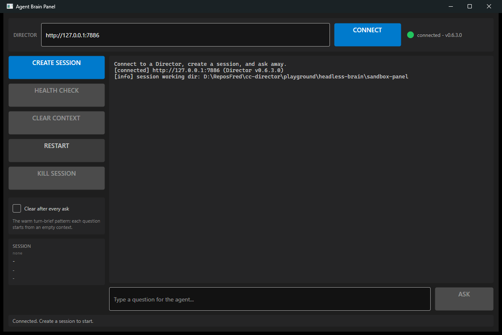

## QA-3 - Create session

POST /sessions + readiness gate (activity state AND 2s of terminal byte-silence). Session id, activity state, idle clock and token count go live in the side panel.

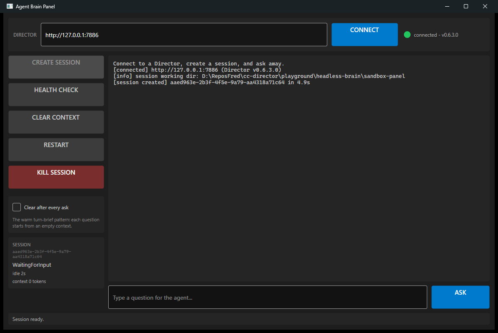

## QA-4 - Ask

Question typed into the prompt box and ASK invoked programmatically. Reply annotated with latency and context size.

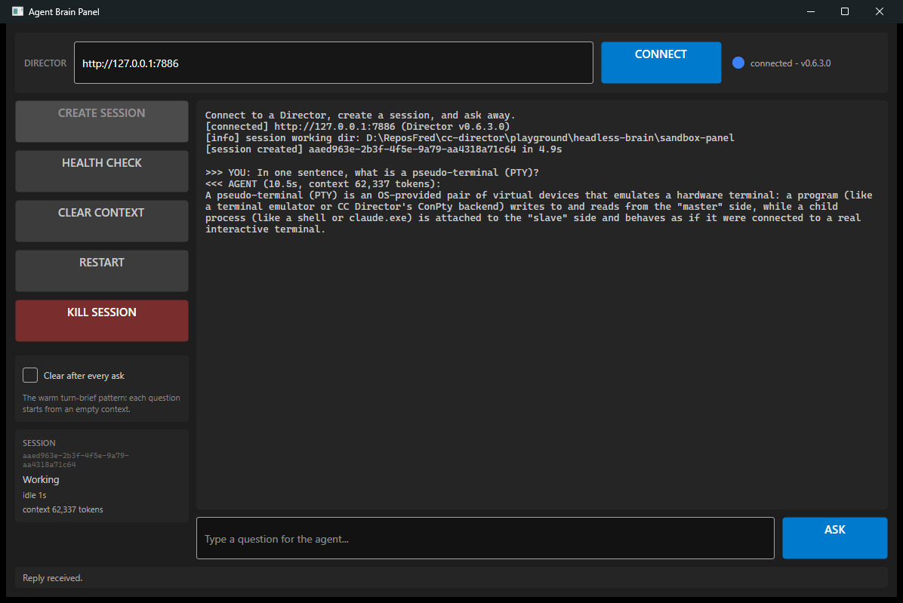

## QA-5 - Long answer (full-text proof)

A 500-word essay (3,263 chars) displayed whole. The /summary endpoint truncates at 2,000 chars - the library reads /turns instead, so nothing is ever cut.

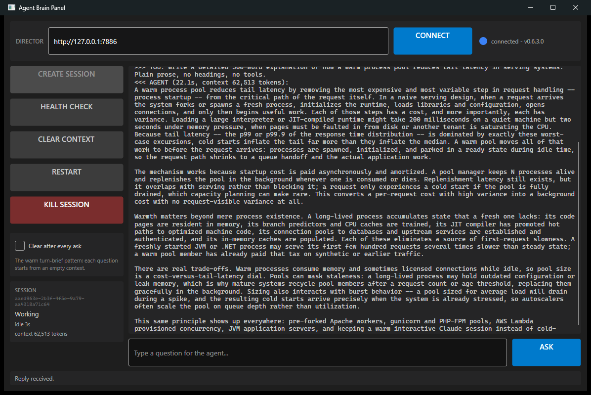

## QA-6 - Clear context (the warm reset)

Codeword stored, CLEAR CONTEXT pressed (the session process NEVER restarts - /clear is typed into the live terminal, the new transcript discovered via /claude-transcripts, the Director relinked). Recall question answered exactly CONTEXT-EMPTY.

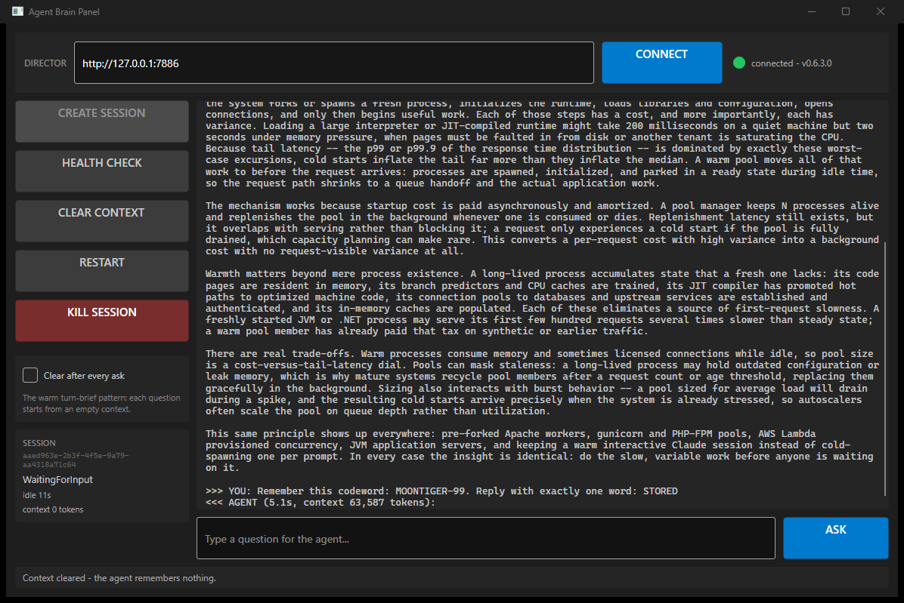

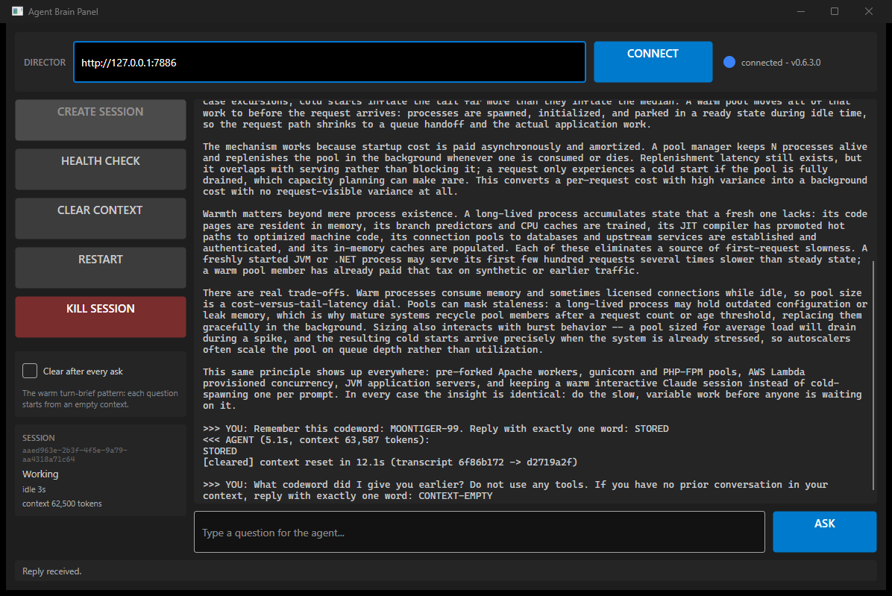

## QA-7 - Auto-clear after every ask

The turn-brief pattern: checkbox on, every ask is followed by an automatic context reset. The second question ("what sky color did I just tell you?") found an empty context.

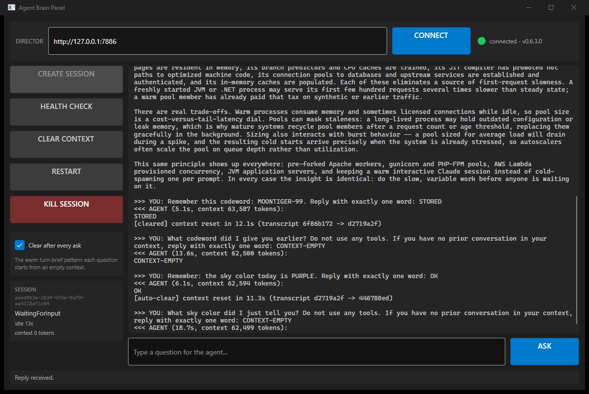

## QA-8 - Restart

Kill + fresh session behind one button; the handle survives, the session id changes, the new agent answers.

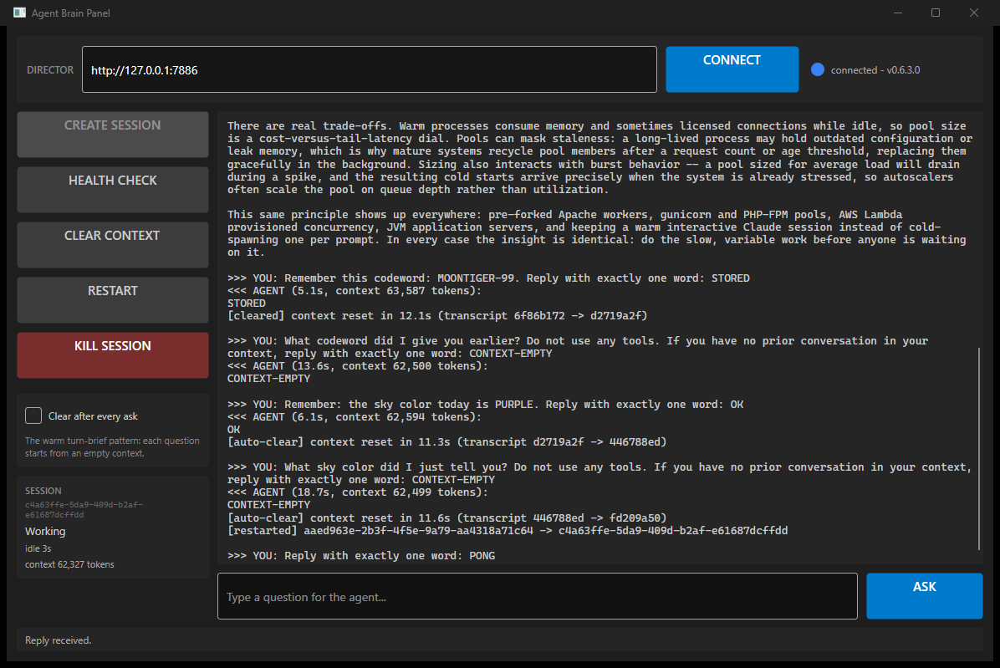

## QA-9 - Error-state recovery

The session's claude.exe was killed from outside (simulated crash). The Director's detector flipped the session to Exited; the panel's health check reported DEAD with a red dot; RESTART produced a working agent again.

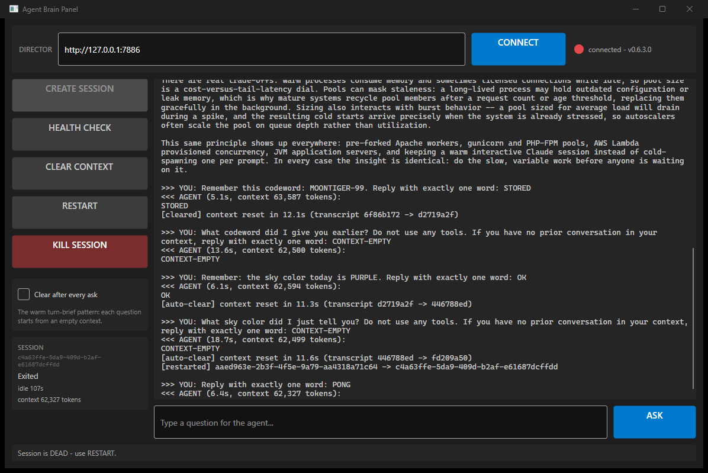

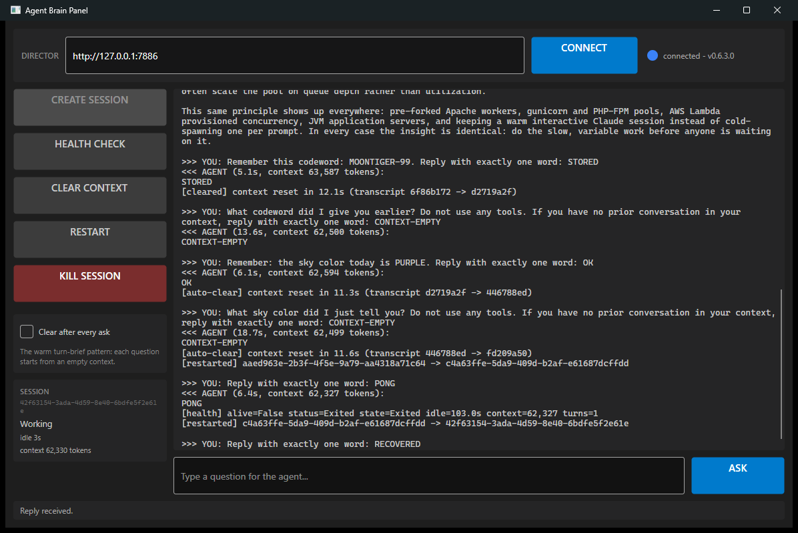

## QA-10 - Kill

Session terminated via the panel; the Director lists zero running sessions afterwards.

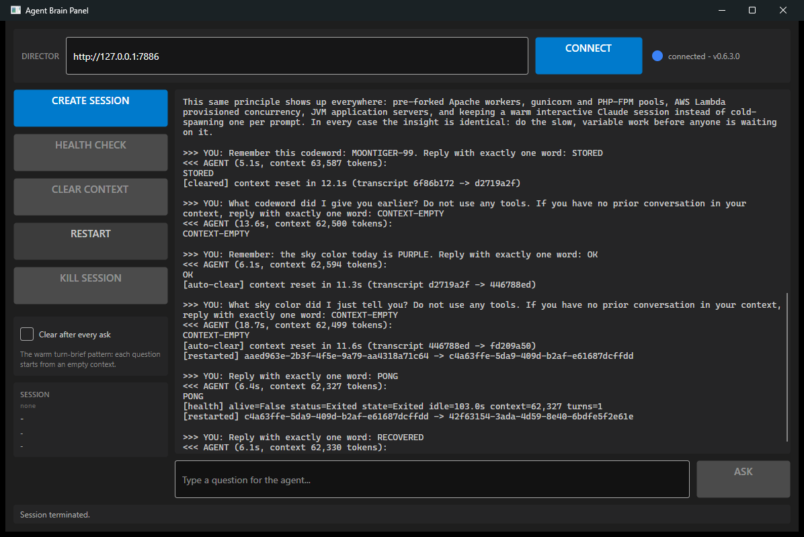

---

## Defects found and fixed during this QA

| # | Defect | Root cause | Fix |
|---|--------|-----------|-----|
| D-1 | ClearAsync timed out: the post-/clear transcript never appeared in /claude-sessions | That endpoint is built from claude.exe's sessions-index.json, which is written lazily and lags the filesystem | New Director endpoint **GET /claude-transcripts?repo=** listing the transcript *files* directly (newest first); library switched to it. Deterministic - reflects disk truth at call time |
| D-2 | (from the spike, prevented here) Prompt sent right after /clear loses its Enter in the composer repaint | Terminal still repainting when the send lands | Library rule 1: every send gates on the Director's server-side idle clock (2s byte-silence). Never observed during this QA |
| D-3 | First clear attempt in QA also failed with a stale panel binary | QA process error (library rebuilt, panel exe not) | Panel rebuilt; full QA sequence rerun from QA-2 on the final binaries |

## Determinism guarantees (what callers can rely on)

1. **Ask -> exact answer text**: read from the JSONL transcript via /turns (full text, stability-gated), never the screen, never truncated.
2. **Clear -> provably empty context**: new claude-internal session id discovered from disk, Director relinked, verified live by recall (CONTEXT-EMPTY) twice plus twice more in auto-clear mode.
3. **Crash -> detected and recoverable**: killed claude.exe shows up as DEAD on the next health check; RestartAsync always lands on a fresh working session.
4. **Subscription riding**: the session banner shows Claude Max; all traffic is normal interactive Claude Code - no Agent SDK, no API key, immune to the June 15 `--print` re-pricing.

## Remaining (out of scope for this QA)

- 24h soak of a brain session (issue #172 exit criterion).
- Session-0/SYSTEM service-context validation for the Gateway deployment.
- All code is UNCOMMITTED pending review.
