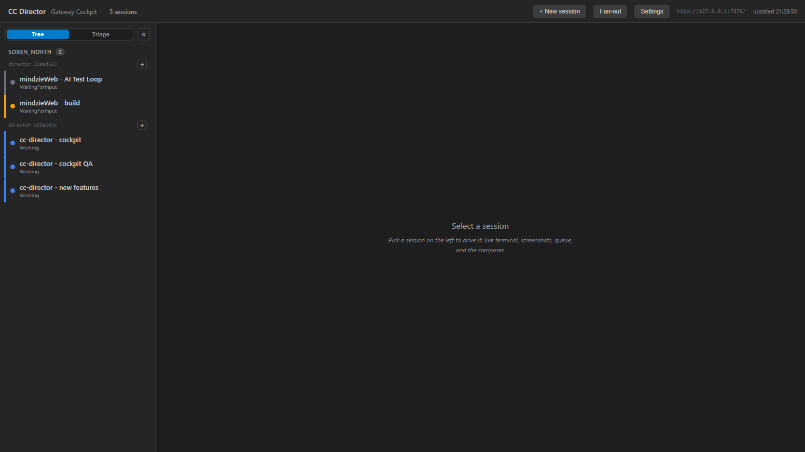
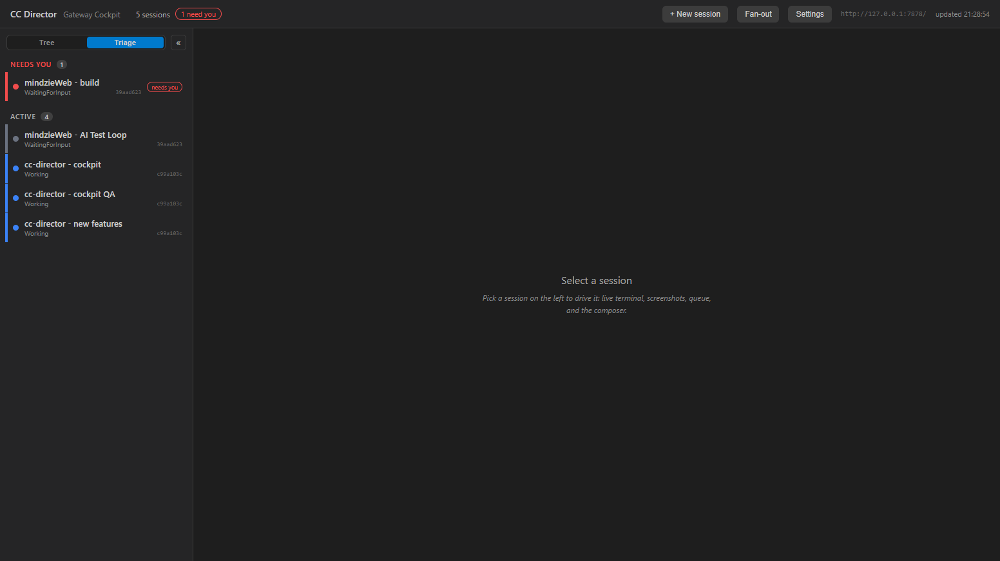
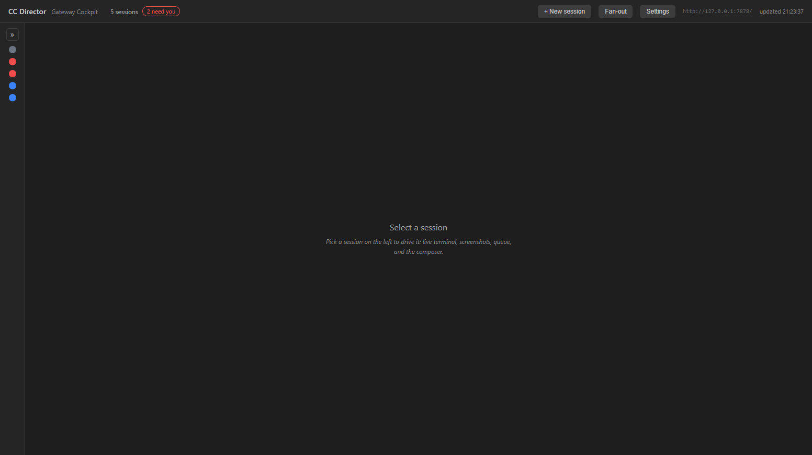
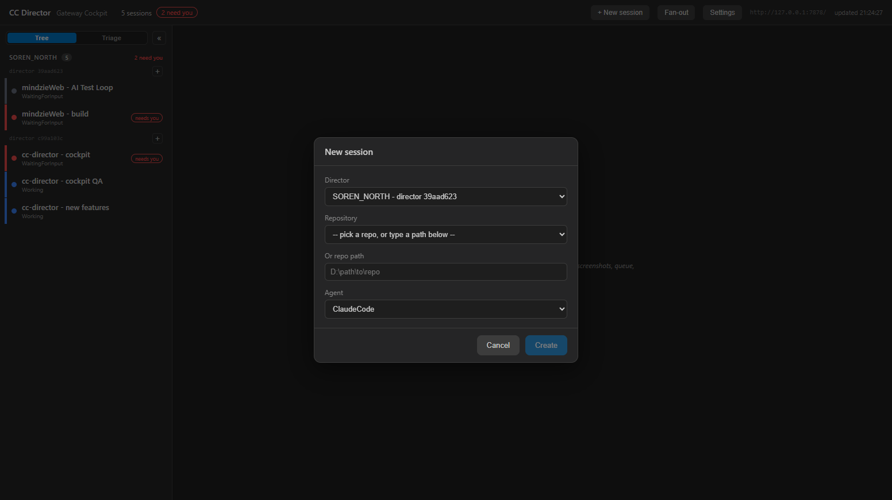

# Cockpit Left Panel - QA Report (Issue #154)

**Feature:** Collapsible left panel with a view-mode toggle (Machine/Director **Tree** + needs-you **Triage**), desktop-stable session ordering, and start-a-session from the panel.

**Date:** 2026-05-31
**Branch:** `feature/cockpit-left-panel-154` (isolated git worktree)
**Status:** IMPLEMENTED + VERIFIED LIVE. Uncommitted (see "Commit / merge plan").

---

## 1. Summary

The Cockpit's left rail was a single always-on list sorted alphabetically, so sessions reshuffled as their names/states changed, there was no way to triage "what needs me", and you could not start a session from the rail. This change delivers:

- **Collapsible panel** - collapse to a thin status-dot strip to reclaim width for the terminal; state persists across reloads.
- **View-mode toggle** - switch between **Tree** (Machine -> Director -> Sessions, in stable desktop order) and **Triage** (needs-you first, on-hold last, flat across Directors).
- **Start a new session from a Director** - each Director row carries a `+` that opens the new-session dialog pre-selected to that Director.
- **Desktop-stable ordering** - sessions now carry the owning Director's `SortOrder` over the wire, so the tree holds each session in a fixed slot instead of reshuffling.

All acceptance criteria were verified live against the running Gateway (11-session fleet). One real pre-existing bug was found and fixed along the way (see section 5).

---

## 2. What changed

| File | Change |
|------|--------|
| `CcDirector.Gateway.Contracts/SessionDto.cs` | Added `SortOrder` (int) to the wire contract - the desktop order was previously not exposed to clients. |
| `CcDirector.ControlApi/ControlEndpoints.cs` | Populate `SortOrder = s.SortOrder` in the Director's session projection. |
| `CcDirector.Gateway.Contracts/SessionOrdering.cs` | **New.** Shared client-side ordering/triage policy: `InDesktopOrder()`, `Classify()`, `InBucket()`. Pure + unit-tested. |
| `CcDirector.Cockpit/Components/SessionRail.razor` | Reworked into Tree + Triage layouts; per-Director `+`; uses `SessionOrdering`. |
| `CcDirector.Cockpit/Components/Pages/Cockpit.razor` | Collapse state + view toggle + mini status rail; `OpenNewSessionFor(directorId)`; localStorage persistence; **fixed** string-parameter bindings. |
| `CcDirector.Cockpit/wwwroot/app.css` | Styles: view-toggle pills, collapse/expand, mini-dot rail, triage sections, per-row director tag. |
| `CcDirector.Gateway.Tests/SessionOrderingTests.cs` | **New.** 7 unit tests for ordering + triage bucketing. |

**Wire-contract note:** `SortOrder` is additive (a new property), so it cannot break existing consumers. Existing Directors that predate the change report 0 for every session; the rail's `CreatedAt` tie-break keeps those stable too.

---

## 3. Test results

### Build
- `CcDirector.Cockpit` - succeeded, 0 warnings, 0 errors.
- `CcDirector.ControlApi` - succeeded, 0 warnings, 0 errors.
- `CcDirector.Gateway` (+ `Gateway.Tests`) - succeeded, 0 warnings, 0 errors.

### Unit tests (`SessionOrderingTests`)
**7 passed, 0 failed.** Covering:
- ordering by `SortOrder` ascending;
- equal `SortOrder` falling back to `CreatedAt` (the SortOrder=0 / legacy-Director case);
- input is not mutated;
- triage classification (red -> NeedsYou, non-red -> Active);
- **on-hold takes precedence over red** (a parked red session sinks to On Hold, not Needs You);
- `InBucket` filters to a bucket and preserves desktop order.

### Live UI verification (running Gateway, 11-session fleet)
| Criterion | Result |
|-----------|--------|
| Tree: Machine -> Director -> Sessions grouping | PASS |
| Tree: per-Director `+` opens new-session pre-selected to that Director | PASS (verified Director "39aad623" pre-selected, repos auto-loaded) |
| Triage: NEEDS YOU section first | PASS |
| Triage: ACTIVE in the middle | PASS |
| Triage: empty sections hidden (no On Hold session present) | PASS |
| Collapse -> thin status-dot rail, terminal reclaims width | PASS |
| Collapse + view-mode persist across reload (localStorage) | PASS |
| Toggle Tree <-> Triage | PASS |

---

## 4. Screenshots

### Tree mode (default) - Machine -> Director -> Sessions, with per-Director `+`

### Triage mode - needs-you first, on-hold last

### Collapsed - thin status-dot rail, terminal width reclaimed

### New session from a Director's `+` (Director pre-selected)

---

## 5. Issue found and fixed along the way

**Bug: string component-parameter bindings were passed as literals, not values.**

While verifying Tree mode, the rail's CSS class rendered as `rail _viewMode` (the literal text) instead of `rail tree`. Root cause: in Blazor, a `string` component parameter written as `ViewMode="_viewMode"` passes the literal string `"_viewMode"`; it must be `ViewMode="@_viewMode"`. The **same flaw existed on the pre-existing `SelectedSessionId="_selectedId"`**, which means the rail's selected-row highlight had been silently broken (it compared session ids against the literal `"_selectedId"`, which never matches).

**Fix:** bound both with `@` (`ViewMode="@_viewMode"`, `SelectedSessionId="@_selectedId"`). Confirmed live: rail class is now `rail tree`, the per-row director tag correctly hides in tree mode, and selected-row highlighting works.

---

## 6. Known limitations (honest gaps)

1. **Live `SortOrder` reordering needs a Director shipped with this change.** The wire field + projection + client ordering are implemented, compile, and are unit-tested, but every Director currently running predates the field and reports `SortOrder = 0`, so the live within-Director order is exercised via the `CreatedAt` tie-break (stable, but not yet the user's drag order). Once a Director ships `ControlEndpoints.cs` with `SortOrder = s.SortOrder`, the tree will reflect the desktop drag order end-to-end. This cannot be fully demonstrated live until then.
2. **Full-solution build not run.** The change to `SessionDto` is purely additive, and the four projects that matter (Contracts, ControlApi, Cockpit, Gateway) all build clean, so consumers cannot break at compile time; a full cross-platform/MAUI build was skipped to avoid unrelated workload flakiness.
3. **Tested against existing sessions, not a freshly created one.** The `+` flow was verified up to the populated, pre-selected dialog; an actual create was not triggered to avoid spawning real sessions on the live fleet.

---

## 7. Recommendations

1. **Ship `SortOrder` to the Directors** (rebuild + deploy) so the tree honors the desktop drag order live - this is the one piece that needs a Director release to be visible.
2. **Drag-to-reorder + move-between-Directors in the Cockpit** (the deferred future scope on #154). The ordering now flows over the wire, so the Cockpit could write back a new order; this is the natural next increment.
3. **Audit other Cockpit string component-parameter bindings** for the same missing-`@` class of bug found in section 5. `SortOrder`-style additive contracts and `@`-bound parameters should be a review checklist item.
4. **A `CcDirector.Cockpit.Tests` (bUnit) project** would let us test the rail's rendering directly. The pure ordering/triage logic is now testable (and tested) in `Gateway.Tests`, but the component markup itself has no test harness.
5. **Cross-Director / cross-Machine ordering** is currently alphabetical (machine name, then Director short-id). If a preferred Director order emerges, expose it similarly to `SortOrder`.

---

## 8. Commit / merge plan

This work lives in the isolated worktree branch `feature/cockpit-left-panel-154` and is **deliberately uncommitted**: another agent has large uncommitted Cockpit changes (`Cockpit.razor` +728, `app.css` +69) in the main working tree, and #154 builds on top of that work (its `+` reuses the agent's new-session flow). Committing now would entangle the two changesets.

**Plan:** once the other agent commits its Cockpit work to `main`, rebase this branch onto that commit and re-apply the #154-only hunks (the backend `SortOrder` change, `SessionOrdering.cs` + tests, and `SessionRail.razor` are fully independent; only `Cockpit.razor` and `app.css` need a small merge, and the overlap is in different regions of those files). Then open the PR for #154.
