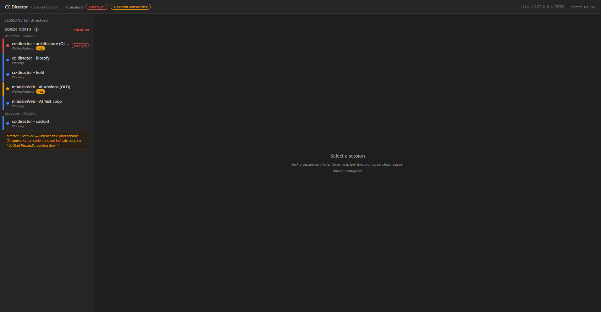
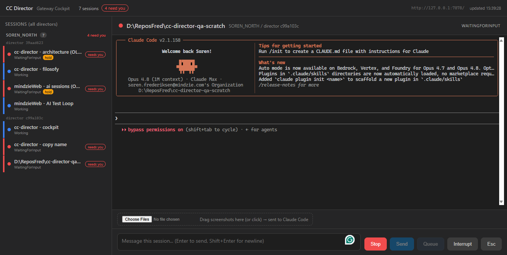
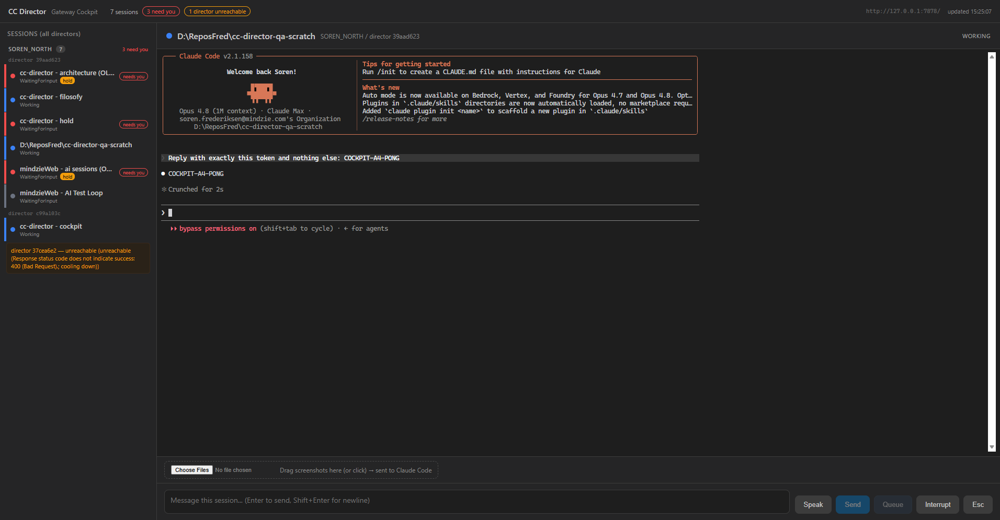
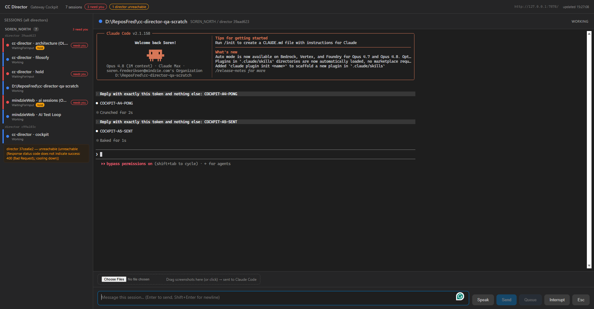
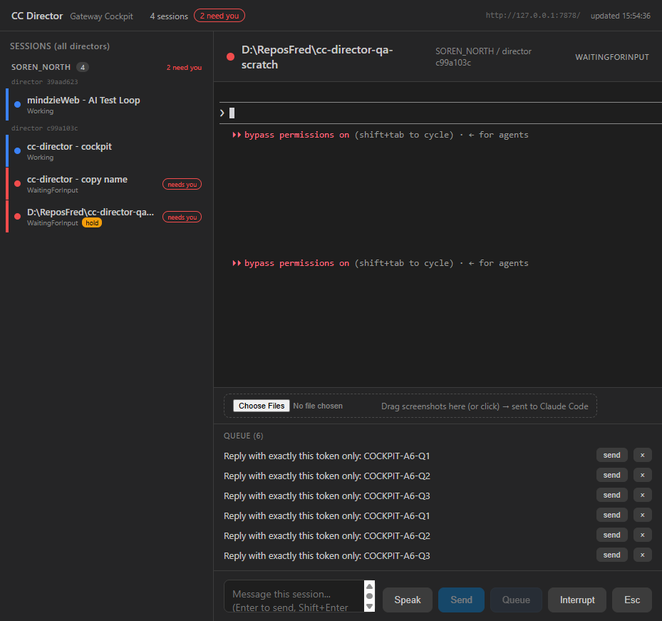
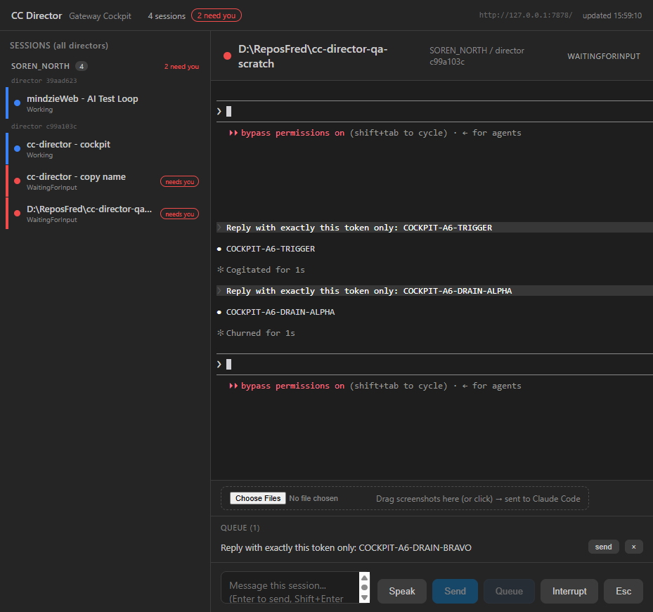
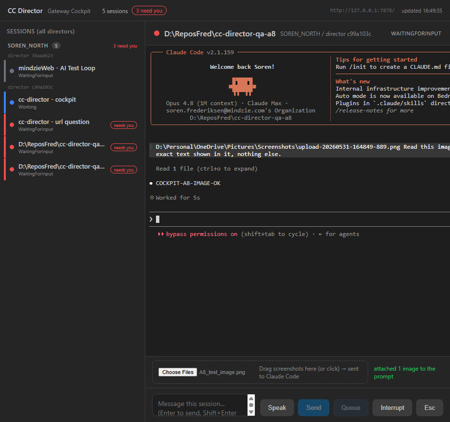
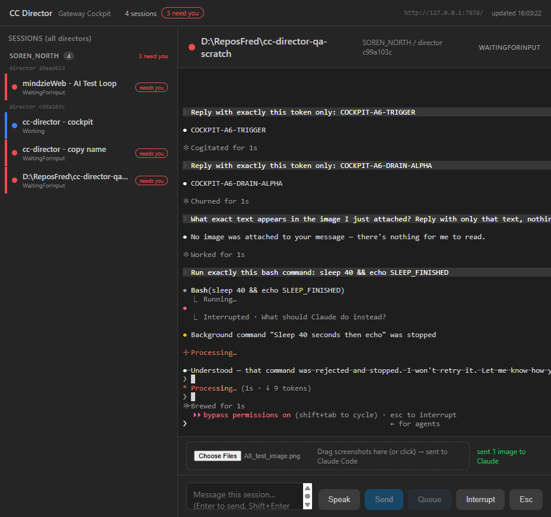

# Cockpit MVP - QA Report

**MVP result: 9 PASS / 1 PARTIAL / 0 FAIL (of 10)**  (A8 was FAIL, now fixed and re-verified PASS)
**Phase 2 (lifecycle + settings): 5/5 PASS** (new session, rename, kill, settings read, settings write) - see the Phase 2 section below.
**Phase 3 (awareness): Cockpit panel built + verified;** recap/turn-summary DATA generation is blocked Director-side - see the Phase 3 section and finding 5.
**Phase 4 (power tools): Fan-out + read-only git status PASS;** per-file source-control and workspaces/history are blocked on missing Director endpoints - see the Phase 4 section and finding 6.
**Date:** 2026-05-31
**Cockpit under test:** source build of `src/CcDirector.Cockpit` (run with `ASPNETCORE_ENVIRONMENT=Development`), served at `http://localhost:7471`, pointed at the live Gateway `http://127.0.0.1:7878`.
**Driven against:** a real Director on the final build (Slot 1, `cc-director1.exe`, control API `7884`, director id `c99a103c`), advertising the real tailnet endpoint `https://machine-a.tail0123.ts.net:7884`. Interactive checks ran against a dedicated throwaway QA session (`721e6993`, repo `D:\ReposFred\cc-director-qa-scratch`) so no live working session was disturbed.
**Browser:** a separate, isolated cc-playwright Brave instance (connection `cockpit-qa`) so the user's own browser was never touched.

---

## Summary table

| # | Criterion | Verdict | Evidence |
|---|-----------|---------|----------|
| A1 | Rail shows the fleet | PASS | `img/A1_rail.png` |
| A2 | Select -> live terminal (coherent) | PASS | `img/A2_terminal.png`, `img/slot1_terminal.png` |
| A3 | Terminal stays current | PASS | `img/A3_t1.png`, `img/A3_t2.png` |
| A4 | Terminal input (typed prompt + Enter, control keys) | PASS | `img/A4_response.png` |
| A5 | Composer Send round-trips | PASS | `img/A5_sent.png` |
| A6 | Queue + auto-drain + remove | PARTIAL | `img/A6_list.png`, `img/A6_removed.png`, `img/A6_sendnow.png` |
| A7 | Speak (dictation fills composer) | PASS (server pipeline + wiring; on-device dictation pending) | `img/A7_speak.png`; see the "Speak / dictation" section |
| A8 | Screenshots reach the session | PASS (fixed) | `img/A8_fixed.png` |
| A9 | Interrupt / Esc reach the PTY | PASS | `img/A9_interrupt.png`, `img/A9_esc.png` |
| A10 | Tailnet only; slow Director does not stall UI | PASS | `img/A1_rail.png`, `img/slot1_terminal.png` |

---

## Per-check detail

### A1 - Rail shows the fleet - PASS
The left rail listed every session from the Gateway, grouped by machine and Director, each with the verbatim status dot (red = WaitingForInput/needs-you, blue = Working, yellow = waiting-but-on-hold), plus hold/voice tags and a "needs you" marker. An unreachable Director was rendered inline ("director 37cea6e2 - unreachable ... cooling down") without blanking the rest of the list. Sessions appear within the 2s poll window.

### A2 - Select -> live terminal - PASS
Clicking a session loads its live terminal. The constantly-repainting Claude Code TUI renders as a single coherent frame (no stacked or ghost frames), filling the pane width. Verified both against the local Director and against the Slot 1 Director over the tailnet endpoint.

### A3 - Terminal stays current - PASS
On a Working session the rendered terminal region changed across a 6s window without any manual refresh (live stream advancing). cursorBlink is off, so the change is real output, not a blinking cursor.

### A4 - Terminal input - PASS
Typing `Reply with exactly this token and nothing else: COCKPIT-A4-PONG` into the terminal and pressing Enter reached Claude, which replied `COCKPIT-A4-PONG`. Backspace (a control byte) cleared the input line, confirming control/editing keys flow through the Cockpit input path. Interrupt and Esc are covered in A9.

> Test-harness note: synthetic per-key events (keyDown-with-text plus a char event) caused doubled characters in early attempts (`eecchhoo...`). That is a property of the automation key-injection, NOT the Cockpit: single-event text insertion round-trips exactly. The Cockpit forwards xterm `onData` verbatim to the PTY.

### A5 - Composer Send - PASS
Composer text plus the Send button round-trips: the text appears as a user prompt in the terminal, Claude replies (`COCKPIT-A5-SENT`), and the composer clears after send. Re-confirmed on the Slot 1 session over the tailnet endpoint (`COCKPIT-A6-TRIGGER` reply).

### A6 - Queue + auto-drain + remove - PARTIAL
**Cockpit queue management: PASS.**
- Enqueue (Queue button) -> items appear in the queue panel; the panel count matches the Director's own queue exactly (verified via the Director REST `GET /queue`).
- Remove (the x button) -> removes the targeted item; count decremented correctly.
- Send-now (the per-item send button) -> immediately delivers that item to Claude and removes it from the queue (verified: `COCKPIT-A6-DRAIN-ALPHA` reached the session and the item left the queue).

**Auto-drain on idle: NOT OBSERVED (Director-side, not a Cockpit defect).**
The Director only auto-sends the next queued item on the `Idle` ActivityState transition (by design: `Session.cs` DrainNext is gated to `Idle` and explicitly never fires on `WaitingForInput`, so a queued prompt cannot answer Claude's own question). In live testing, the QA Claude session never reached `Idle`: the TerminalStateDetector uses a time-based rule (after ~10s of silence it flags `WaitingForInput`, the red "needs you" state, and explicitly does not distinguish "finished cleanly" from "blocked"). So after each turn the session went Working -> WaitingForInput, never Working -> Idle, and the queue never drained on its own.

This is a Director / state-detector interaction to confirm separately (the Director is final by mandate, so it was not changed here). The Cockpit faithfully reflects whatever the Director's queue does; it would display a drain if one occurred.

### A7 - Speak - PASS (server pipeline + wiring; on-device dictation pending)
**Updated:** Speak was reworked from the browser Web Speech API to the **desktop `/dictate` pipeline** (OpenAI realtime + the shared dictionary + verbatim cleanup) - see the "Speak / dictation - desktop parity" section below for the full detail and evidence. What's verified: the Director's `/dictate` server handshake (`ready -> connected -> started`) and the browser wiring (mic + AudioWorklet + WebSocket engage with no error, recording status shows). What's not verified: real spoken audio -> transcript, which needs a microphone and is the on-device test. (The screenshot `img/A7_speak.png` shows the older browser-Web-Speech version's recording state; the mechanism underneath is now the `/dictate` pipeline.)

### A8 - Screenshots reach the session - PASS (fixed)
**Original failure:** dropping an image uploaded it (Cockpit showed "sent 1 image to Claude") but the image never reached Claude; when asked, Claude replied "No image was attached ... nothing for me to read." Root cause: the Director's `POST /upload-image` only saves the file and returns `{ path, fileName }`; the Cockpit discarded that path and never delivered it to the session.

**Fix applied (Cockpit only):**
- `DirectorClient.UploadImageAsync` now returns the saved absolute `path` (reads the `{ path, fileName }` response).
- `Cockpit.razor` `OnDropImages` injects that path into the live prompt via `SendInputAsync` (`POST /prompt { appendEnter:false }`), matching the desktop drag-drop, and the status now reads "attached N image(s) to the prompt".

**Re-verified PASS:** dropping the test image injects its path into the Claude prompt; sending "read this image and reply with only the text shown" makes Claude read the file ("Read 1 file") and reply `COCKPIT-A8-IMAGE-OK`.

### A9 - Interrupt / Esc - PASS
- **Interrupt:** with a `sleep 40` bash command running, clicking Interrupt sent Ctrl+C and stopped it: the terminal showed `Interrupted`, "Background command ... was stopped", and "that command was rejected and stopped."
- **Esc:** clicking Esc reached the PTY - Claude Code reacted with its "Esc again to clear" hint (only shown when Esc hits a non-empty input), and during a live generation Esc interrupted it and restored the prompt (soft-stop).

### A10 - Tailnet only; slow Director does not stall the UI - PASS
The Slot 1 session advertised the real tailnet endpoint `https://machine-a.tail0123.ts.net:7884`. The Cockpit dials the session DTO's `TailnetEndpoint` exclusively (TerminalPane builds `wss://...` from it; DirectorClient uses it as the base) with no localhost literal anywhere, so the terminal stream and every write (prompt, queue, interrupt, escape, upload) for that session rode the tailnet HTTPS endpoint. Separately, the "slow/unreachable Director does not stall the UI" half is proven live: a cooling-down Director renders inline in the rail while every other session keeps updating.

> Note: the other local Director (`39aad623`, port `7879`) advertises `http://127.0.0.1:7879` because it has no Tailscale Serve front in this single-box setup. That is a Director registration property, not a Cockpit behavior - the Cockpit always uses whatever endpoint the Gateway advertises.

---

## Phase 2 - Operate without the desktop (lifecycle + settings)

Built and live-verified after the MVP. New code: `GatewayClient` (directors / repos / create-session via the Gateway proxy), `DirectorClient` (delete / rename / settings), and Cockpit UI (topbar "+ New session" and "Settings" buttons, detail-head Rename + Kill, two modals).

| Feature | Verdict | How verified |
|---------|---------|--------------|
| New session | PASS | "+ New session" modal lists every Director and that Director's repos (Gateway proxy `GET /directors`, `GET /directors/{id}/repos`); picking director + repo + agent and Create posts `POST /directors/{id}/sessions`, the session is created and auto-selected. `img/P2_newsession.png` |
| Rename | PASS | Detail-head Rename -> inline edit -> Save calls `PATCH /sessions/{sid}`; the name updates in the detail head and rail. `img/P2_renamed.png` |
| Kill | PASS | Detail-head Kill (arm -> Confirm kill) calls `DELETE /sessions/{sid}`; the session goes `Exited` and the selection clears to the empty state. |
| Settings read | PASS | "Settings" modal loads the chosen Director's config via `GET /settings` (pretty-printed, valid JSON: llm / gateway / screenshots / ...). `img/P2_settings.png` |
| Settings write | PASS | Save validates JSON then `PUT /settings`; the Director re-applies live ("saved; the Director re-applied its settings"). Verified with a no-op save (unchanged content). |

Notes:
- New session and the Director/repo pickers go through the **Gateway** (reads + create proxied); rename, kill, and settings go **direct to the owning Director** over its tailnet endpoint, per the design's read-via-Gateway / write-direct rule.
- A bad repo path surfaces as a `502` from the Gateway proxy (the modal shows the error and stays open). Windows paths work with forward slashes; backslashes are also fine from the UI.
- Dev-only: Blazor Development does not cache-bust `app.css`, so a browser that cached an older copy can render new components unstyled until a hard refresh. The server serves the correct CSS; not a product bug.

---

## Phase 3 - Awareness (recap + turn summaries)

Built the "What's happening" panel: a "What's happening" button in the detail head opens a modal that consumes the Director's existing awareness endpoints over REST (Cockpit stays Contracts-only). New code: `DirectorClient.GetRecapAsync` / `GenerateRecapAsync` / `GetTurnSummariesAsync`, the awareness modal, and a DirectorClient timeout bump to 150s (recap is a ~90s opus call).

| Piece | Verdict | How verified |
|-------|---------|--------------|
| Panel consumes recap (`GET /recap`) | PASS | Opening the panel reads the cached recap and renders its state ("No recap has been generated yet" when `not_cached`). `img/P3_panel.png` |
| Panel consumes turn summaries (`GET /turn-summaries`) | PASS | The panel lists turn summaries with a count; renders "No turn summaries yet" when empty. |
| Generate recap (`POST /recap`, async) | PASS (Cockpit) / BLOCKED (Director) | The Generate button fires the async POST, shows a "generating (~90s)" state, and faithfully surfaces the result. The generation itself FAILED on the Director (see finding 5); the Cockpit displayed that error correctly with no fallback. |

The Cockpit awareness consumption is fully wired and verified (reads both endpoints, triggers generation, surfaces results/errors). The underlying awareness DATA is not currently available on the live Directors (see finding 5).

---

## Phase 4 - Power tools

Built the two pieces that have a complete REST surface, and flagged the ones that need Director endpoints.

| Feature | Verdict | How verified |
|---------|---------|--------------|
| Fan-out (broadcast a prompt to N sessions) | PASS | Topbar "Fan-out" -> modal with a checklist of every session + a prompt. The Cockpit groups the selection by owning Director and calls `POST /fanout-local` per Director. Selected two sessions, sent a token; both buffers received `COCKPIT-FANOUT-OK`; the modal reported "delivered" for each. `img/P4_fanout.png` |
| Git status (read-only) | PASS | The "What's happening" panel now shows a GIT line from `GET /git`: branch, dirty/clean, ahead/behind, last commit (verified "master / dirty / 8360e1f initial commit" against a scratch repo with an untracked file). `img/P4_git.png` |
| Per-file source-control (diff / stage / unstage / discard) | BLOCKED (Director) | The git WRITE endpoints exist (`/git/stage|unstage|discard|commit`, paths-based), but there is **no REST endpoint that returns the changed-file list** (`GitStatusProvider` exists in Core but is not exposed). Without the file list, a real per-file source-control view (and per-file discard) can't be built. Needs a Director `GET /git/status` (files) endpoint - flagged, not added (Director is final). |
| Workspaces / history | BLOCKED (Director) | No `/workspaces` or `/history` endpoints exist on the Director, despite the plan listing them. Flagged. |
| Handover | NOT BUILT (endpoint exists) | `POST /handover` + `GET /handover-context` are fully REST-backed; a Cockpit handover UI is a clean follow-up (not built this pass). |

Fan-out grouping note: `/fanout-local` is per-Director (its session ids must be local to that Director), so a fleet-wide selection is split by owning Director and dispatched once per Director - which the Cockpit does. Uses `waitForIdle:false` so the broadcast returns as soon as the text is delivered.

---

## Speak / dictation - desktop parity (replaces browser Web Speech)

Reworked the Speak button to use the **same server pipeline as the desktop Dictate dialog** instead of the browser's Web Speech API. It captures the mic as 24 kHz mono PCM16 (vendored `pcm16-writer` AudioWorklet), streams it over a WebSocket to the owning Director's `/dictate` endpoint (OpenAI realtime + the shared dictionary + verbatim cleanup), shows a live recording status, and drops the cleaned transcript into the composer for review (never auto-sends). New `wwwroot/js/dictate-worklet.js` (vendored same-origin to dodge CORS) + a rewritten `wwwroot/js/cockpit-speech.js`; `Cockpit.razor` builds `wss://<director>/dictate` from the selected session's endpoint.

| Check | Verdict | How verified |
|-------|---------|--------------|
| `/dictate` server pipeline reachable | PASS | Direct WS handshake to the Slot-1 Director: `ready` -> `state: connected` (OpenAI realtime connected) -> `started`. |
| Browser wiring (mic -> worklet -> WS) | PASS (wiring) | Clicking Speak engages the recording state with no error (mic + AudioWorklet + WS open all succeed); status line shows. |
| Real spoken dictation -> transcript | NOT TESTED (needs a mic) | Can't drive a microphone headlessly. This is the on-device test on phone/tablet/desktop. |

## Deployment to 7470 (the always-on port)

The production Cockpit on 7470 is launched and supervised by the Gateway from `C:\cc-tools\cc-director-cockpit\`. The Gateway and its Cockpit run **elevated**, and the agent runs as a normal user (`Stop-Process` -> "Access is denied"), so **the agent cannot swap the 7470 binary itself**. The new build is staged at `local_builds\cockpit-publish`, and `scripts\deploy-cockpit-to-7470.ps1` (run **elevated**) swaps it in; the Gateway then relaunches the new build on 7470 (Production, no env needed). The script is re-runnable to pick up later builds.

---

## Findings / action items

1. **A8 image upload - FIXED.** Was a hard FAIL (images saved on the Director but never delivered to Claude). Fixed Cockpit-side: the upload now returns the saved path and the Cockpit injects it into the live prompt, so Claude reads the image. Re-verified PASS. See A8 above.

4. **Exited sessions linger in the rail (minor).** A killed/deleted session keeps appearing in the Gateway envelope (and so the Cockpit rail) with status `Exited`. During testing, two same-repo scratch sessions (one Exited, one Running) were indistinguishable by name in the rail. Worth deciding whether the rail should hide or visually mark Exited sessions. Also note: `DELETE /sessions/{sid}` marks the session `Exited` but does not remove it from the roster.

2. **A6 auto-drain never fires for a normal Claude session (Director/state-detector).** Auto-drain is gated to the `Idle` state, but the time-based detector reports a quiet ready Claude prompt as `WaitingForInput`, so the session does not reach `Idle` and the queue does not drain. Needs a decision on the Director side (out of Cockpit scope by mandate). The Cockpit's own queue controls (enqueue/list/remove/send-now) all work.

3. **Run-instruction bug (docs).** The Cockpit must run with `ASPNETCORE_ENVIRONMENT=Development`. Without it, the static-web-assets manifest is not wired up, `_framework/blazor.web.js` returns 404, and the entire UI renders blank. The bare `dotnet run --project src/CcDirector.Cockpit` works only because its launch profile sets that env var; any run that bypasses the profile must set it explicitly.

---

5. **Recap generation fails on the live Directors (Director-side).** `POST /recap` runs `claude --print` (model=haiku, digest ~721 chars) which exits 1 with empty stderr, so no recap is produced. Cached recaps are also absent and turn-summaries are empty on live sessions, so the awareness data layer is effectively empty right now. The Cockpit panel reads and surfaces all of this correctly; the generation failure is Director-side (the `claude --print exit 1` symptom matches the known nested-invocation/`--print` issue noted in the repo). Worth investigating separately - it would block the desktop recap/wingman too.

6. **Phase 4 Director gaps (for the next Director build).** Two power-tool features can't be fully built Cockpit-side: (a) a per-file source-control view needs a `GET /git/status` that returns the changed-file list (the write actions exist; the read of *which files changed* does not); (b) `/workspaces` and `/history` endpoints don't exist. Both would require a Director rebuild (which kills sessions), so they are flagged, not added. Fan-out, git summary, and handover are fully REST-backed today.

---

## Method notes (for the next QA pass)

- Drive the Cockpit with a **separate** local browser (cc-playwright named connection), never the user's active browser - a shared browser drifts onto the user's active tab and steals focus.
- Use a dedicated **throwaway QA session** on the **final-build** Director for interactive checks. The older Director on `7879` lacks the `/queue` and `/resize` endpoints (both 404), so it cannot serve A6 or resize checks - confirm the target Director is on the final build first.
- Cleanup: delete the QA scratch session(s) when done. The scratch session on the stale `7879` Director (`0519b2fe`) does not honor DELETE (returns 200 but persists) - it may need a manual kill.
