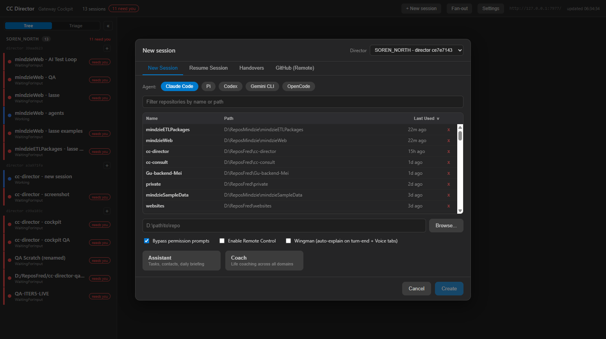
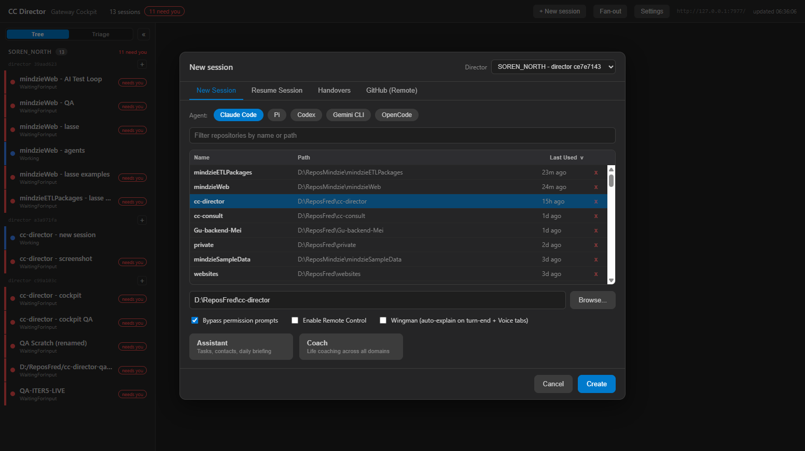
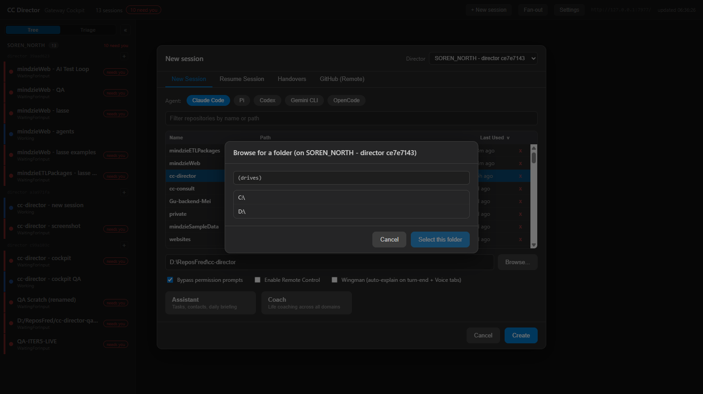
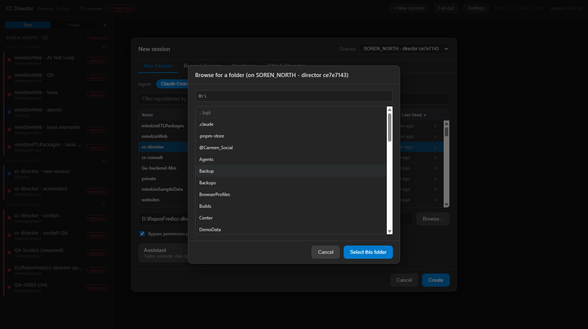
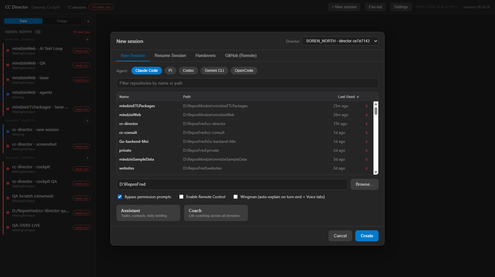
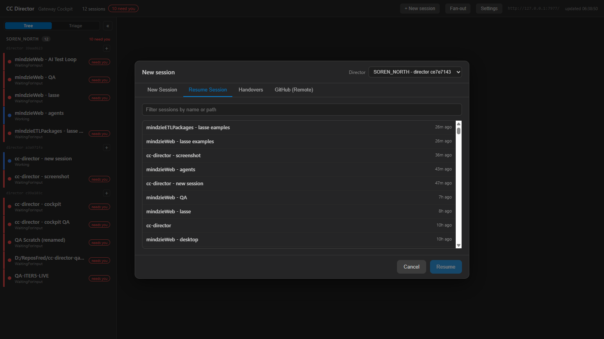
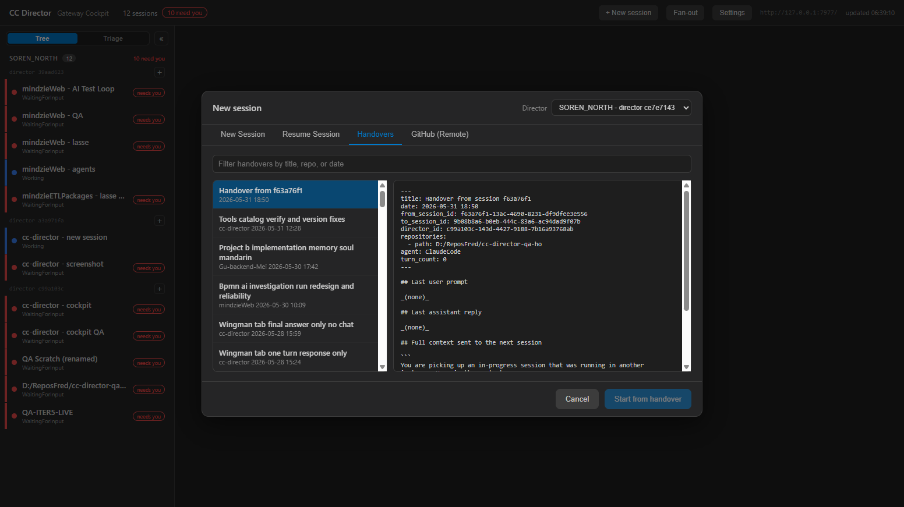
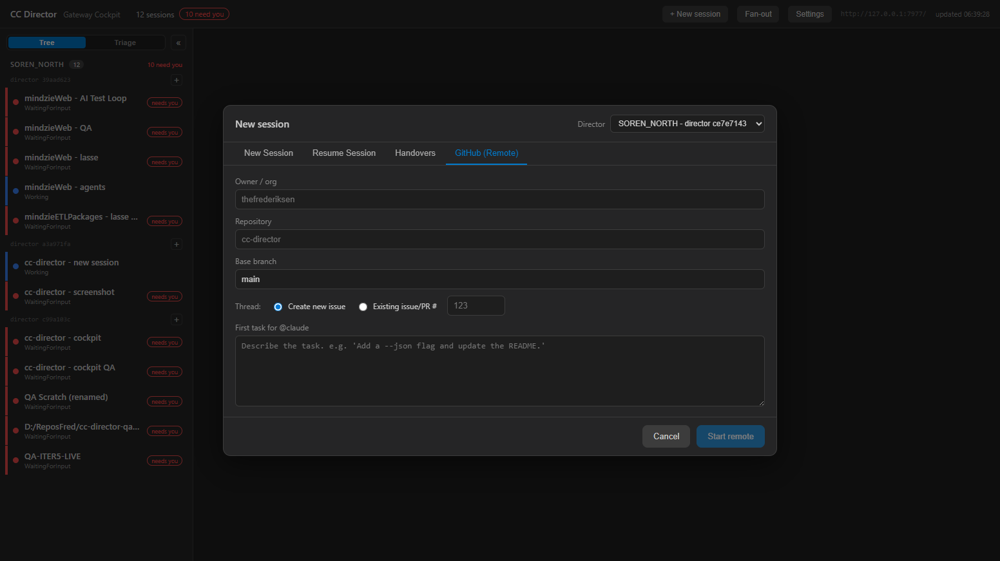
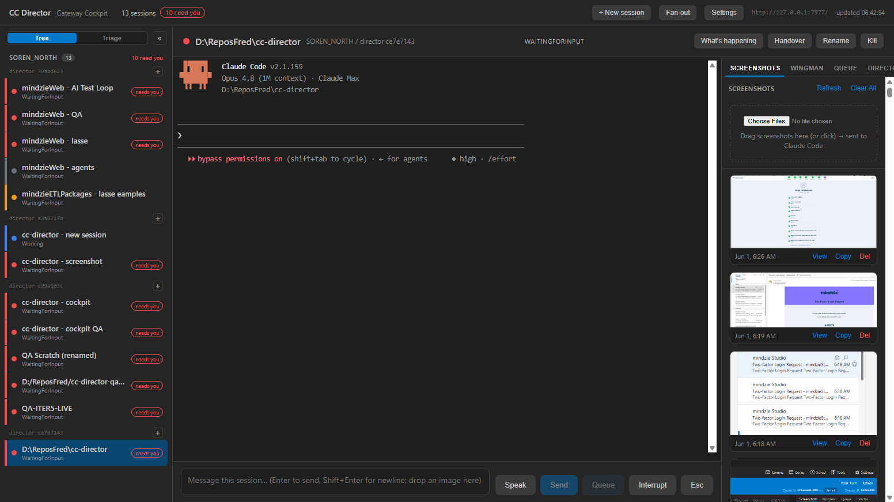

# Cockpit New Session Dialog - Full Parity: QA Report

**Date:** 2026-06-01
**Author:** Claude (autonomous implementation + QA)
**Scope:** Bring the Cockpit (Blazor Server) "New session" dialog to full feature parity
with the desktop Avalonia `NewSessionDialog`, including the ability to select an existing
repository AND browse/select any directory on the Director's machine.

---

## 1. Executive Summary

All planned phases are implemented, built clean, and verified end-to-end against a live
stack (Cockpit -> Gateway -> test-slot Director). The Cockpit "New session" dialog now
matches the desktop dialog:

- **Agent chips** (Claude Code / Pi / Codex / Gemini CLI / OpenCode)
- **Searchable, sortable recent-repos table** (Name / Path / Last Used) with per-row remove
- **Path field + Browse...** remote folder picker (navigate drives and any directory)
- **Option toggles**: Bypass permission prompts, Enable Remote Control, Wingman
- **Assistant / Coach** quick-launch cards
- **Resume Session** tab (resumable Claude sessions)
- **Handovers** tab (list + live preview + start-from-handover)
- **GitHub (Remote)** tab (owner/repo/branch/issue/prompt)

**Verification result:** PASS. 13/13 backend integration tests pass; all 7 new REST routes
verified live both directly on the Director and through the Gateway proxy; the dialog was
driven in a real browser and a session was created end-to-end with the Bypass flag correctly
applied.

> Isolation: the test ran against a fresh **slot-5** Director and a **separate local Gateway**
> started with `CC_GATEWAY_NO_TAILSCALE=1` on port 7977, so the user's production Directors,
> production Gateway, and Tailscale Serve mappings were never touched.

---

## 2. What Was Built

### 2.1 Contracts (`CcDirector.Gateway.Contracts`)
- `NewSessionRequest.ResumeSessionId` (new field, for the Resume tab).
- New DTOs: `ClaudeSessionDto`, `HandoverDto`, `HandoverContentDto`, `CoachingCategoryDto`,
  `DirEntryDto`, `DirectoryListingDto`.

### 2.2 Director Control API (`ControlEndpoints.cs`)
- `DELETE /repos?path=` - remove a repo from the recent list.
- `GET /coaching/categories` - Assistant/Coach cards with resolved paths.
- `GET /claude-sessions` - resumable sessions (history store + Claude session index).
- `GET /handovers` and `GET /handovers/content?path=` - handover list + preview.
- `GET /fs/list?path=` - remote folder browser (drives when no path).
- `POST /sessions` now honors `ResumeSessionId` (was hardcoded null).
- New Core helper `HandoverScanner` (testable frontmatter parsing).

### 2.3 Gateway proxy (`GatewayEndpoints.cs` + `DirectorEndpointClient.cs`)
- `/directors/{id}/...` proxy routes for: repos DELETE, coaching/categories,
  claude-sessions, handovers (+content), fs/list, and sessions/github.
- Dev/test isolation flag `CC_GATEWAY_NO_TAILSCALE=1` in `TailscaleServeProvisioner`.

### 2.4 Cockpit (`Cockpit.razor` + `GatewayClient.cs` + `app.css`)
- Tabbed dialog rebuild + repo table + browse modal + option toggles + cards.
- New `GatewayClient` methods for every new endpoint.

---

## 3. REST API Testing

### 3.1 Integration tests (xUnit, in-process ControlApiHost)

`src/CcDirector.Gateway.Tests/CockpitParityEndpointsTests.cs` - **13/13 PASS**.
Each runs a real `ControlApiHost` on an ephemeral port with `CC_DIRECTOR_ROOT` and
`CC_VAULT_PATH` redirected to a temp dir (isolated; never touches the real vault).

| # | Test | Asserts |
|---|------|---------|
| 1 | `Repos_lists_seeded_repositories_with_lastused` | seeded repos returned |
| 2 | `Delete_repo_requires_path` | 400 without `path` |
| 3 | `Delete_repo_removes_from_registry` | repo removed; list shrinks |
| 4 | `Coaching_categories_returns_assistant_and_coach_with_paths` | both cards + paths |
| 5 | `Claude_sessions_returns_a_list` | 200 + list shape |
| 6 | `Handovers_lists_seeded_handover_with_parsed_frontmatter` | title/date/repo/session parsed |
| 7 | `Handover_content_returns_full_text` | full markdown returned |
| 8 | `Handover_content_requires_path` | 400 without `path` |
| 9 | `Handover_content_rejects_path_outside_folder` | 400 path-traversal guard |
| 10 | `Fs_list_without_path_returns_drive_roots` | drives, `IsDrive=true` |
| 11 | `Fs_list_with_path_returns_subdirectories_and_parent` | subdirs + parent path |
| 12 | `Fs_list_with_nonexistent_path_returns_400` | 400 for bad path |
| 13 | `Create_session_accepts_resume_session_id_field` | body w/ ResumeSessionId parses |

```
Passed!  - Failed: 0, Passed: 13, Skipped: 0, Total: 13 - CcDirector.Gateway.Tests.dll
```

### 3.2 Live verification - directly on the test Director (`http://127.0.0.1:7880`)

| Endpoint | Result |
|----------|--------|
| `GET /repos` | 200 (6699 bytes) |
| `GET /coaching/categories` | 200 (324 bytes) |
| `GET /claude-sessions` | 200 (878893 bytes) |
| `GET /handovers` | 200 (22748 bytes) |
| `GET /fs/list` (drives) | 200 (136 bytes) |
| `GET /fs/list?path=D:\ReposFred` | 200 (4733 bytes) |
| `GET /fs/list?path=D:\nope-xyz` | 400 (bad path) |
| `DELETE /repos` (no path) | 400 |
| `DELETE /repos?path=<bogus>` | 200 `{removed:false}` (non-destructive) |

### 3.3 Live verification - through the Gateway proxy (`http://127.0.0.1:7977`)

The exact path the Cockpit uses: `/directors/{id}/...` for Director `ce7e7143`.

| Proxy route | Result |
|-------------|--------|
| `GET /directors/{id}/repos` | 200 (6699 bytes) |
| `GET /directors/{id}/coaching/categories` | 200 (324 bytes) |
| `GET /directors/{id}/claude-sessions` | 200 (878893 bytes) |
| `GET /directors/{id}/handovers` | 200 (22748 bytes) |
| `GET /directors/{id}/fs/list` (drives) | 200 (136 bytes) |
| `GET /directors/{id}/fs/list?path=D:\ReposFred` | 200 (4733 bytes) |
| `DELETE /directors/{id}/repos?path=<bogus>` | 200 `{removed:false}` |

All proxy routes return identical payloads to the direct calls, confirming the full
Cockpit -> Gateway -> Director chain.

---

## 4. UI Screenshots (live, driven via cc-playwright)

### 4.1 New Session tab - full parity
The dialog with agent chips, sortable recent-repos table (Name / Path / Last Used) with
per-row remove, path field + Browse, the three option toggles, and Assistant/Coach cards.



### 4.2 Selecting an existing repository
Clicking a row highlights it, fills the path field, and enables Create.



### 4.3 Browse - drive roots (remote filesystem)
The Browse... button opens a remote folder picker showing the Director machine's drives.



### 4.4 Browse - navigating into a drive
Navigating into `D:\` lists its real sub-directories with an up-level entry.



### 4.5 Browse - navigating into a directory
Navigated into `D:\ReposFred`, showing the live directory contents.


### 4.6 Browsed path selected
"Select this folder" fills the path with `D:\ReposFred` - a directory NOT in the recents
list, proving arbitrary-directory selection.



### 4.7 Resume Session tab
Live resumable Claude sessions with names and relative times.



### 4.8 Handovers tab
Handover documents (left) with a live markdown preview (right) and Start-from-handover.



### 4.9 GitHub (Remote) tab
Owner/repo/branch, new-issue vs existing-thread, and the first-task prompt.



### 4.10 End-to-end create
Creating a session in `D:\ReposFred\cc-director` with Bypass permission prompts checked.
The new session is created and selected; the terminal shows **"bypass permissions on"**,
confirming the checkbox flowed through as `--dangerously-skip-permissions`.



---

## 5. Test Stack & Isolation

| Component | How it was run | Port |
|-----------|----------------|------|
| Test Director | `cc-director5.exe` via `cc-director-launch` task (slot 5) | 7880 (loopback) |
| Local Gateway | `dotnet run` with `CC_GATEWAY_NO_TAILSCALE=1 --port 7977` | 7977 (loopback) |
| Cockpit | `dotnet run` (Development), `Cockpit__GatewayUrl=http://127.0.0.1:7977` | 7471 |

Production was never touched: no production Director was killed, the production Gateway
service was not restarted, and Tailscale Serve mappings were left intact (the local Gateway's
provisioner was disabled by `CC_GATEWAY_NO_TAILSCALE=1`).

---

## 6. Files Changed

- `src/CcDirector.Gateway.Contracts/NewSessionRequest.cs` (ResumeSessionId)
- `src/CcDirector.Gateway.Contracts/CockpitParityDtos.cs` (new)
- `src/CcDirector.Core/Sessions/HandoverScanner.cs` (new)
- `src/CcDirector.ControlApi/ControlEndpoints.cs` (6 endpoints + resume passthrough + helpers)
- `src/CcDirector.Gateway/Api/GatewayEndpoints.cs` (7 proxy routes)
- `src/CcDirector.Gateway/Discovery/DirectorEndpointClient.cs` (7 client methods)
- `src/CcDirector.Gateway/Tailscale/TailscaleServeProvisioner.cs` (CC_GATEWAY_NO_TAILSCALE)
- `src/CcDirector.Cockpit/Services/GatewayClient.cs` (7 methods)
- `src/CcDirector.Cockpit/Components/Pages/Cockpit.razor` (tabbed dialog + browse + @code)
- `src/CcDirector.Cockpit/wwwroot/app.css` (dialog styles)
- `src/CcDirector.Gateway.Tests/CockpitParityEndpointsTests.cs` (new, 13 tests)

---

## 7. Notes / Follow-ups

- The dialog degrades gracefully against Directors that predate these endpoints: repos still
  load (legacy endpoint), and the optional coaching cards simply do not appear rather than
  showing an error. Resume/Handovers/Browse against an old Director surface a clear error.
- Nothing has been committed (per project rules); changes are on the working tree.
- The QA stack (slot-5 Director, local Gateway on 7977, Cockpit on 7471) was left running for
  live review. To tear down: stop the Cockpit/Gateway `dotnet run` processes and
  `Stop-Process` the slot-5 `cc-director5` Director.
