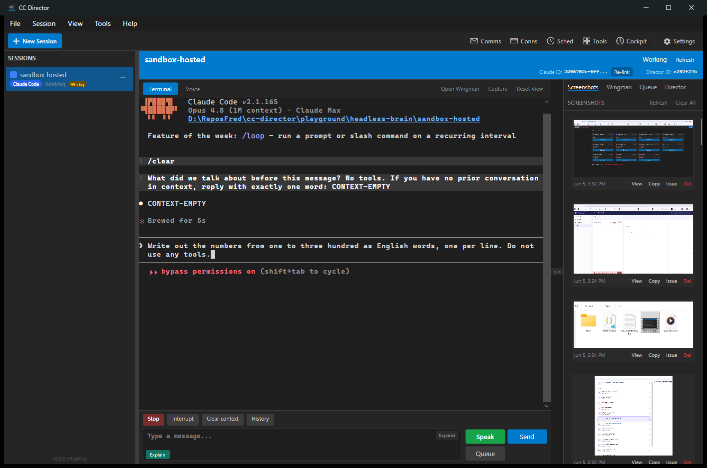
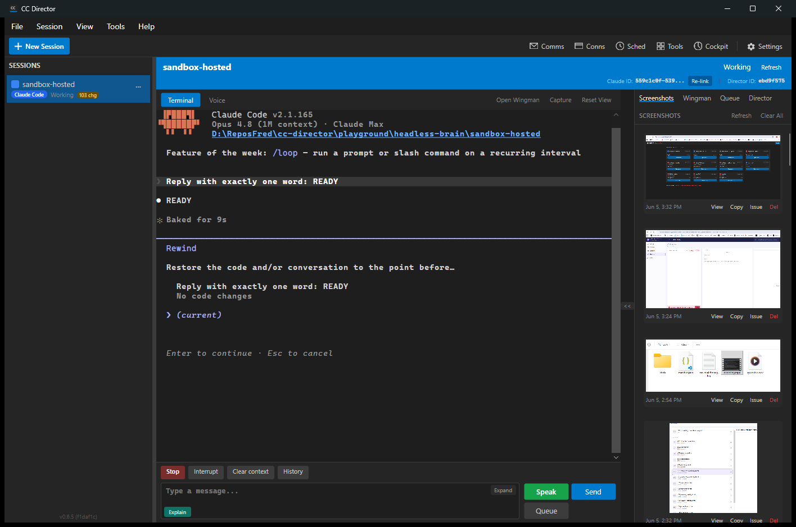
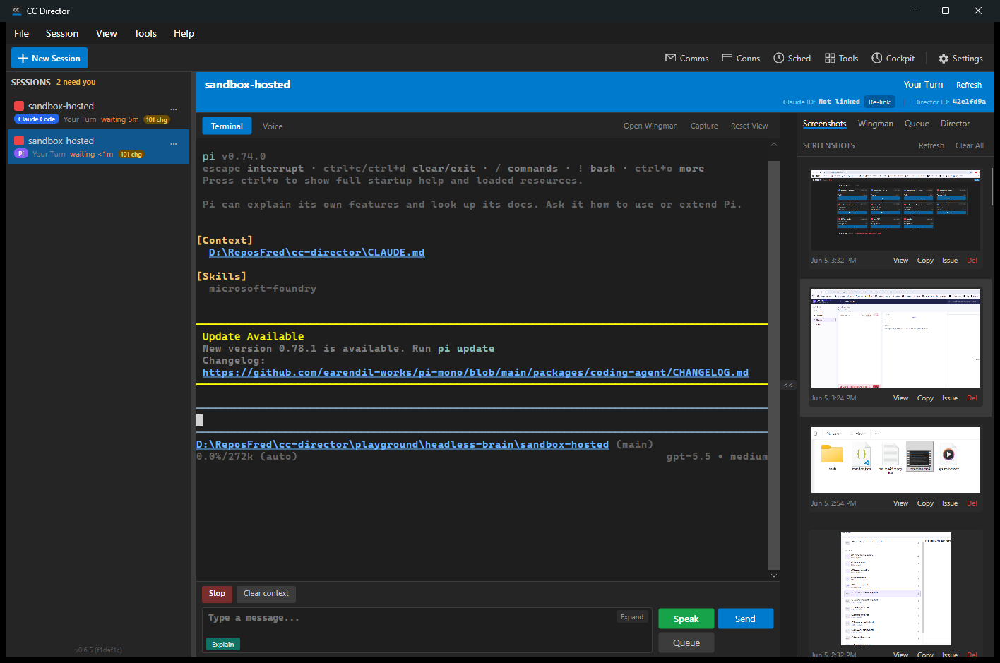
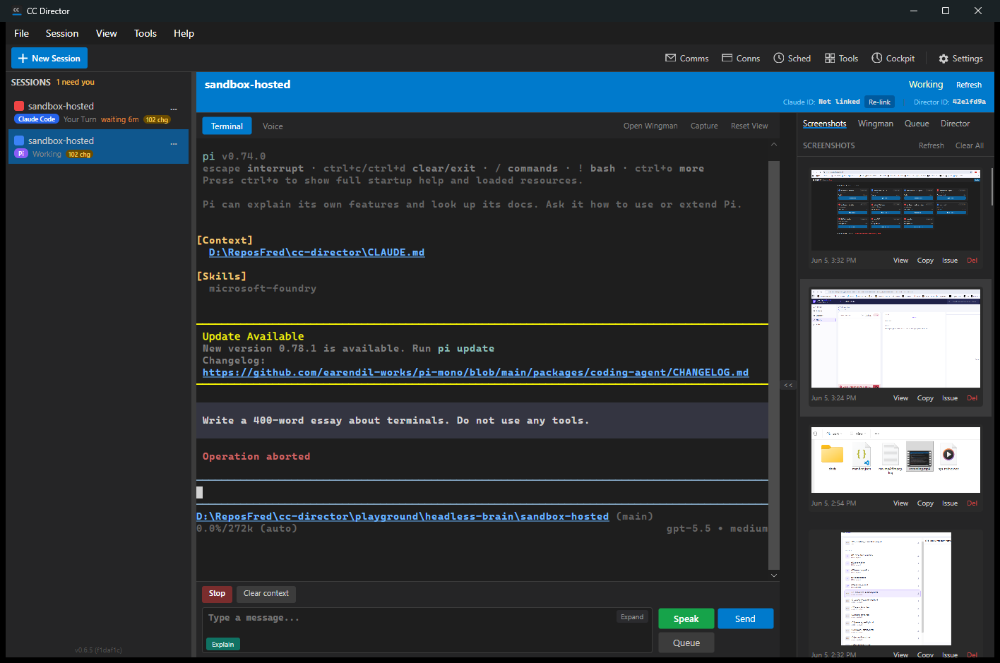
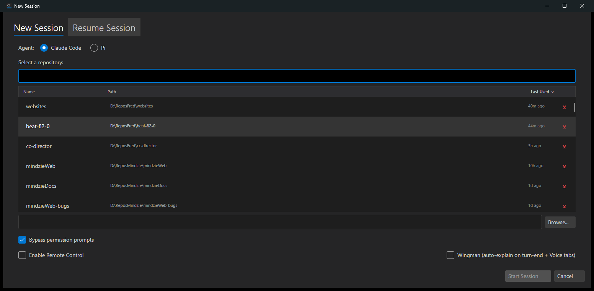

# Director on Drivers - QA Report

**Date:** 2026-06-05 &nbsp;|&nbsp; **Verdict: ALL 8 CASES PASS**

Deliverables under test (plan: docs/plans/director-drivers.md - all five phases):

1. **cc-director migrated onto the driver layer**: `Session` routes cancel / interrupt / clear-context / history / prompt-submit through `IAgentDriver` (ClaudeDriver for Claude, the new **PiDriver** for pi, GenericDriver with the pre-driver bytes for unverified CLIs).
2. **New session action buttons**: Stop / Interrupt / Clear context / History above the prompt bar, rendered from the session driver's declared capabilities - a Pi session automatically shows fewer buttons than a Claude session, with zero per-agent UI code.
3. **New REST surface**: `/clear-context` (clear + transcript re-discovery + in-place relink in one call), `/history-picker`; `/interrupt` + `/escape` re-plumbed through drivers; `SessionDto.DriverCapabilities` for clients.
4. **Echo-verified submit in the Director** (PTY transports only): every programmatic send now goes through ClaudeDriver's type-verify-Enter protocol - the composer-race fix from the hosted-agent QA, now protecting the Director too.

Test rig: slot-5 Director (cc-director5.exe v0.6.5 + drivers, launched via Task Scheduler), real desktop window driven by UI Automation, captured with PrintWindow. Claude Code v2.1.165 / Opus 4.8 / Claude Max; pi v0.74.0 / gpt-5.5.

---

## Results summary

| # | Case | Result | Evidence |
|---|------|--------|----------|
| DQ-1 | Unit suites | **PASS** - Core.Tests 1461/1464 (the 1 failure is the documented SessionLogWriter parallel-load flake; passes 4/4 in isolation), HostedAgent+Drivers 43/43, AgentBrain 16/16 | dotnet test |
| DQ-2 | Driver wiring, zero regression | **PASS** - Claude session DTO declares the full capability set; /escape + /interrupt return accepted via drivers (same bytes as before, new owner) | REST transcript below |
| DQ-3 | STOP button | **PASS** - a running 300-number turn aborted from the desktop button; claude restored the prompt to its composer (its Esc semantics) | dq3-actionbar.png, dq3-stopped.png |
| DQ-4 | CLEAR CONTEXT + auto-relink | **PASS** - one POST /clear-context: transcript c880688e -> 2496702e, recall answered CONTEXT-EMPTY, /usage follows the NEW transcript, header badge shows the relinked id. The stale-relink gap from the issue #172 spike is closed Director-side | dq3-actionbar.png (header) |
| DQ-5 | HISTORY button (double-Esc) | **PASS** - claude's Rewind picker opened from the button; **timing tuned live**: 120ms gap got coalesced (no picker), 350ms reliable - now baked into ClaudeDriver | dq5-history.png |
| DQ-6 | Pi session | **PASS** - bar shows ONLY Stop + Clear context (PiDriver declares Cancel+ClearContext); a live pi turn (gpt-5.5) stopped by the button: "Operation aborted". pi's own header confirms the keystroke research: "escape interrupt - ctrl+c/ctrl+d clear/exit" | dq6-pi-bar.png, dq6-pi-stopped.png |
| DQ-7 | Echo-verified Director submit | **PASS** - REST /prompt sends produced exact replies (DRIVERS, READY, CONTEXT-EMPTY) through the verify-then-Enter path; non-PTY transports (Pipe/Studio/Embedded/Remote) explicitly keep their own submit semantics | REST transcript |
| DQ-8 | Existing surfaces unbroken | **PASS** - full Core suite green (modulo the known flake), /summary //usage //buffer all exercised live, prompt-bar/queue paths funnel through the same SendTextAsync that passed DQ-7 | suites + live run |
| DQ-9 | Agent picker: "verified driver = shipped" | **PASS** - with alpha OFF (the real default config) the New Session dialog offers exactly Claude Code + Pi; Codex/Gemini/OpenCode (GenericDriver, unverified) stay alpha-gated and graduate automatically when a real driver lands (`alpha \|\| HasVerifiedDriver(kind)`) | dq9-picker-alpha-on.png |

---

## DQ-3 / DQ-4 - The action bar on a Claude session

Stop / Interrupt / Clear context / History above the prompt input. The terminal behind it shows the DQ-4 clear cycle (the /clear, the CONTEXT-EMPTY recall) and the header badge carries the post-clear relinked Claude ID:


STOP during a 300-number generation - aborted, prompt restored to the composer by claude's own Esc semantics:



## DQ-5 - HISTORY opens claude's Rewind picker

Driver-tuned double-Esc (350ms gap, live-calibrated) from the button:



## DQ-6 - Pi: fewer capabilities, fewer buttons, working Stop

The same UI code renders only what PiDriver declares. pi's startup header is visible proof of why per-CLI drivers exist (its Ctrl+C CLEARS or QUITS - a naive interrupt would kill it; PiDriver refuses InterruptAsync):



A live pi turn stopped by the button - "Operation aborted":



## DQ-9 - Pi ships by default ("verified driver = shipped")

The New Session dialog under the REAL non-alpha config: the agent picker is no longer
an alpha feature - Claude Code and Pi (both with live-verified drivers) are baked in,
while the GenericDriver agents stay behind the flag until their drivers are written:



## REST transcript (DQ-2 / DQ-4 / DQ-7, abridged)

```
POST /sessions {agent: ClaudeCode}      -> caps: ClearContext, Cancel, TranscriptRead,
                                                PreassignedSessionId, Interrupt, History
POST /sessions/{sid}/escape             -> accepted: true
POST /sessions/{sid}/interrupt          -> accepted: true
POST /sessions/{sid}/prompt "DRIVERS"   -> reply: DRIVERS          (echo-verified submit)
GET  /sessions/{sid}/usage              -> context=62950 msgs=2
POST /sessions/{sid}/clear-context      -> old=c880688e new=2496702e (auto-relink)
POST /sessions/{sid}/prompt recall      -> reply: CONTEXT-EMPTY
GET  /sessions/{sid}/usage              -> follows the NEW transcript (msgs=2)

POST /sessions {agent: Pi}              -> caps: ClearContext, Cancel
(pi turn) BtnStopTurn                   -> terminal: "Operation aborted"
```

## Defects found and fixed during this QA

| # | Defect | Root cause | Fix |
|---|--------|-----------|-----|
| D-1 | HISTORY button produced no picker | ClaudeDriver's double-Esc used a 120ms gap; claude coalesces presses that close together | Gap tuned live to 350ms (REST-probed until the Rewind picker appeared), baked into ClaudeDriver with the calibration note |
| D-2 | (design-time) echo-verified submit would have broken Studio/Pipe/Embedded sessions | Those transports have no TUI echo to verify | Session gates the driver submit on BackendType == ConPty; non-PTY transports keep their own submit paths explicitly |

## What this proves

- The Director now drives every CLI through the same driver layer as the HostedAgent - one source of truth per tool's keystrokes.
- Capability-driven UI works end to end: PiDriver declares less, the bar shows less, and what IS shown actually works against the live tool.
- The composer-race protection and the clear+relink dance - both born in the hosted-agent QA - now protect the Director's daily-driver path too.

## Remaining (out of scope, tracked in the plans)

- Cockpit button bar (REST surface is ready: SessionDto.DriverCapabilities + the four endpoints)
- Codex / Gemini / OpenCode drivers (GenericDriver keeps them at pre-driver behavior until verified)
- pi transcript parsing (TranscriptRead for PiDriver)
- All code UNCOMMITTED pending review
