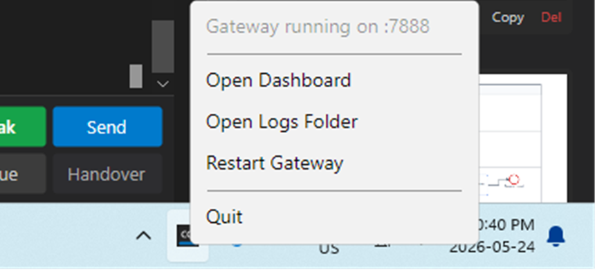

# CC Director Gateway - Tray App

**Date:** 2026-05-24
**Status:** Implemented and verified working
**Project:** `src/CcDirector.GatewayApp`
**Related:** plan at `docs/plans/gateway-tray-app.md`, GitHub issue #140

---

## What was built

The gateway used to be a foreground **console app** (`cc-director-gateway`): someone had to
launch it in a terminal and keep that window open. That is not a sustainable home for a
process that should always be running while the user is logged in.

This change wraps the existing gateway host in a small **Avalonia system-tray app**
(`cc-director-gateway-tray`). It runs quietly in the notification area, starts on login,
and is never accidentally closed: there is no main window, so only the tray menu's **Quit**
shuts it down.

The console app was left untouched - both now exist, and both run the exact same
`GatewayHost`. The tray app is for normal always-on use; the console stays for
debugging and CI where watching stdout is handy.

---

## Why it was built this way

**A tray app, not a Windows Service.** The gateway only does useful work while the user is
logged in - it discovers and serves that user's running Director instances. A service
running under `svchost`/SYSTEM would gain nothing and add lifecycle complexity. A
session-bound tray app matches what the gateway actually needs.

**Wrapped in one process, not a supervisor.** `GatewayHost` was already a self-contained
`IAsyncDisposable` with `StartAsync` / `StopAsync`, and the old `Program.cs` did nothing
but new it up and block on Ctrl+C. So the tray app is a near drop-in: it owns a
`GatewayHost` instance and swaps "block on Ctrl+C" for "live in the tray until Quit." Almost
no gateway code changed.

**Avalonia, to match the rest of CC Director.** CC Director is already Avalonia, and
Avalonia ships a built-in `TrayIcon` + `NativeMenu`. One UI stack, no new framework.

**Single instance via a named mutex.** The gateway is one-per-machine (it binds a fixed
port). A second launch - for example, autostart racing a manual start - would otherwise
crash on the port bind. The mutex makes the second instance detect the first and exit
cleanly instead.

**Autostart via the HKCU Run key.** Per-user (`HKCU\...\Run`) is the right scope because the
gateway must start *in the user's interactive session*, not machine-wide. Registration is
idempotent: the value is only written when missing or pointing at a different exe, so a
normal startup is a no-op.

**Status shown as text, not a colored dot.** The project's house rule forbids Unicode/emoji
in any output, so the menu reflects state in plain text ("Gateway running on :7888") rather
than a colored glyph.

---

## How it looks

### Tray icon in the notification area

The app shows a single "CC" tray icon. Right-clicking it opens the menu.


### Right-click menu

The menu shows live status plus the v1 actions: open the dashboard, open the log folder,
restart the gateway, and quit.



---

## Architecture

New project `src/CcDirector.GatewayApp` (`net10.0-windows`, `WinExe`, assembly
`cc-director-gateway-tray`), referencing the existing `CcDirector.Gateway` and
`CcDirector.Core`.

| File | Responsibility |
|---|---|
| `Program.cs` | `[STAThread]` entry; parses args; **named-mutex single-instance guard**; bootstraps Avalonia. |
| `GatewayAppOptions.cs` | Parses `--port N` and `--no-autostart`; holds them for the app to read. |
| `App.axaml(.cs)` | Sets `ShutdownMode = OnExplicitShutdown` (no main window kills it); creates the tray controller. |
| `GatewayTrayController.cs` | Owns the `TrayIcon` + `NativeMenu` and the in-process `GatewayHost`; start/stop/restart, status updates, menu actions. |
| `Autostart.cs` | Idempotent `HKCU\...\Run` registration (`EnsureRegistered` / `IsRegistered` / `Unregister`). |
| `Assets/tray.ico`, `app.ico` | Tray + application icon. |

**Menu actions**
- **Open Dashboard** - resolves the Tailscale HTTPS front-door URL (falls back to
  `http://127.0.0.1:<port>/`) and opens it in the default browser.
- **Open Logs Folder** - opens the gateway log directory in Explorer.
- **Restart Gateway** - `StopAsync` then a fresh `GatewayHost.StartAsync` (a new instance,
  because stop disposes the registry/Tailscale provisioner).
- **Quit** - stops the host cleanly, hides the icon, `Shutdown()`.

---

## Verification (all run against the live tray app)

**Build** - clean Release build (`net10.0-windows`), 0 warnings, 0 errors.

> Note: the Debug build is intentionally avoided here because the user's *running* console
> gateway holds the Debug DLLs locked. Building Release writes to a separate output and does
> not disturb any running process.

**Gateway live in-process** - `GET /healthz` on the tray app's port returns 200 and is
aggregating the real Directors running on this machine:

```
STATUS 200: {"status":"ok","directors":3,"sessions":4,"version":"1.0.0.0", ...}
```

**Dashboard reachable** - `GET /` (with a browser `Accept: text/html`) returns the gateway
dashboard, proving what "Open Dashboard" targets:

```
GET / -> 200, text/html; charset=utf-8, 18700 bytes, title "CC Director - Directory"
```

**Single-instance enforced** - launching a second copy while the first holds the mutex:

```
PASS: 2nd instance exited immediately (exit code 0); original instance still alive.
```

**Autostart registration** - launching with autostart enabled creates the Run key; it is
idempotent and removable:

```
PASS: HKCU\...\Run\CcDirectorGateway =
      "...\cc-director-gateway-tray.exe"
(removed afterwards to leave a clean state - see note below)
```

**Lifecycle log** - the tray app's own log shows the clean startup path:

```
[Program] CC Director Gateway tray app starting (port=7888)
[GatewayTrayController] Start
[GatewayTrayController] Tray icon created
[GatewayHost] listening on http://127.0.0.1:7888
[GatewayTrayController] Gateway running on :7888
```

---

## Follow-up hardening

Three rough edges from the first cut were closed in the same session.

### 1. Always-running is now actually wired

`scripts/install-gateway-tray.ps1` publishes a Release build to a stable per-user location,
`%LOCALAPPDATA%\cc-director\gateway-tray\`, and (with `-Launch`) starts it once. Because the
app self-registers the Run key at its own path on startup, installing from a fixed location
makes login-autostart correct and durable across rebuilds.

Verified: after `install-gateway-tray.ps1 -Launch`, the installed instance answered
`/healthz` 200, and the autostart Run key pointed at the installed exe:

```
HKCU\...\Run\CcDirectorGateway =
  "C:\Users\soren\AppData\Local\cc-director\gateway-tray\cc-director-gateway-tray.exe"
```

### 2. Port conflicts are surfaced, not silently fatal

A new gateway can't bind a port another process already owns. Previously that showed a bare
"FAILED" on a tray icon Windows hides by default - a silent dead-end. Now, on a bind
failure, the app probes the port and reports what is actually there, and stays alive so
**Restart** can retry. Verified live by launching against the in-use port 7878:

```
[GatewayTrayController] StartHostAsync FAILED: Failed to bind to address http://0.0.0.0:7878: address already in use.
[GatewayTrayController] DiagnoseStartFailure: probe=OurGateway, status="Another gateway already on :7878"
```

The process stayed alive (no crash). Status distinguishes three cases: another CC Director
gateway on the port, some other app on the port, or a different failure entirely.

### 3. Distinct gateway icon

The tray previously reused CC Director's "CC" icon, making the two indistinguishable. It now
has a dedicated emerald glyph with routing chevrons:


---

## Scope notes and what is deferred

- **v1 is tray-menu-only**, as agreed. A double-click status window (port, token, Tailscale
  state, log tail, Director count) was deliberately deferred.
- **Console gateway vs tray on port 7878.** The single-instance mutex guards tray-vs-tray,
  not tray-vs-console. If the old console `cc-director-gateway` is also running on 7878, the
  tray app now reports "Another gateway already on :7878" rather than failing silently - but
  the operational decision to retire the always-on console in favour of the tray is the
  user's to make.
- **Tailscale front-door on a non-default test port:** "Open Dashboard" resolves the tailnet
  front door (port 443), which maps to the default gateway port. On the standard
  port-7878 deployment this is correct; it only looks off when running a test instance on an
  alternate port.

---

## How to run

```
# normal (registers autostart, default port 7878)
cc-director-gateway-tray.exe

# test instance on another port, no autostart
cc-director-gateway-tray.exe --port 7888 --no-autostart
```
