# HostedAgent + ClaudeDriver - QA Report

**Date:** 2026-06-05 &nbsp;|&nbsp; **Verdict: ALL 12 CASES PASS**

Deliverables under test (plans: docs/plans/hosted-agent.md, docs/plans/agent-driver.md):

1. **CcDirector.HostedAgent** - a brain that hosts its OWN claude.exe inside an embedded pseudoconsole. No Director, no REST, zero external process dependency. Many instances per host process, one claude.exe child each.
2. **CcDirector.Core/Drivers** - the per-CLI driver layer: `IAgentDriver` + `ClaudeDriver` (launch args, echo-verified submit, Esc cancel, /clear, JSONL transcript reads). The HostedAgent is a generic host running a driver; `HostedAgent.For(AgentKind.Codex)` fails loud until a Codex driver is written and live-verified.
3. **IAgentBrain** - the shared contract (Ask / Cancel / Clear / Restart / Kill / Health) implemented by both the HostedAgent and the REST AgentBrainClient.
4. **Agent Brain Panel** - the big-button test harness, now with a Hosted/Director mode picker and a CANCEL TURN button.

Test rig: the panel and the two-brains smoke were launched via Windows Task Scheduler (clean process tree - the nested-ConPty rule), driven by UI Automation, captured with Win32 PrintWindow. Claude Code v2.1.165, Opus 4.8, **Claude Max subscription - no API key, no Director anywhere in the process tree**. Every claude.exe in this report is a direct child of the test harness itself.

---

## Results summary

| # | Case | Result | Evidence |
|---|------|--------|----------|
| HQ-1 | Unit suites | **PASS** - 48 tests green (32 HostedAgent+ClaudeDriver, 16 AgentBrain) | `dotnet test` |
| HQ-2 | Headless spawn | **PASS** - claude.exe is a CHILD of the panel process, carrying the driver's pre-assigned `--session-id` | hq2-start.png + process tree |
| HQ-3 | Ask | **PASS** - full reply, 13.3s, context tokens shown | hq3-ask.png |
| HQ-4 | Long answer | **PASS** - 3,331 chars intact (transcript path, no truncation). This exact prompt exposed defect D-1 and now passes through the echo-verified submit | hq4-long.png |
| HQ-5 | Clear context | **PASS** - codeword SILVERWOLF-31 stored, CLEAR (4.3s), recall returned exactly CONTEXT-EMPTY; claude.exe pid 82560 UNCHANGED through the clear | hq5-clear.png, hq5-verify.png |
| HQ-6 | Auto-clear mode | **PASS** - second ask had no memory (CONTEXT-EMPTY); resets 6.6s / 5.4s | hq6-autoclear.png |
| HQ-7 | Restart | **PASS** - claude.exe pid CHANGED (82560 -> 98420), fresh agent answered | hq7-restart.png |
| HQ-8 | Crash recovery | **PASS** - claude.exe killed externally; health DEAD + red dot; RESTART healed; answered "RECOVERED" | hq8-dead.png, hq8-recovered.png |
| HQ-9 | Kill | **PASS** - zero claude.exe children left under the panel | hq9-kill.png |
| HQ-10 | CANCEL TURN (driver Esc) | **PASS** - a 300-number generation aborted after ~8s via the driver's Esc keystroke; status "Turn cancelled - session stays usable"; next ask answered normally | hq10-cancel.png, hq10-after-cancel.png |
| HQ-11 | Two brains, one process | **PASS** - smoke host ran TWO HostedAgents side by side: parallel ALPHA (6.8s) / BRAVO (6.0s), killing A left B alive ("STILL-HERE") | smoke log below |
| HQ-12 | Unsupported drivers fail loud | **PASS** - `HostedAgent.For(Codex/Gemini/Pi/OpenCode)` throws NotSupportedException ("No agent driver exists... write the driver first") - unit-verified | For_UnsupportedAgentKinds_FailLoud |

**Latency profile (final build):** spawn-to-ready 4.8-5.2s (two brains in parallel); short ask 6-13s; 500-word answer 21.4s; clear 4.3-6.6s; restart ~10s. All replies read from the JSONL transcript, never the terminal screen.

---

## HQ-2 - Headless spawn (the architecture proof)

START HOST in hosted mode. The process tree shows claude.exe as a direct child of agent-brain-panel.exe with the ClaudeDriver's pre-assigned session id - no Director involved:

```
agent-brain-panel.exe (21024)
  \- claude.exe (82560) --dangerously-skip-permissions --session-id 19d43273-...
```

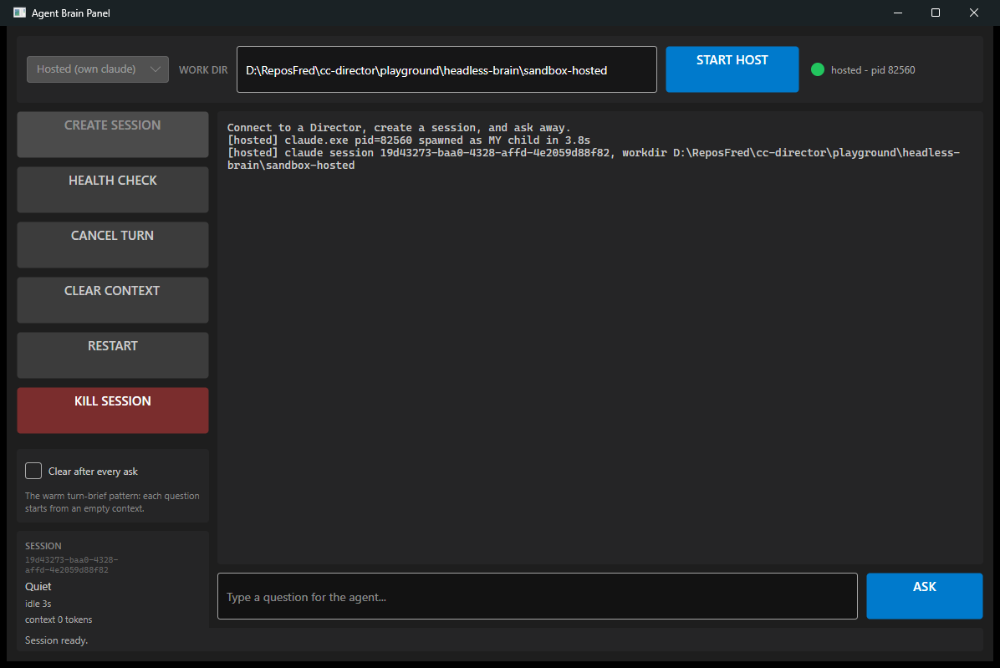

## HQ-3 / HQ-4 - Ask + long answer

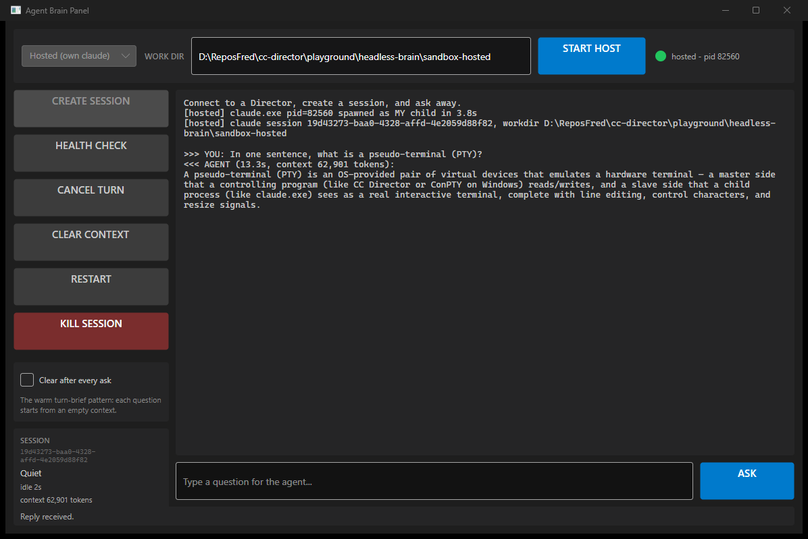

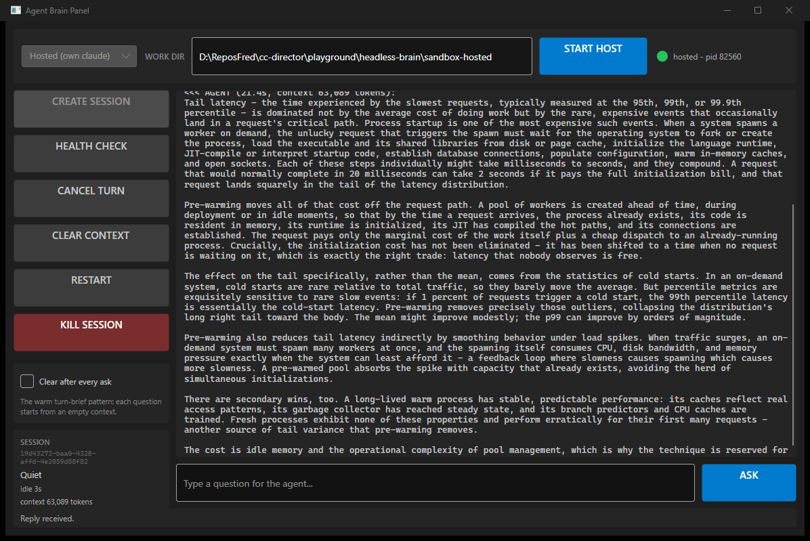

## HQ-5 - Clear context, process never restarted

The conversation is wiped (recall returns CONTEXT-EMPTY), the transcript id switches, and the claude.exe pid is identical before and after - the warm reset the whole design exists for.

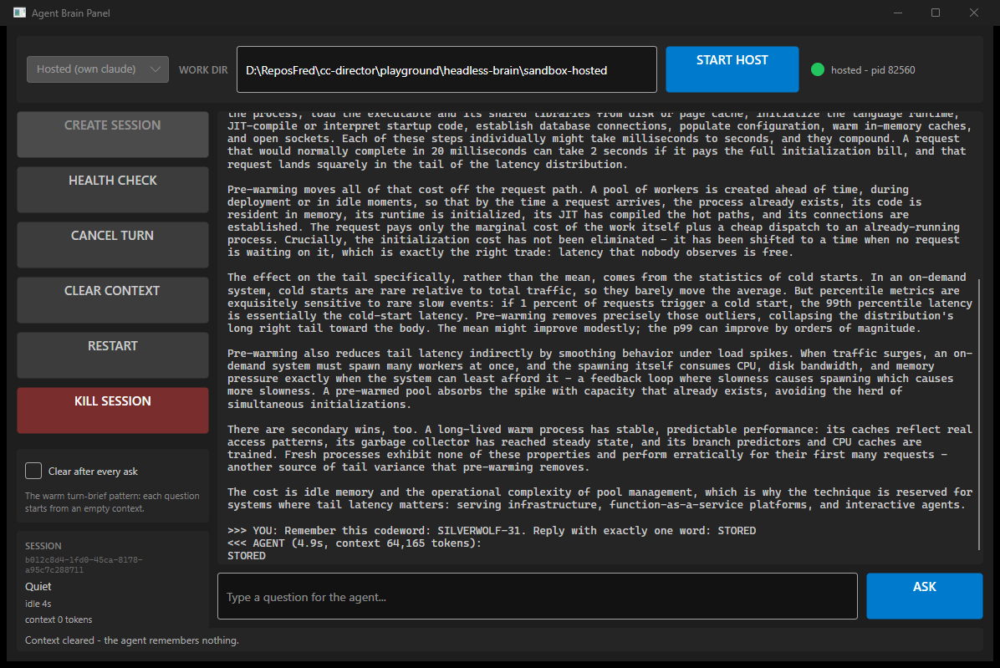

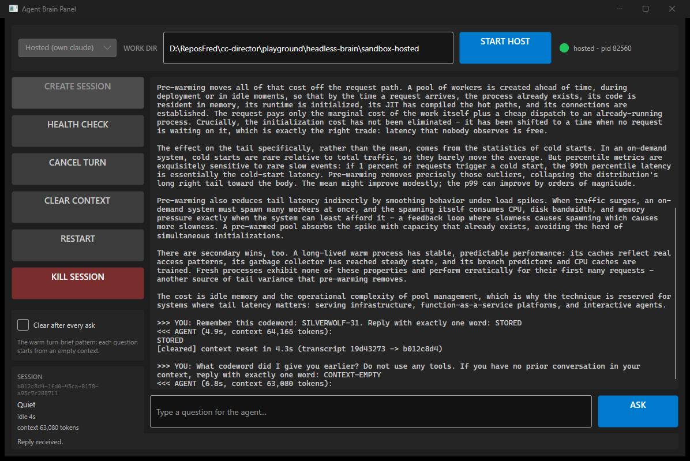

## HQ-6 - Auto-clear after every ask

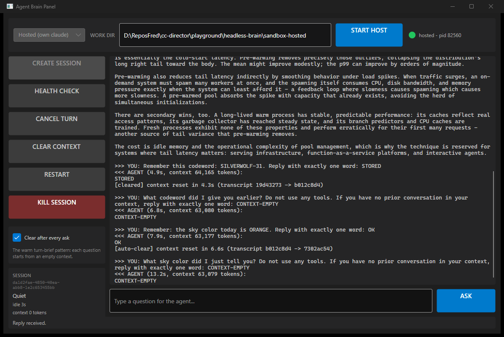

## HQ-10 - CANCEL TURN (the driver's Esc)

A deliberately long generation ("write out one to three hundred as words") cancelled mid-turn. The log shows the driver keystroke, the aborted ask, and the session answering PONG right after:

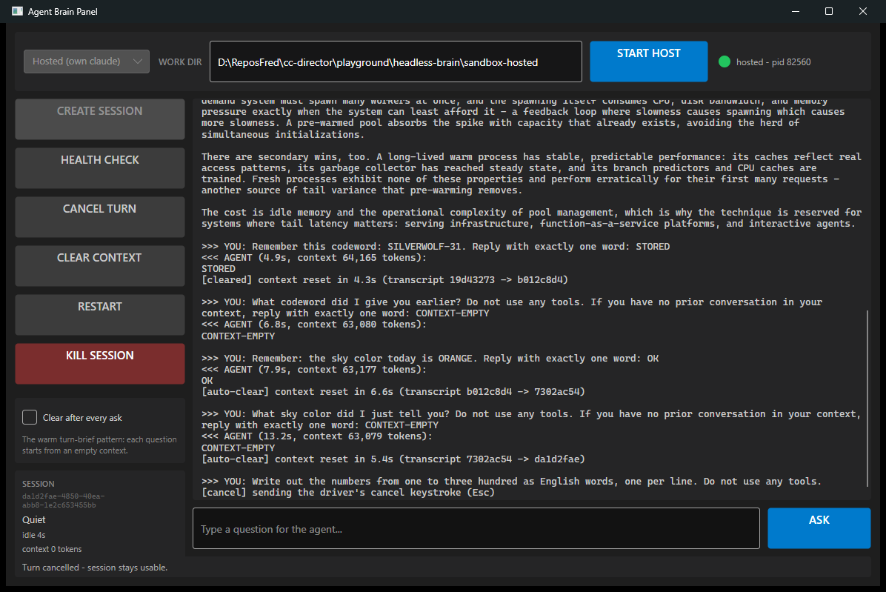

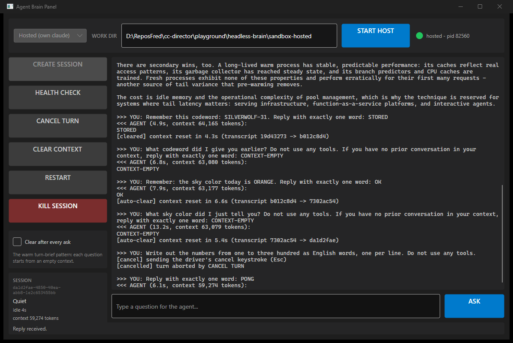

## HQ-7 / HQ-8 / HQ-9 - Restart, crash recovery, kill

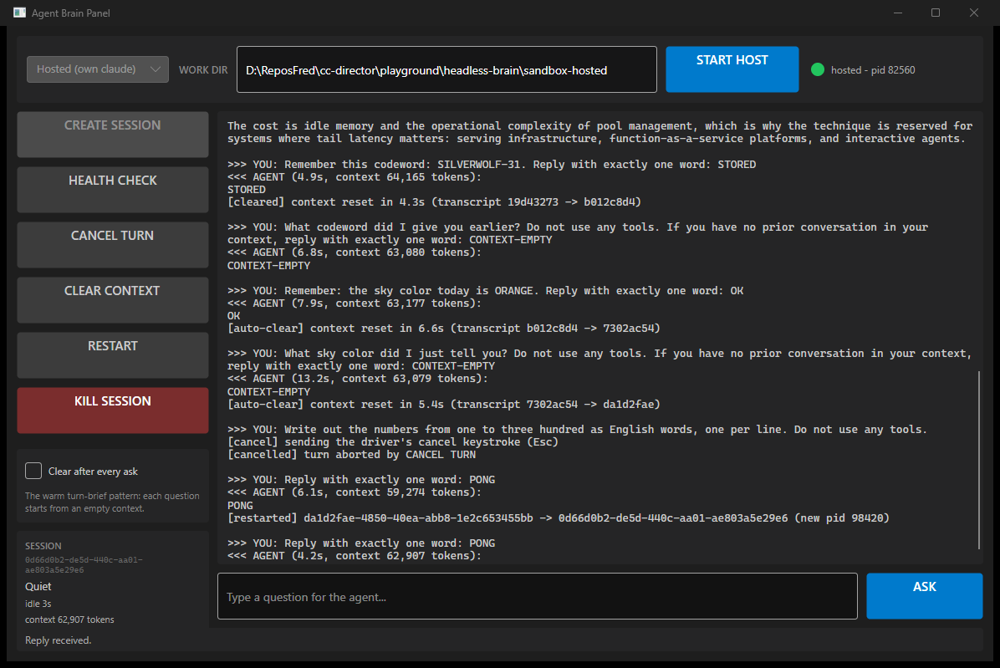

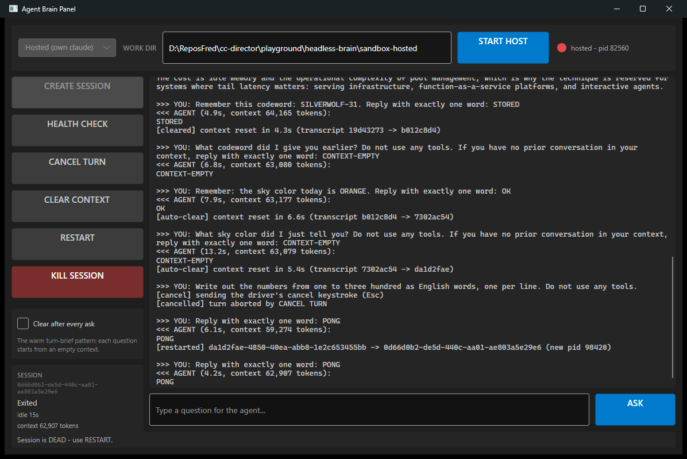

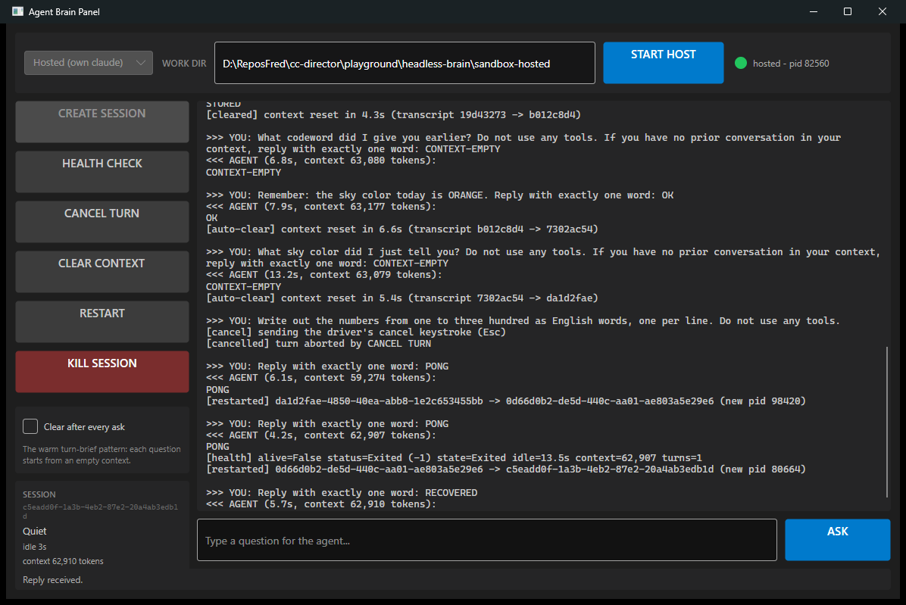

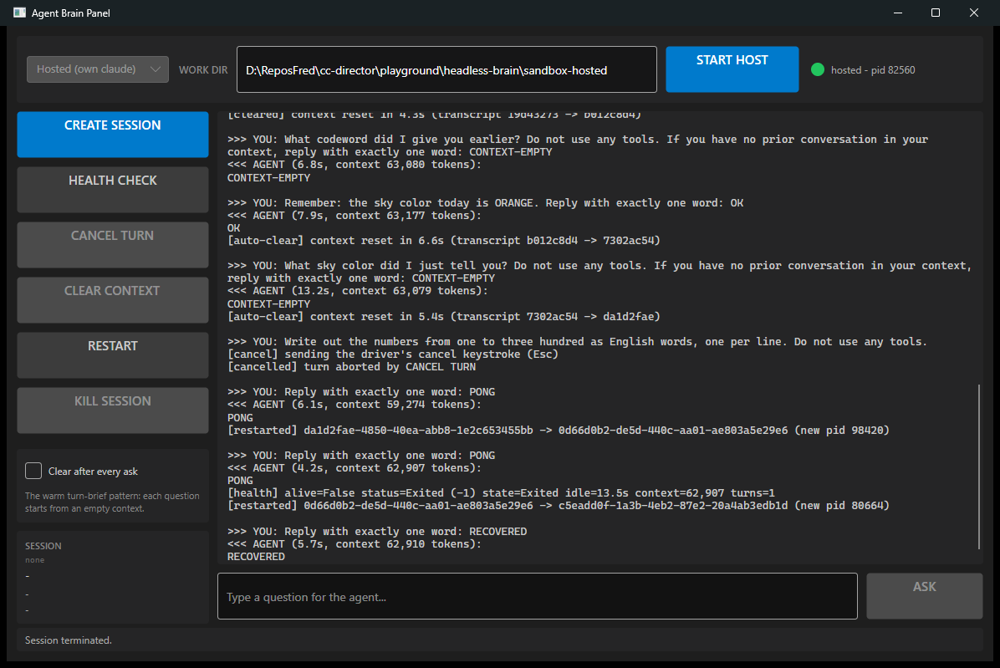

## HQ-11 - Two hosted brains in one process

Console smoke (windowless host, launched via Task Scheduler), verbatim output:

```
[smoke] host process pid=43444
[smoke] starting brain A and brain B in parallel...
[smoke] both ready in 4.8s
[smoke] brain A: claude pid=19844, session=334c64a3-48e4-404e-95b0-40b073ff8197
[smoke] brain B: claude pid=78732, session=c1d757d6-5bf5-4a2e-9ebc-9cfb0de74a1a
[smoke] asking both in parallel...
[smoke] A answered: ALPHA (6.8s)
[smoke] B answered: BRAVO (6.0s)
[smoke] killing brain A; brain B must stay alive and answer...
[smoke] brain B after A's death: alive=True
[smoke] B follow-up: STILL-HERE
[smoke] PASS: two independent hosted brains in one process
```

## Final-binary verification

After the last code change, the panel was rebuilt and re-verified live (START HOST + ask):

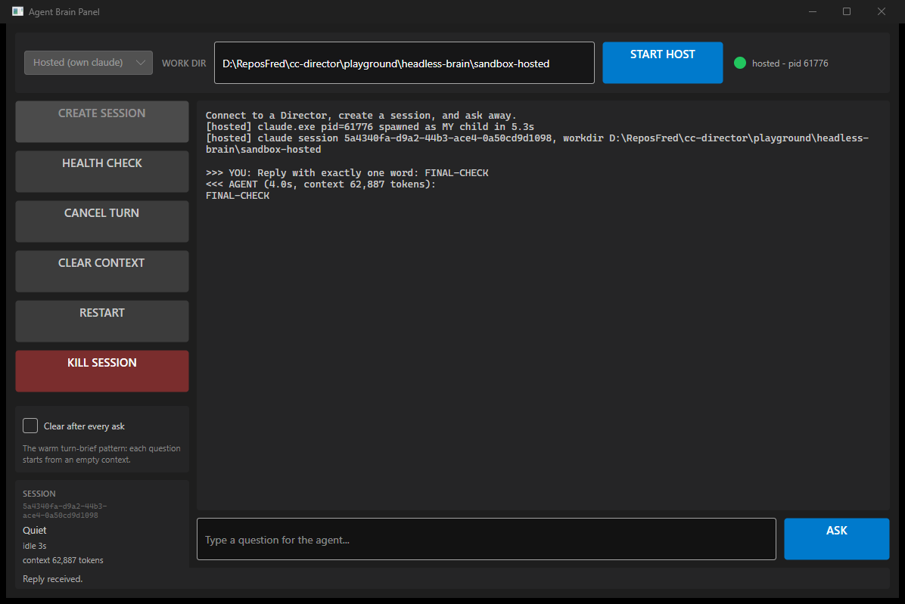

---

## Defects found and fixed during this QA

| # | Defect | Root cause | Fix |
|---|--------|-----------|-----|
| D-1 | A prompt arrived in claude's composer as "/Write ..." - a stray "/" turned it into a bogus slash command and the ask timed out | claude's TUI input handling races right after a turn ends; blind type-and-Enter trusts the composer | **Echo-verified submit** in ClaudeDriver: type WITHOUT Enter, verify the composer echo in the terminal byte stream (including a leading-"/" corruption check), only then press Enter; one Esc-and-retype recovery, then fail loud. Unit-tested with the exact live corruption replayed |
| D-2 | Both brains in the smoke died on first ask with "Input must be provided either through stdin or as a prompt argument when using --print" | Hosting the ConPty from a CONSOLE process with redirected stdio breaks the claude spawn (cousin of the nested-ConPty trap) | Smoke host made windowless (WinExe) writing its own log file; host-process requirements documented on the class |
| D-3 | Smoke retry failed differently: composer echo never appeared, claude alive | Working dirs under %TEMP% are untrusted - claude shows the trust-folder MODAL, so there is no composer | Working dirs placed under the trusted repo tree; the echo-failure exception now carries the ANSI-stripped terminal tail so this state is diagnosable from the log alone |

All three defects were caught BY the harness (echo verification, death diagnostics) rather than around it - which is the point of the driver layer: per-CLI quirks live in one tested class.

## What this proves (the asked-for outcome)

- **The ClaudeDriver works fully headless**: spawn, ask, long answers, cancel, clear-in-place, restart, crash detection, kill - all driven programmatically against an invisible terminal owned by the harness process itself.
- **Multiple brains per process** work (HQ-11), each with independent lifecycle.
- **Headless is a UI choice, not an architecture**: ConPty has no window; the Director's visible terminals and these invisible ones are the same machinery with and without a renderer.
- **Riding the Max subscription**: interactive sessions, no API key, no Agent SDK.

## Remaining (out of scope, tracked in the plans)

- Codex / Gemini / Pi / OpenCode drivers (each needs live keystroke verification)
- Director/Session migration onto drivers (incremental, /interrupt + /escape first)
- 24h soak + session-0/SYSTEM service-context validation (issue #172)
- All code UNCOMMITTED pending review
