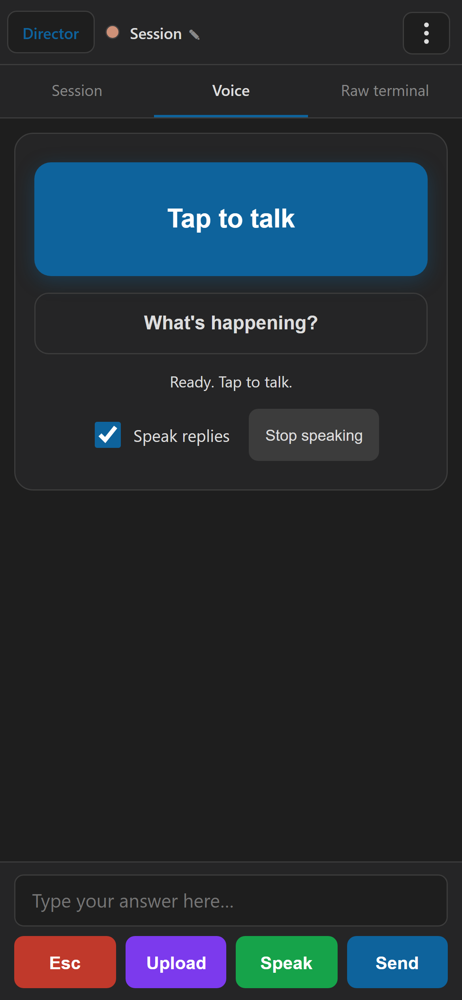
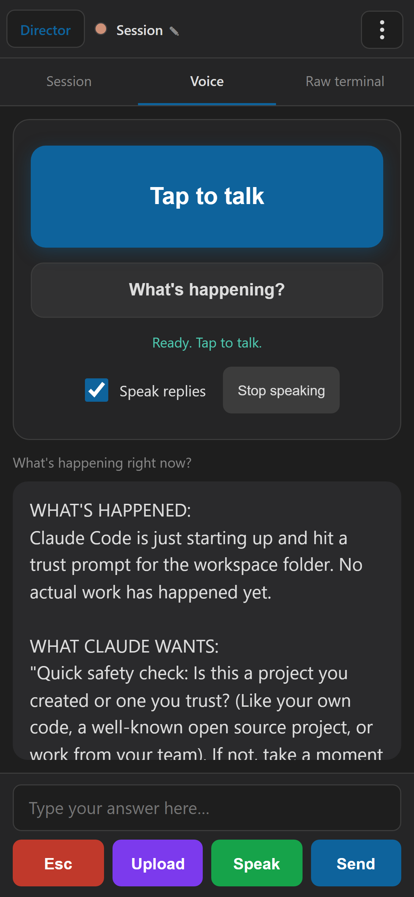

# Voice Unification - Functional Report

Date: 2026-05-25
Branch: main (uncommitted working tree)

## Goal

Consolidate the voice experience so the Android app and the HTML view share one
backend and feel the same, add an on-demand "What's happening?" button so you can
ask the agent to confirm the current state, clean up the noisy HTML voice screen,
and prove it works with screenshots and tests.

## Summary of what shipped

1. A shared session-level voice-mode flag now travels on the wire (SessionDto), so
   the HTML view, the Android roster, and (when wired) the desktop tile all read one
   authoritative source instead of guessing.
2. The HTML voice view gained the same on-demand "What's happening?" briefing the
   Android app already had, and the two now call the SAME backend endpoint - one
   implementation, two thin clients.
3. The HTML voice screen was de-cluttered: hero talk button, one secondary action,
   one concise status line. The verbose walkie-talkie hint paragraph is gone.
4. The Android app was consolidated onto the shared endpoints: its "What's happening?"
   now uses the same wingman briefing the web uses, and entering/leaving a session
   sets the shared voice-mode flag so the session shows as "being talked to" everywhere.

All HTML-side behavior was verified end to end in a real browser against a real
Director with a real agent session, with screenshots below. Android changes compile
(MAUI Android build, 0 errors) and pass the off-device unit tests; on-device end-to-end
was not run this session (no physical device attached) and remains the owner's step.

## Architecture: one backend, thin clients

The key finding driving this work: the HTML view and the Android app were already
~95% the same backend (same `/voice/utterance` upload + `/chat` round-trip, same
`ClaudeSummarizer`, same turn log). The only real divergence was the "what's happening"
feature, which the two clients implemented two different ways:

- HTML (before): had no such button on the voice screen.
- Android (before): read a recap (session history) via the conductor path.

This branch removes the divergence by standardizing both on
`POST /sessions/{sid}/wingman/ask` with `mode=explain` - a fresh, plain-language
briefing of what the session is doing right now. The HTML view calls it via `fetch`;
the Android app calls it via `DirectorVoiceClient.ExplainAsync`. Same endpoint, same
prompt, same answer - the client code is just transport.

The voice-mode flag follows the same principle. It already existed on the Director as
`Session.VoiceMode` (driven by the existing `/voice-mode` toggle the HTML uses on the
Voice tab). This branch surfaces it on `SessionDto.VoiceMode` so every client observes
the one value rather than each deciding locally. Durable cross-restart persistence was
deliberately left out: on a single-user tailnet the one active viewer's mode IS the
session's mode, so the existing in-memory flag is the right source of truth without
adding a parallel persisted concept.

## Evidence

### 1. The cleaned-up Voice screen + new button



The screen now reads as one primary action (hero "Tap to talk"), one quiet secondary
action (outlined "What's happening?"), a single-line status ("Ready. Tap to talk."),
and a compact controls row. The harness asserted both that the "What's happening?"
button is present AND that the old verbose hint paragraph was removed.

### 2. "What's happening?" works end to end



One tap fetched a live wingman briefing and rendered it in the reply panel:

> WHAT'S HAPPENED: Claude Code is just starting up and hit a trust prompt for the
> workspace folder. No actual work has happened yet.
> WHAT CLAUDE WANTS: "Quick safety check: Is this a project you created or one you
> trust?" ...

This was a real `POST /wingman/ask` (mode=explain) call against a real session (420
characters returned), not a stub. The text is also handed to the speech queue to be
read aloud (the spoken audio is not observable in a headless browser, so no `/tts`
network call is captured there; the on-screen render and the briefing fetch are the
verifiable parts).

### 3. The voice-mode flag round-trips on the wire

Pure REST against the running Director (no browser):

| Step | `SessionDto.voiceMode` |
|------|------------------------|
| Initial | true (left on by a prior toggle) |
| After `POST /voice-mode {enabled:true}` | true |
| After `POST /voice-mode {enabled:false}` | false |

`GET /sessions` reflected each change immediately - this is exactly the field the
Android roster and the desktop tile read.

## Test results

| Check | Result |
|-------|--------|
| Control API project build | PASS (0 warnings, 0 errors) |
| MAUI Android client build (net10.0-android) | PASS (0 errors; 50 pre-existing warnings) |
| Avalonia Director publish (slot 4) | PASS (34.9 MB single-file) |
| Android client unit tests | PASS (37/37, incl. 2 new VoiceMode roster tests) |
| Voice-mode wire round-trip (REST) | PASS (enable -> true, disable -> false) |
| HTML harness: session view loads | PASS |
| HTML harness: cleaned CTA + button present, hint removed | PASS |
| HTML harness: "What's happening?" renders a real briefing | PASS (420 chars) |

Test session was a throwaway repo under Temp; the owner's live session was never
touched. The test Director ran under Task Scheduler (slot 4) and was shut down after.

## Files changed

Backend / wire:
- `src/CcDirector.Gateway.Contracts/SessionDto.cs` - add `VoiceMode`.
- `src/CcDirector.ControlApi/ControlEndpoints.cs` - populate `VoiceMode` in `Map()`.

HTML view:
- `src/CcDirector.ControlApi/Web/session-view.html` - de-clutter the Voice CTA, add the
  "What's happening?" secondary button (+ CSS), add the `whatsHappening()` handler that
  calls `/wingman/ask` explain and speaks/renders the result.

Android client:
- `phone/CcDirectorClient/Voice/SessionInfo.cs` - add `VoiceMode`.
- `phone/CcDirectorClient/Voice/RosterParser.cs` - parse `voiceMode`.
- `phone/CcDirectorClient/Voice/DirectorVoiceClient.cs` - add `ExplainAsync` (shared
  briefing endpoint) and `SetVoiceModeAsync` (shared flag).
- `phone/CcDirectorClient/TalkPage.xaml.cs` - "What's happening?" now uses `ExplainAsync`;
  entering/leaving a session sets the shared voice-mode flag; roster shows a `[voice]` tag.
- `phone/CcDirectorClient.Tests/RosterParserTests.cs` - 2 new tests for `VoiceMode`.

Docs / harness:
- `docs/features/voice-unification/PLAN.md` - the implementation plan.
- `docs/features/voice-unification/harness/unification_harness.py` - the Playwright +
  REST harness used for this report.
- `docs/features/voice-unification/screenshots/` - screenshots + `results.json`.

## What is NOT done (honest gaps)

- Desktop tile badge: the flag is on the wire so the desktop tile CAN now read it, but
  the Avalonia tile does not yet render a voice-mode badge. This is the remaining piece
  of "mark the session everywhere" and is a small follow-up in `SessionViewModel` +
  the tile XAML.
- Android on-device end-to-end: the code compiles and unit tests pass, but talking to a
  session from a physical phone (mic -> transcribe -> reply -> native TTS) was not
  exercised this session. The shared endpoints it now calls are the same ones the HTML
  path exercised successfully here.
- Backend STT/cleanup consolidation (Workstream A in the plan): not part of this pass;
  the desktop in-app dictation still uses its own STT/cleanup pipeline.

## How to re-run the HTML proof

```
# Build + launch a test Director on slot 4 (Task Scheduler), create a scratch session,
# then:
python docs/features/voice-unification/harness/unification_harness.py \
    --base http://127.0.0.1:<port> --sid <scratch-session-id> \
    --out docs/features/voice-unification/screenshots
```
