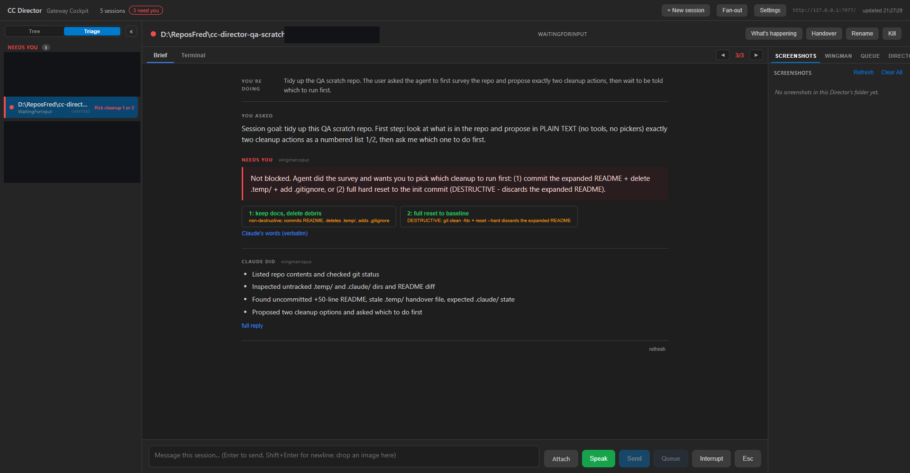
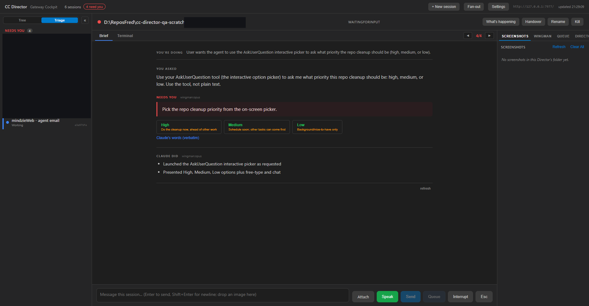
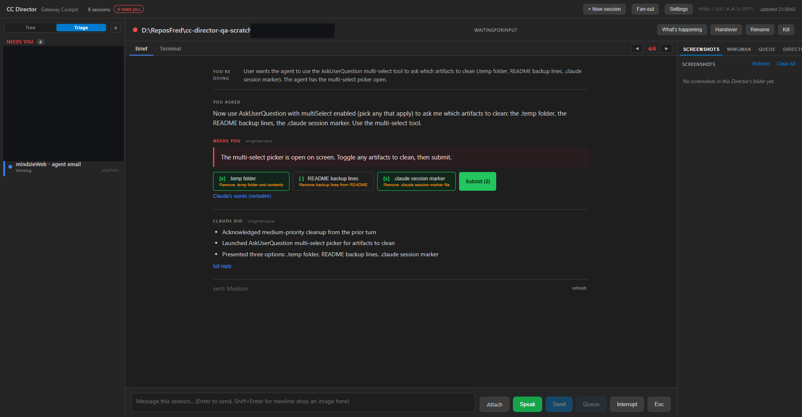
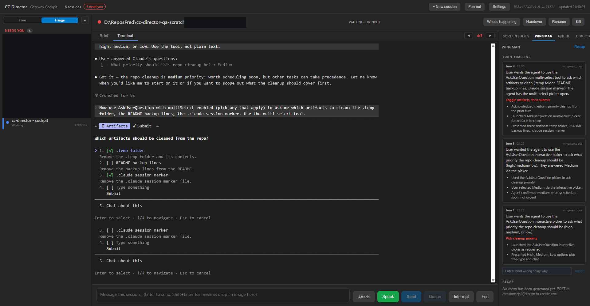

# Wingman Turn Briefing - QA Report

**Date:** 2026-06-04 (evening)
**Scope:** All four phases of `docs/plans/wingman-turn-briefing-implementation.md`, built and
live-verified in one pass. Architecture: `docs/architecture/wingman/TURN_BRIEFING.md` (v2.1).
**Verdict: the core loop works end to end with the real strong model. One real limitation found
and documented honestly (remote multi-select answering), plus rollout caveats.**

---

## What was built

| Phase | Deliverable | Status |
|---|---|---|
| P1 | Turn lifecycle: Session.BriefingState (orthogonal - a session can ask AND work), TurnBriefStore (durable JSON ring, survives restarts), TurnPackageBuilder, TurnBriefOrchestrator (turn-end trigger, 2.5s transcript-settle, watch-cancel, staleness discard), REST GET /turnbriefs + /latest, POST /turnbriefs/feedback, SessionDto.BriefingState + RailLine | DONE |
| P2 | WingmanTurnBriefGenerator: one structured OPUS call per turn end (claude --print side-spawn on the Max subscription, no --bare, no tools), prompt built from the six captured question shapes, validation layer (evidence must be verbatim, multi-select must carry submit, no fake options), degrade ladder to an honest stub | DONE |
| P3 | Cockpit: BriefPane renders the stored TurnBrief (YOU'RE DOING / NEEDS YOU with urgency + receipts / CLAUDE DID), one-tap option buttons (reply + keys paths), multi-select toggle+Submit UI, rail rows show the wingman's railLine instead of a state enum, "wingman reading..." yellow chips, wingman tab = turn timeline + D7 feedback. THE REGEX OPTION PARSER WAS DELETED (D6 made flesh). | DONE |
| P4 | D7 feedback corpus collection live and verified; fleet consumers (phone FIFO, voice) read the same store BY DESIGN - the Android-side port belongs to the Android-first track per standing rule, not attempted here | PARTIAL (by design) |

Tests: **41/41 green** (19 new TurnBrief suite: store ring/replace/restart survival, package
delta/caps/reply-pending, orchestrator lifecycle incl. watch-cancel and staleness discard,
generator prompt assembly + 8 validation cases; 22 existing Brief v1 tests untouched).
All projects build with 0 warnings.

## Live E2E evidence (slot-5 Director + dev Cockpit + local source Gateway, REAL opus)

### 1. Plain-text ask -> brief -> rail -> one-tap answer

The agent surveyed the repo and asked which of two cleanups to run first. The wingman produced,
**~21s after turn end**:

- intent: "Tidy up the QA scratch repo. The user asked the agent to first survey... then wait
  to be told which to run first." - rolling intent, not the literal message
- needsYou.statement led with "Not blocked." then the two real choices - and FLAGGED OPTION 2
  AS DESTRUCTIVE in its note, unprompted (the risk-awareness the permission-prompt capture
  demanded)
- evidence: "Which one do you want to do first?" - verbatim, server-validated
- railLine "Pick cleanup 1 or 2" rendered in the rail INSTEAD of a generic "needs you" pill
- clicking option 1's button delivered the reply; the session went Working. VERIFIED.

### 2. Interactive picker (transcript-blind) -> keys answer

AskUserQuestion picker (high/medium/low priority). The question NEVER reaches the JSONL until
answered - the wingman read it from the screen grid in the turn package and produced
answerVia=keys with options High->"1", Medium->"2", Low->"3" and railLine "Pick cleanup
priority". Clicking the Medium button sent the bare digit through the raw-input path and the
picker RESOLVED (session went Working). The "open the terminal to answer" cop-out is dead for
single-select pickers. VERIFIED.

### 3. Multi-select checklist -> correct brief; REMOTE ANSWERING UNPROVEN

The multiSelect AskUserQuestion produced a per-contract brief: selectionMode=multiple,
submit="\r", three toggle options, railLine "Toggle artifacts, then submit". The Cockpit's
toggle+Submit UI rendered and sent the key sequence.

**HONEST FINDING: the picker did not react.** Ground truth (the xterm terminal) showed the
checkboxes still unchecked after digits, space, enter, and arrow keys via the raw-input path -
even though the SAME path resolves single-select pickers instantly. Claude Code's multi-select
TUI evidently uses a key protocol we have not cracked remotely (tab-bar focus + space/enter
semantics differ from single-select). The brief and the UI are correct per contract; the SEND
SEQUENCES for multi-select are wrong. Logged as the top follow-up. Fallback today: the Brief
shows the question + the terminal answers it.

### 4. Turn timeline + D7 feedback

The wingman tab shows the session's story - 3 briefs (turn 1 "Pick cleanup priority", turn 3
nothing-needed, turn 4 "Toggle artifacts, then submit") with intent, rail line, and did bullets
per turn. The "this brief is wrong" report was submitted from the UI and landed as a labeled
example at `brief-feedback/20260605-014030-83258acd-t4.json`. VERIFIED.

### 5. Lifecycle correctness (from the Director log + unit tests)

- Turn end -> "briefing sid=... turn=N" -> opus -> "stored ... railLine=..." for turns 1, 3, 4
  (turn 3 correctly produced needsYou=null for a nothing-needed turn - urgency tiers work).
- Validation in action live: one evidence string failed the verbatim check and the RECEIPTS
  were dropped while the brief survived ("validation: evidence not verbatim; dropping
  receipts") - the page never shows paraphrased quotes.
- Watch-cancel, staleness discard, no-transcript skip, restart restore: covered by the 19-test
  suite (watch-cancel additionally proven by design against the 5s-delay fake generator).

## Measured numbers

| Metric | Value |
|---|---|
| Opus brief generation (observed, n=5) | 7.9s - 14.4s |
| Turn end -> brief available end to end | ~15-25s (settle 2.5s + generation + store) |
| Brief REST read (cache hit, stored JSON) | instant |
| Cost | runs on the Claude Max subscription (claude --print side-spawn); no API key, no per-token bill |

## Known limitations / rollout caveats (none of these are silent)

1. **Remote multi-select answering unproven** (finding #3 above). Next step: crack the real key
   protocol in a focused experiment, then fix the wingman prompt's send-sequence guidance -
   the contract (selectionMode/submit) already models it.
2. **The production Gateway and the live Directors need new builds** for BriefingState/RailLine
   to flow fleet-wide (old builds drop the new DTO fields in aggregation). Verified working
   through a source-built Gateway; the same train as every Director-side fix this week.
3. **Phone FIFO / voice consumers** read the same TurnBriefStore by design but the Android app
   changes are the Android-first track's port.
4. The detector can flip Working briefly on OUR OWN keystroke repaints (seen during the
   multi-select probing) - watch-cancel makes this harmless for briefs (cancel + regenerate on
   the true turn end), but it is why answer-delivery verification must read the screen, not the
   state.
5. A genuinely AMBIGUOUS turn (confidence: "ambiguous") has still not occurred naturally; the
   D7 feedback loop is the collector.

## Kill switch

`CC_TURNBRIEFS=0` disables the whole pipeline (plan DT2). Degrade ladder below the wingman tier:
v1 condenser brief -> raw summary -> terminal, each labeled on the page.

## Files

Director: `Core/Wingman/TurnBriefStore|TurnPackage|TurnBriefGenerator|TurnBriefOrchestrator.cs`,
`Core/Sessions/BriefingState.cs` + Session fields, `ControlApi/TurnBriefEndpoints.cs` + host
wiring, `Gateway.Contracts/TurnBriefDto.cs` + SessionDto fields, `Storage/CcStorage` dirs.
Cockpit: `BriefPane.razor` (TurnBrief tiers + multi-select UI; regex parser deleted),
`SessionRail.razor` (railLine), `Cockpit.razor` (wingman tab timeline + D7 feedback, briefing
chip), `DirectorClient.cs`, `app.css`. Tests: `Core.Tests/Wingman/TurnBriefTests.cs`.
