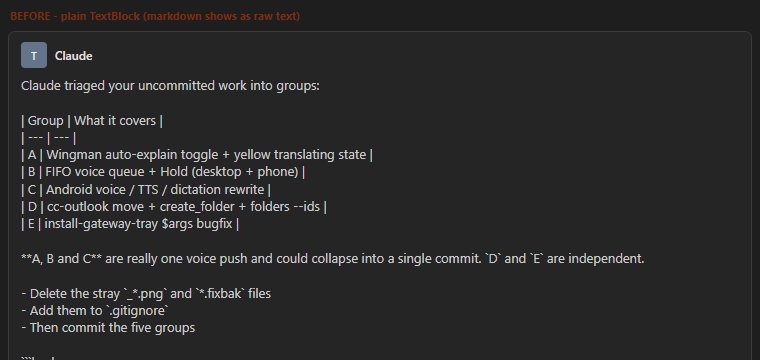
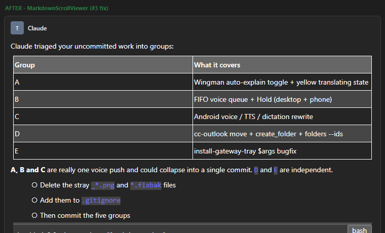
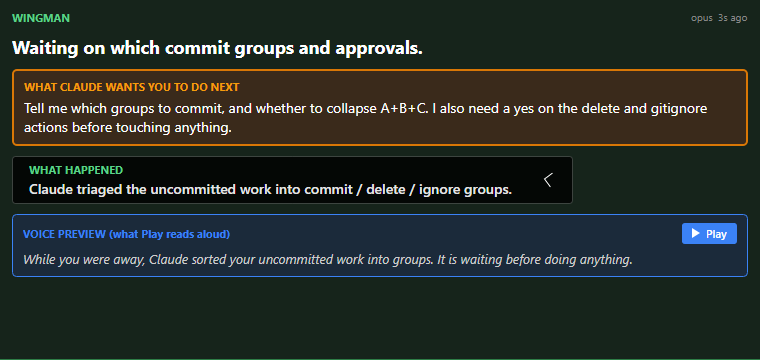
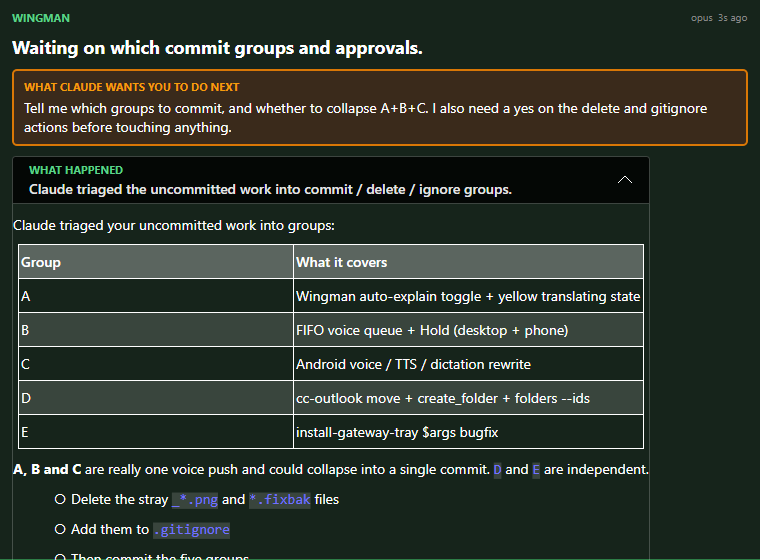
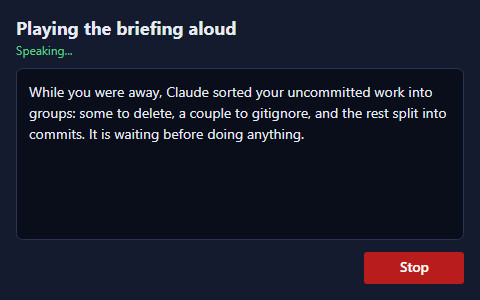

# Wingman Tab Cleanup - Verification Report

**Date:** 2026-05-28
**Scope:** Five fixes to the desktop Wingman tab (Avalonia). All built clean, unit-tested, and rendered/booted for visual proof.

---

## Summary

| # | Item | Status |
|---|------|--------|
| 1 | Speak playback as a modal dialog with a Stop button (no more stacking clicks) | Done |
| 2 | Disambiguate the two "Speak" buttons (blue Play vs green Speak/dictate) | Done |
| 3 | Render markdown in the transcript and briefing (fixes the broken table) | Done |
| 4 | Tighten the briefing hierarchy (action first, "what happened" collapsed) | Done |
| 5 | Stop the 2-second full re-parse churn in the transcript | Done |

Build: `0 Warning(s), 0 Error(s)`. Unit tests: `12 passed`. Live boot: clean (Control API responsive on the test instance).

---

## 3 - Markdown rendering (the broken table)

**Root cause.** Every Claude text card and the briefing's long-description field rendered with a plain `TextBlock`. No markdown was ever interpreted, so a markdown table showed as raw `|` pipes (and `**bold**`, bullets, and code showed their literal characters).

**Fix.** Added the `Markdown.Avalonia` package and replaced the plain text controls with its `MarkdownScrollViewer` in both the transcript Text card (`CleanView.axaml`) and the briefing long-text (`MainWindow.axaml`). No theming work was needed: the renderer reads the app's Fluent Dark theme directly.

The two images below render the **exact** table from the original bug screenshot. The first is the old plain-text path; the second is the real `MarkdownScrollViewer` now used in the app.

### Before - plain TextBlock (the bug)



### After - MarkdownScrollViewer (the fix)



A real bordered table, bold text, inline code chips, bulleted list, and a code block - all themed correctly for the dark cards.

---

## 4 - Tighter briefing hierarchy

The briefing banner was reordered so the decision you must act on leads:

1. Headline
2. **WHAT CLAUDE WANTS YOU TO DO NEXT** (orange) - moved directly under the headline
3. **WHAT HAPPENED** - now a collapsed expander (its one-line summary rides in the header; the detail, rendered as markdown, expands on demand). It largely restated the Voice Preview, so it no longer competes for attention.
4. **VOICE PREVIEW** (blue) with the Play button

### Collapsed (default)



### Expanded - "What happened" reveals the rendered markdown table



This is the same spot in the briefing where the broken pipes appeared in the original screenshot; it now renders as a proper table.

---

## 1 and 2 - Speak fixes

**The problem you flagged:** the "Speak it" button fired playback in the background with no visible state and no way to stop it, so repeated clicks were confusing. It also shared the word "Speak" with the dictation button in the input bar, which does the opposite thing (mic in, not audio out).

**Fix:**
- "Speak it" is now a blue **Play** button (with a play triangle) that opens a **modal player**. Because it is modal, it blocks the launching button while audio plays - no stacking. It shows a read-along of the text and a single **Stop** button; Stop / Escape / closing the window all cancel playback. If audio generation fails, it shows an honest error instead of closing as if it had spoken.
- The green **Speak** (dictation) button is unchanged, so "Speak" now consistently means "talk to the agent" everywhere, and "Play" means "listen".

### The playback dialog (#1)



The blue Play button and its "VOICE PREVIEW (what Play reads aloud)" label are visible in the briefing screenshots above (#2).

---

## 5 - No more transcript churn

**The problem:** on every 2-second poll where new output existed, the transcript tore down and rebuilt **every** card and force-scrolled to the bottom - so it flickered during a turn and yanked you back down if you had scrolled up to read.

**Fix:** the update path now diffs the freshly parsed cards against what is on screen and does the least work:

- **No change** -> skip entirely (no clear, no scroll).
- **Pure append** -> insert only the new cards; existing cards keep their identity and the list does not flicker.
- **In-place change** (a pending tool gaining its result, or a rewind) -> full rebuild, which is unavoidable.

It also only auto-scrolls when you were already at the bottom, so scrolling up to read history is no longer interrupted.

The decision logic was extracted into a pure, dependency-free helper (`CleanViewDiff`) and unit-tested:

```
Passed!  -  Failed: 0, Passed: 12, Skipped: 0, Total: 12
```

Cases covered: identical lists, empty-to-populated, pure append (with correct insert index), last-item change, middle-item change, shrink/rewind, prefix-match-but-changed-tail, and signature field-boundary collisions.

---

## Verification performed

1. **Build:** full Avalonia project builds with `0 Warning(s), 0 Error(s)` (warnings-as-errors is on).
2. **Unit tests:** `CcDirector.Avalonia.Tests` - 12/12 pass for the `CleanViewDiff` logic (#5).
3. **Render harness:** an Avalonia headless + Skia harness renders the **real** `MarkdownScrollViewer` and the reordered briefing on the same Fluent Dark theme the app uses; the five PNGs above are its output.
4. **Live boot smoke:** a test build (slot 4) launched via the Task Scheduler path booted cleanly - the real `MainWindow.axaml` and `CleanView.axaml` (now carrying the markdown control and the reordered briefing) construct without error, and the Control API answered `/sessions`. A XAML-load failure would have crashed the boot.

## Files changed

- `src/CcDirector.Avalonia/CcDirector.Avalonia.csproj` - add `Markdown.Avalonia`; `InternalsVisibleTo` for tests
- `src/CcDirector.Avalonia/Controls/CleanView.axaml` (+ `.axaml.cs`) - markdown card; incremental update + scroll preservation
- `src/CcDirector.Avalonia/Controls/CleanViewDiff.cs` - new pure diff helper (#5)
- `src/CcDirector.Avalonia/MainWindow.axaml` (+ `.axaml.cs`) - reordered briefing, markdown long-text, Play button, open playback dialog
- `src/CcDirector.Avalonia/Voice/SpeakPlaybackDialog.axaml` (+ `.axaml.cs`) - new modal player (#1)
- `src/CcDirector.Avalonia/Voice/DesktopTtsPlayer.cs` - `SpeakAsync` returns success so the dialog can report failures
- `src/CcDirector.Avalonia/Helpers/MarkdownHtmlRenderer.cs` - fully-qualify `Markdig.Markdown` (namespace collision with the new package)
- `src/CcDirector.Avalonia.Tests/` - new test project for `CleanViewDiff`
- `playground/wingman-render-harness/` - the headless render harness that produced these screenshots
