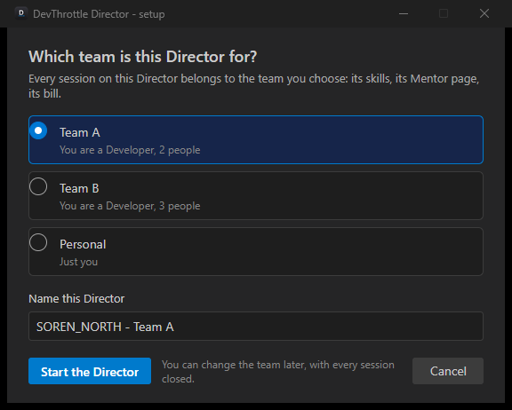
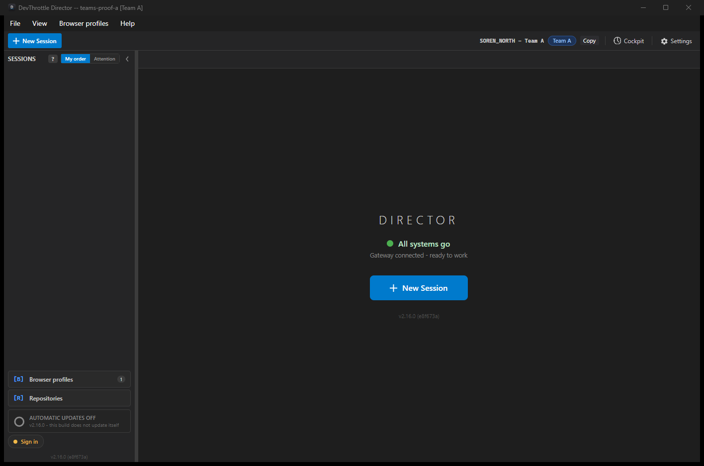
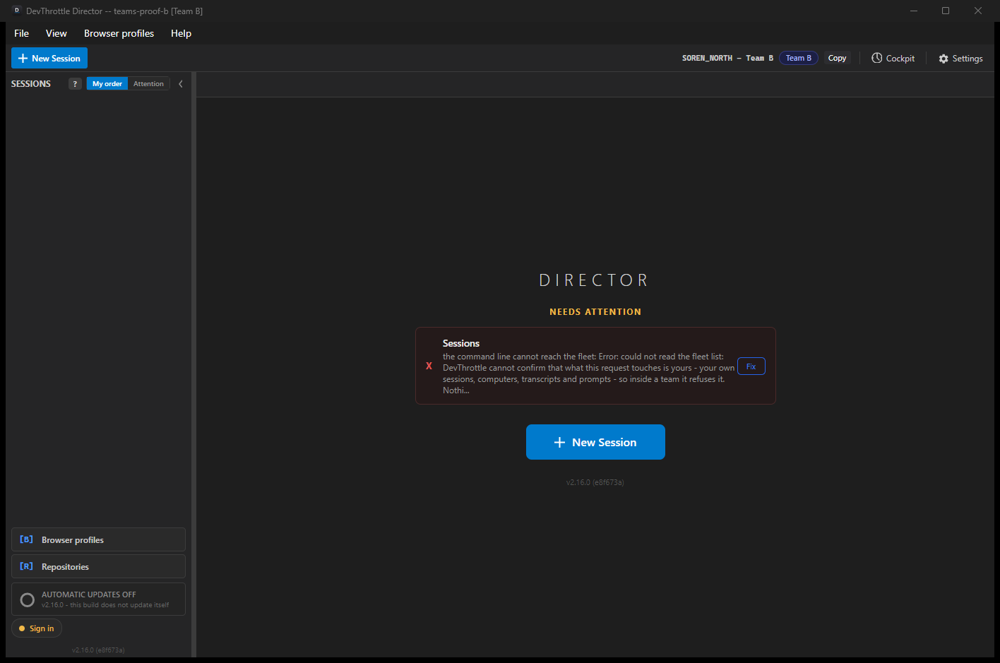
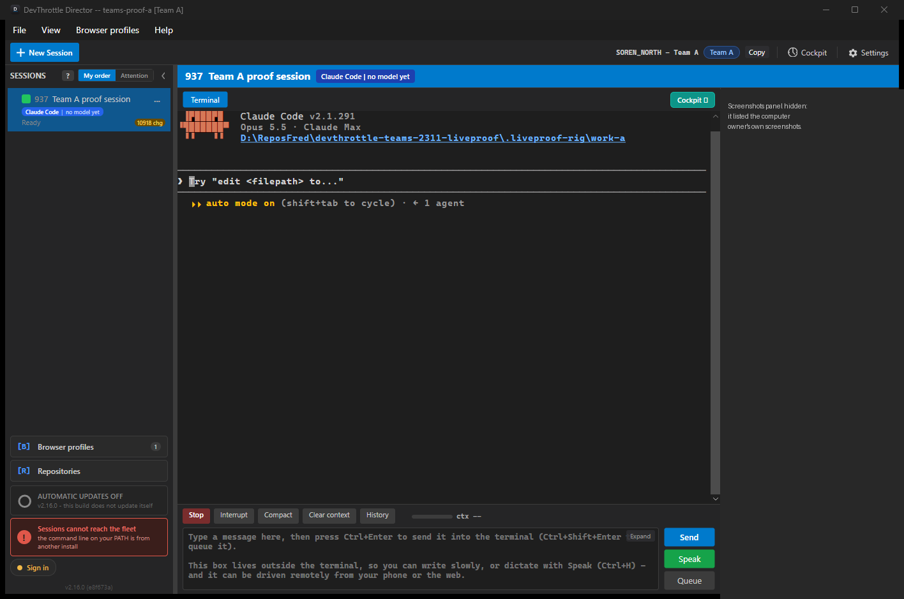
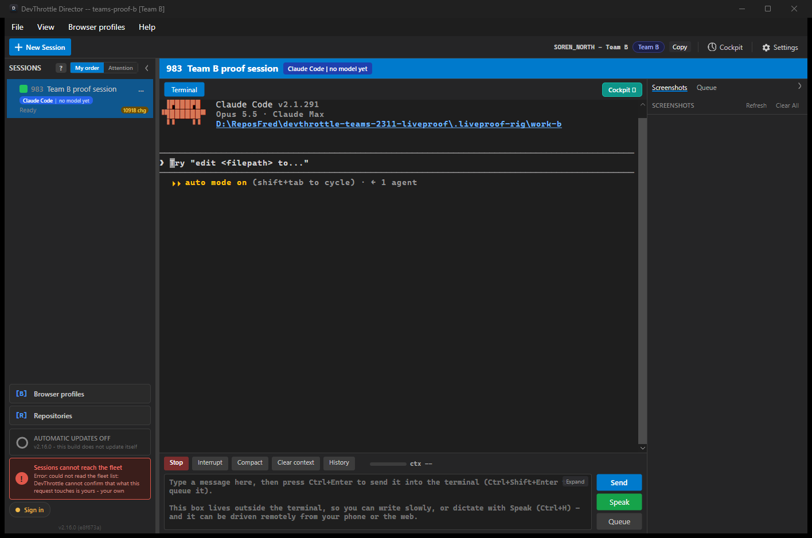
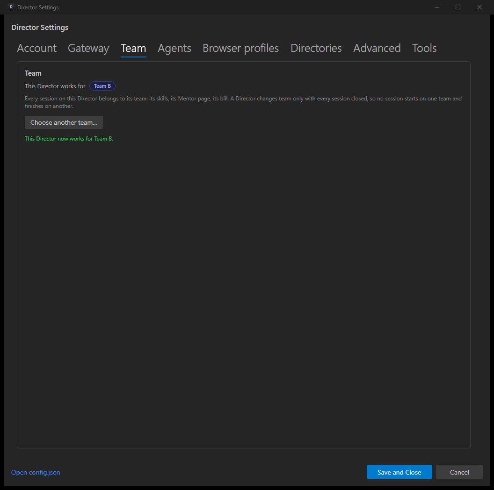
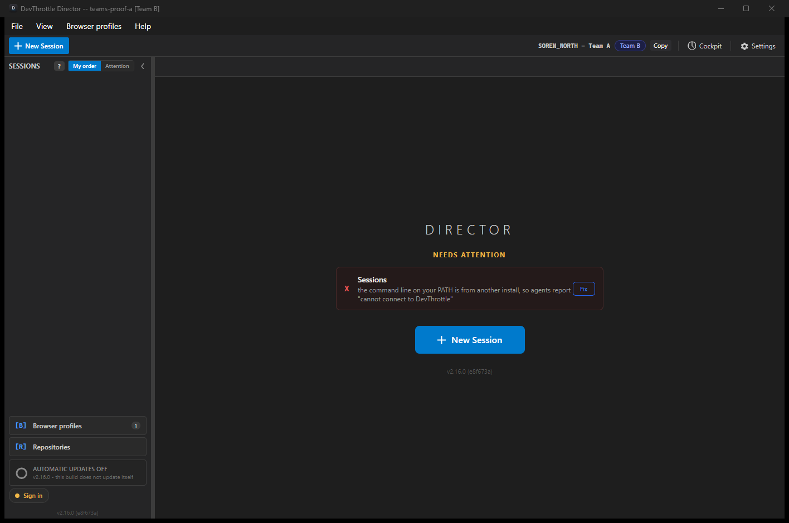

# Teams 13, live: two Directors, two teams, one computer

Proof for `thefrederiksen/devthrottle_internal#2311` ("a Director is set up for a team, with its own key"), run live on
SOREN_NORTH on 6 October 2026 against origin/main `e8f673ab9` (the local Gateway reported version
`2.16.0+e8f673ab9232fa77faf0e61c2b062ba08ec4cf32`). Every proof before this one ran against a faked Gateway or inside one
test process. This one ran a real Gateway process and two real Director processes, built from this tree, talking over
real sockets and the real tunnel. **No product code changed.** This folder holds proof files only.

All six steps of the brief were shown live. Step 4 was shown on the request path (the team's bill decides the tier every
request is served on); the per-session narration answer that also reads it needs a model call and was not exercised live
(see "What this does not prove").

## The rig, and how it was kept away from everything real

| Piece | What ran | Kept apart how |
|---|---|---|
| Local hosted Gateway | `src/CcDirector.Gateway` (the development console host) built from this tree, port 7951 (checked free first), `CC_GATEWAY_HOSTED=1`, `CC_GATEWAY_TEAMS=1`, `CC_GATEWAY_NO_TAILSCALE=1` | Its own root `.liveproof-rig/gateway-root` (`CC_DIRECTOR_ROOT`, process scope only), its own SQLite database there, no PostgreSQL connection string (cleared in the launch file). `/healthz` answered `"teams":true` and this tree's commit. |
| Sign-in and website stand-in | `rig/auth_stub.py` on port 7952 | Mints ES256 account tokens with a key made for this run, for three made-up people (`rig/people.json`, addresses on the reserved `.invalid` domain). The Gateway and the Directors were given its public key (`DEVTHROTTLE_JWT_PUBLIC_KEY_SET`), issuer and sign-in address, and every website call (`DEVTHROTTLE_API_URL`, `DEVTHROTTLE_REFRESH_URL`) was pointed at it; it answers 503 and forwards nothing. Its log ([evidence/stub-requests.log](evidence/stub-requests.log)) shows only the three sign-ins - no website call was attempted. |
| Director A | `scripts/local-build/cc-director5.exe` (test slot 5), `--instance teams-proof-a` | Its own root `.liveproof-rig/director-root`, the instance registered there beforehand. Its first log lines: `Instance: slug=teams-proof-a, isDefault=False, explicit=True, home=...\.liveproof-rig\director-root\instances\teams-proof-a`, and `CcStorageMigration ... SKIPPED - storage is pinned by CC_DIRECTOR_ROOT`. Its own mutex `Local\cc-director-instance-37be082b87dfc5d2`. Automatic updates off. Director id `16081887-799c-402d-a010-06bfc6daef5b`. |
| Director B | `cc-director6.exe` (slot 6), `--instance teams-proof-b` | The same, `home=...\instances\teams-proof-b`, mutex `...40477648025ad410`. Director id `977326fb-d7fe-482c-a867-c5f0d972e9c5`. |

Each process was started by its own scheduled task (`teams-2311-liveproof-*`), as a visible window, because a Director
started from an agent's console loses its sessions. The launch files are in `rig/`.

**The isolation was not complete: both test Directors opened and wrote the owner's engine database.** The user-level
variable `CC_VAULT_PATH` on this computer names the owner's vault, `%LOCALAPPDATA%\cc-director\vault`, and the storage
code takes it ahead of `CC_DIRECTOR_ROOT` (`CcStorage.Vault()`), so both processes opened
`%LOCALAPPDATA%\cc-director\vault\engine.db` instead of one in their own instance home. I saw the variable before the
launch and did not clear it. On that database each Director ran the schema check (creates tables only if missing),
marked interrupted runs as failed (0 marked), recomputed the next run time of every enabled job, and purged runs older
than 30 days (0 purged by each). Each ran the owner's
scheduler while it was up - Director A 07:48:07 to 08:02:52, Director B 07:53:21 to 08:02:55 - and no job run is logged
by either. Every log line is in [evidence/owner-state-touches.txt](evidence/owner-state-touches.txt), section 1. The
launch files in `rig/` now clear `CC_VAULT_PATH` (see "To run it again"); the rig was not run again.

**Never touched:** the owner's Directors and instances and their keys, the production Gateway, any production
database, Supabase, Stripe. No email was sent: invitations were not used, and the seat sync after the removal logged
`NOTIFY_OWNER_SERVICE_TOKEN is not set on this Gateway - the seat sync was NOT called`.

**Side effects on the machine, all named:** each sign-in opened its hand-back page as a tab in the owner's default
browser (three tabs on `127.0.0.1`, left open - they are the owner's browser). The first-run wizard's browser step,
clicked by mistake, started a Chrome with its profile inside the rig on debugging port 9310; it was closed within a
minute. The wizard's screenshot step pointed Director A at the owner's screenshots folder, so Director A's Screenshots
panel listed them; that panel is covered in the two pictures where it showed. The two agent sessions started in step 3
wrote their transcripts under the agent's own per-user folder (two folders named after `.liveproof-rig\work-a` and
`work-b`); nothing was typed into either session.

**Side effects on the owner's per-user state, found in the logs after the run** (all in
[evidence/owner-state-touches.txt](evidence/owner-state-touches.txt)):

- **Backup cleaner** (section 2). Each Director started its periodic scan of the owner's per-user agent backup
  folder. That cleaner can delete files it judges corrupt; the only line either wrote is the "Starting periodic scan" line, so no
  deletion is logged.
- **Skills removed from the owner's skill folders** (section 3). The skill installer works on the per-user
  `~/.agents/skills` and `~/.claude/skills`, not per instance. Connected to this Gateway, which serves 12 skills, Director
  A removed six from both folders at 07:56:04 (`browsers`, `demo-mode`, `director-restart`, `hormozi-playbook`,
  `notebook-reviewer`, `remote-desktop`), and both Directors rewrote the 12 from the local Gateway (07:56:05 and
  07:56:18). An owner Director put the six back: my first read-only look after the run found all six present,
  created at 08:26, so they were missing for about 30 minutes at most. The owner's Directors rewrite these folders regularly (a
  second look found them created again at 08:34), so the exact moment they came back was not established. The Tech Lead
  then checked, read only: all 18 managed skills in both folders are byte-identical in body to what the production
  Gateway serves. Nothing to restore. Finding F7.
- **The owner's installed tools and vault** (section 4). Before its own tools were built, Director A's tool check ran
  `cc-vault stats` four times from the owner's installed copy on the user `PATH`, and its fleet check ran the owner's
  installed `cc-devthrottle` twice. `cc-vault stats` ran nine times in all (Director A six, Director B three), every one
  of them against the owner's vault through `CC_VAULT_PATH`.
- **Read-only git in 19 of the owner's repositories** (section 5). After the wizard's code step, Director A's source
  control view ran `status`, `log`, `rev-parse`, `rev-list`, `config --get`, `for-each-ref`, `merge-base`,
  `worktree list` and similar - no fetch, push, prune, checkout or commit. `git status` can refresh a repository's index
  file; whether it did was not checked.

**Stopped at the end, everything:** both Directors by their own shutdown signal (`Local\cc-director-shutdown-<id>`; each
closed its own session), the Gateway with Ctrl+C in its console (a hosted Gateway refuses `POST /shutdown` by design; its
log ends `GatewayDatabase Dispose: closed ...gateway.db`), the stub the same way, and the four scheduled tasks
unregistered. Afterwards no process of these four images was running and nothing listened on 7951, 7952 or 9310.

### Setup on the local Gateway

1. Olivia (the Owner) enrolled a personal device with her account token, then created **Team A** and **Team B** through
   `POST /teams`. Team A = `f96c8023-aa1f-49c5-850b-9945da11ed8f`, Team B = `1a223ddf-1e2f-4b7c-bf5e-23bef903585a`.
2. **Two tables the website owns in production were created empty** in the local database, `entitlements` and
   `team_entitlements`, in the shape the Gateway's own test seam uses. Without them the first enrollment answered 503
   ("the entitlement service is temporarily unavailable"), which is the transcript's first call.
3. **Members were added as rows**, not by invitation: Alice as a Developer in Team A and Team B, Bob as a Developer in
   Team B. An invitation is sent as email by the website, which this proof must not reach. Removal (step 5) went through
   the real route.
4. Both teams got a live bill row: `status=active, seats=5, livemode=1`, period ending 5 November.

Every HTTP call is in [evidence/http-transcript.txt](evidence/http-transcript.txt), keys shown by their last four
characters only.

## Step 1 - two Directors, each set up for a different team, through the real surfaces

**Director A, first-run wizard, signed in as Alice (a member of two teams).** The wizard's gateway step, Hosted gateway,
"Sign in and connect". The Gateway's `/healthz` said `teams: true`, so the Director listed Alice's teams and **asked**:



Team A, then "Start the Director". The wizard reported "This machine is enrolled with http://127.0.0.1:7951"
([1d](screens/1d-director-a-enrolled-with-the-local-gateway.png)). Its log:

```
SignInChooseTeamAndEnrollHostedAsync: asking which team (3 choices)
SignInChooseTeamAndEnrollHostedAsync: chose team f96c8023-aa1f-49c5-850b-9945da11ed8f
EnrollAtHostedGatewayAsync: persisted hosted url + local per-device key (machine=SOREN_NORTH, team=f96c8023-...)
DirectorTeamStore Save: team f96c8023-... to ...\instances\teams-proof-a\config\director\gateway-team.json
```



Window title `DevThrottle Director -- teams-proof-a [Team A]`, the name `SOREN_NORTH - Team A`, the chip **Team A**,
"Gateway connected - ready to work".

**Director B, Settings, Gateway tab, signed in as Bob (a member of Team B only).** "Use a hosted Gateway", "Sign in with
DevThrottle" ([1f](screens/1f-director-b-gateway-connection-panel.png)). Bob has one team, so - by #3573, now on main -
he was **not asked**: `one team, not asked; team 1a223ddf-...`, and the Director was named as the question would have
named it.

The panel's picture after sign-in was not captured (the capture still showed "Waiting for you to sign in"). That
Director B was set up through the connection panel rests on its log, lines 457-485
([evidence/step1-director-b-connection-panel-log.txt](evidence/step1-director-b-connection-panel-log.txt)):

```
[GatewayConnectionPanel] choice: Use hosted -> hosted enroll
... ListHostedTeamsAsync: 1 team(s)
... one team, not asked; team 1a223ddf-...
... DirectorTeamStore Save ...
[GatewayConnectionPanel] hosted enroll succeeded; re-applying and handshaking
```



Title `... teams-proof-b [Team B]`, name `SOREN_NORTH - Team B`, chip **Team B**. Both ran at the same time on one
computer (both appear in the step 3 and step 5 pictures, taken a few seconds apart). Director B's "Needs attention" box
is finding F1 below.

## Step 2 - each Director enrolled with its own key, in its own team

Read straight from the local database, table `device_credentials` ([evidence/step2-device-rows.txt](evidence/step2-device-rows.txt)):

| Row id (`DeviceId`) | `TenantId` | `AccountSubject` | Status | Key ends |
|---|---|---|---|---|
| `cee45cd5...a3109\|16081887-799c-402d-a010-06bfc6daef5b` | Team A | Alice | active | `rb0g` |
| `45b28b54...4d349\|977326fb-d7fe-482c-a867-c5f0d972e9c5` | Team B | Bob | active | `_bf8` |

Each row id ends in that Director's own id, its tenant is its team, its subject is the person who signed in. The key each
Director stores in its own instance home (`instances\teams-proof-a\config\director\gateway-token.txt`, and `-b`) ends
`rb0g` and `_bf8` respectively: two Directors, two keys, two teams.

## Step 3 - a session on each; each team sees only its own

A session was started on each Director through `POST /directors/{id}/sessions`, each with that Director's own team key:
Team A's `b1e52eb0-...` on Director A, Team B's `6e5ce7a5-...` on Director B. Both answered 201.




What each team key is answered (full bodies in the transcript):

| Asked with | Team A's session | Team B's session | Director A | Director B | `GET /directors` (whole team) |
|---|---|---|---|---|---|
| Director A's key (Alice, Team A) | **200** | 403 | **200** | 403 | 403 (a Developer sees only their own) |
| Director B's key (Bob, Team B) | 403 | **200** | 403 | **200** | 403 |

Every 403 is the team gate's `team_action_refused`: "DevThrottle cannot confirm that what this request touches is yours".

Each team's Fleet Map, asked by its Owner (`GET /teams/{id}/fleet-map`):

```
Team A: one Director, "SOREN_NORTH - Team A", sessions: [ "Team A proof session" (waiting) ]
Team B: one Director, "SOREN_NORTH - Team B", sessions: [ "Team B proof session" (waiting) ]
```

## Step 4 - paid features follow the team's bill

The Gateway re-reads every team's bill once a minute and logs the decision per team (`t#29fd7757` is Team A and
`t#016aeadc` is Team B - the log's hashed form, [evidence/teams-log-hashes.txt](evidence/teams-log-hashes.txt)).

Both bills live:

```
07:57:49 [TeamMemberEntitlement] Decide: team t#016aeadc member=True outcome=Entitled tier=team
07:57:49 [TeamMemberEntitlement] Decide: team t#29fd7757 member=True outcome=Entitled tier=team
```

Both Directors' keys served (`GET /gateway/skills` 200). Then Team A's row was ended in the local database
(`status=canceled`, period end now, 11:58:05 UTC), Team B's left alone. The next sweep:

```
07:58:49 [TeamMemberEntitlement] Decide: team t#016aeadc member=True outcome=Entitled tier=team
07:58:49 [TeamMemberEntitlement] Decide: team t#29fd7757 member=True outcome=Entitled tier=free
```

Team A's members dropped to the free tier; Team B stayed on the team tier. Both keys were still served (200 on
`/gateway/skills` and on each Director's own session), which is what the contract now says: a member is never refused
for the team's bill - the team tier with a bill, the free tier without (`docs/proof/teams-2311/step2-team-bill.md`, item
1). `gateway-contract.md` section 5 said a team key is answered 402, which stopped being true when step 2 merged; it is
corrected in this pull request (finding F5).

## Step 5 - removal

Olivia removed Bob from Team B through the real route, `DELETE /teams/{Team B}/members/{Bob's member id}` - 200
`{"done":true}`. Within the same second:

| Call | Before | After |
|---|---|---|
| Director B's key, its own session | 200 | **401** `device credential revoked` |
| Director B's key, `/gateway/skills` | - | **401** |
| Director A's key, its own session | 200 | **200** |

The Gateway's log ([evidence/step5-gateway-log.txt](evidence/step5-gateway-log.txt)):

```
CommitMembershipChange: team t#016aeadc change=MemberRemoved committed, paid seats 3 -> 2
DeviceRegistry RevokeTenantMember: tenant t#016aeadc revoked=1 (reason=team_member_removed)
DirectorConnectionRegistry AbortForTenantMember: aborted 1 live Director connection(s) of one member of tenant t#016aeadc
TeamMemberAccessRevoker: revoked 1 key(s) and cut 1 open tunnel(s) of that one person (reason=team_member_removed)
DirectorHub disconnected: director=977326fb-... (clean)
...
DirectorHub Hello: director=16081887-... bound to conn=1gAY4_GV        <- Director A, unaffected
```

The device row: Director B `status=revoked, reason=team_member_removed`; Director A `active`
([evidence/step5-after-rows.txt](evidence/step5-after-rows.txt)). Alice, also a member of Team B, kept her membership.


Director B shows "Connecting..." and its log shows every call answered `device credential revoked`.

## Step 6 - a move

Director A's Settings, Team tab, "Choose another team..." (signed in as Alice): Team B offered, and the move **locked**
while its session ran - "Close the 1 running session first.":


The Gateway refuses it too: the move asked directly, with the session still registered, answered **409** "This Director
still has sessions open. Close every session on it, then change its team. Nothing was changed."

The session was closed (`POST /sessions/{id}/stop`: "process ended, row removed"). The lock line went
([6b](screens/6b-director-a-move-open-no-session.png)). "Move to Team B":




Title `[Team B]`, chip **Team B**. The Director's log: `MoveAsync: ... sessionsAtHold=0`, `moved; new device key
received`, `team and new device key stored, connection re-applied`. The Gateway's:

```
RevokeOtherKeysOfDirector: director=16081887-... revoked=1 (reason=director_moved_to_another_team)
AbortForDirector: aborted 1 live connection(s) of director=16081887-... in tenant t#29fd7757
Move: director=16081887-... moved from tenant t#29fd7757 to t#016aeadc - the old key is revoked and its tunnel cut, a new key issued
DirectorHub Hello: director=16081887-... bound to conn=8k5YlIyp           <- 70 ms later, on the new key
```

The rows ([evidence/step6-after-rows.txt](evidence/step6-after-rows.txt)): the Team A row for this Director `revoked,
director_moved_to_another_team` (key `rb0g`); a new row `bc8e68eb...|16081887-799c-402d-a010-06bfc6daef5b`, tenant
Team B, Alice, `active`, key `A0SM` - and `A0SM` is the key the Director now stores. The old key answers 401, the new key
200. Team A's Fleet Map is now empty; Team B's lists this Director.

## Findings - seen live, not fixed here

These do not stop any step of the proof, and nothing was changed for them. Each is for the Tech Lead to rule on.

- **F1 - every team Director shows "Needs attention".** The Director's own check of its command line runs
  `cc-devthrottle` to read the fleet list (`GET /sessions`), and inside a team the gate refuses that list to a
  Developer. Both Directors showed "Sessions cannot reach the fleet" in red (see 1g, 3a, 3b). Director B's log:
  `FleetToolReachability ... cc-devthrottle ... FAILED to reach the Gateway at http://127.0.0.1:7951: Error: could not read
  the fleet list: DevThrottle cannot confirm that what this request touches is yours`. Whether an agent inside a team
  session meets the same refusal was not tried.
- **F2 - a Director keeps calling routes not yet opened to teams.** Refused by the team gate during the run
  ([evidence/refused-routes.txt](evidence/refused-routes.txt), counted over the Gateway's whole log to its shutdown: 126
  refusals across 14 route groups, some of them the proof's own cross-team checks in step 3): `GET /account/status` 46
  times, `GET /gateway/session-colours` 43, and `GET /gateway/snooze-presets`, `GET /gateway/injected-text`, `GET
  /gateway/workspaces`, `POST /gateway/director-errors`, `POST /activity-events/batch`, `POST /session-numbers/allocate`,
  `DELETE /session-numbers/{id}`, `POST /gateway/skills/placement`. The two sessions still showed numbers (937 and 983)
  although the Gateway refused to allocate them; where those numbers came from was not looked into.
- **F3 - a removed person's Director does not say so.** After step 5 Director B shows only "Connecting..." with its
  Team B chip, for good; nothing tells the person their key was revoked because they left the team.
- **F4 - a Director's name does not follow a move.** The name the team question suggested, `SOREN_NORTH - Team A`, stays
  after the move to Team B, on the toolbar and on Team B's Fleet Map.
- **F5 - `docs/proof/teams-2311/gateway-contract.md` section 5 was out of date** - it said every request with a team key
  is answered 402 until the team bill is wired; step 2 wired it, and live a member is served (step 4). Corrected in this
  pull request, at the Tech Lead's ruling: section 5 now states what step 2 wired, and section 3's aside that the lease
  answers a team key 402 is corrected the same way.
- **F6 - two Directors on one computer share one engine database and both run its scheduler.** Read in the code, not
  seen live. Each process keeps its own list of running jobs (`_runningJobs`, `src/CcDirector.Engine/Scheduling/Scheduler.cs`
  lines 96-102); `GetDueJobs` selects every due job without claiming it (`src/CcDirector.Engine/Storage/EngineDatabase.cs`
  lines 253-262); and `CleanupOrphanedRuns`, run at every start, marks every run still marked running as failed (same
  file, lines 351-361). So two Directors on one database can both start the same due job, and a Director starting up
  marks the other's running jobs failed. Each Director sets `CC_DIRECTOR_ROOT` to its own instance home, so two instances
  share the database only when `CC_VAULT_PATH` is set - as it is on this computer, where a personal Director and a team
  Director would therefore share it. In this run no job ran.
- **F7 - two Directors on one computer fight over the person's skill folders.** Seen live, and read in the code. The
  skill folders are per user, not per instance or root: `SkillInstallTargets.For` builds them from the user profile,
  `~/.agents/skills` and `~/.claude/skills` (`src/CcDirector.Core/Skills/SkillInstallTargets.cs` lines 53-61). Each
  Director installs its own Gateway's set and removes every managed skill its set withdraws, from the shared folder
  (`src/CcDirector.Core/Skills/SkillDirectoryInstaller.cs` lines 293-302, `ReconcileCopies`) and from the agent's links
  (same file, lines 336-342, `ReconcileLinks`). So a team Director and a personal Director on one computer - or any two
  Directors on different Gateways or tenants - keep replacing each other's skills, and a team's set removes the
  person's own. Here Director A, on a Gateway serving 12, removed six of the owner's.
- **Not a product finding - members show "An account with no email recorded".** That is this rig: Alice and Bob were
  added as rows and never had a personal account on this Gateway, so it has no address for them. A person who accepts a
  real invitation does.

## What this does not prove

- **Not the hosted image, PostgreSQL or Azure.** The Gateway was the development console host with `CC_GATEWAY_HOSTED=1`
  on SQLite. Because it is not the hosted image, it also wires the test seam that gives every newly bound personal
  account a hosted plan (`OnAccountBoundForTest`); that touched only Olivia's personal enrollment, not any team key.
- **Not the real sign-in.** Tokens came from the local stub: the same algorithm (ES256), audience and claim shape, but a
  key and issuer made for this run, given to the processes through the documented override variables.
- **Not invitations, acceptance, the seat sync or Stripe.** Members were added as rows (setup 3); the seat sync was not
  called (no service token); the bill rows were written by hand in the website's shape.
- **Not the per-session paid feature.** The narration plan for a team session reads the same team decision shown in
  step 4, but it is asked only inside a Wingman narration, which needs a model call this rig has no keys for. That it
  reads the team's bill rests on `HostedTeamBillOverTheWireTests` and `TeamBillOnTheRequestPathTests`, not on this run.
- **Not the Cockpit.** Step 3 used the API with each team key and the Owner's Fleet Map, not a browser signed in as a
  member.
- **Not what is pushed down each tunnel.** "Each Director is sent only its team's sessions" was shown by what each key is
  answered, by the Fleet Maps and by each Director's own session list - not by reading the tunnel's traffic.
- **Not two computers or two real people.** One machine, one Windows user, three made-up people.
- **Not a move with a session running elsewhere in the team, a move back to personal, or a demotion to Collaborator.**
  Only the move shown, and removal (not a role change).
- **Director B's Gateway panel after sign-in** was not captured: the picture taken still showed "Waiting for you to sign
  in" while the log already showed the enrollment. Whether the panel lags or the capture was early was not checked; the
  panel path rests on Director B's log (step 1) and the result on its main window
  ([1g](screens/1g-director-b-main-window-team-b-chip.png)).
- **That the owner's state was left alone.** See the top: the run opened the owner's engine database and reached other
  per-user state. The counts logged were zero and the skills came back, but this run cannot certify the owner's state
  untouched.

## To run it again

Build the two slots (`scripts\local-build-avalonia.ps1 -Slot 5` and `-Slot 6`, `-OutputDir scripts\local-build`) and
`dotnet build src\CcDirector.Gateway -c Debug`. Lay out `.liveproof-rig\` with `rig\people.json`, start `rig\auth_stub.py
7952 --jwks-only` once to make the key, write the launch files as in `rig\run-*.cmd` (they carry the public key set),
register `director-root\config\director\named-instances.json` with `teams-proof-a` and `teams-proof-b`, and start each
launch file from its own scheduled task. `rig\gw.py` makes and records the HTTP calls; `rig\win.ps1` lists, captures
(`PrintWindow`) and drives (UI Automation, or a posted click where a control has no automation pattern) the Director
windows.

**Do not run it as it was run.** The launch files now clear `CC_VAULT_PATH`. The user-level `CC_*` variables on this
computer were two: `CC_VAULT_PATH`, cleared because it names the owner's vault and wins over `CC_DIRECTOR_ROOT`; and
`CC_COCKPIT_MANAGED`, which names no path and was already cleared. Check the list again before a run
(`[Environment]::GetEnvironmentVariables('User')`). No root setting moves the per-user folders, so a variable cannot
keep these apart and a run again still reaches them (the launch files say so too): `~/.agents/skills` and
`~/.claude/skills`, where the skill installer adds and removes skills (F7); `~/.claude`, including the backups folder
the backup cleaner scans; the agent's per-user transcript folder, for every session started; and the owner's installed
tools on the user `PATH` - unless the launch file also takes the owner's `cc-director` folders off `PATH`, which these
do not.
