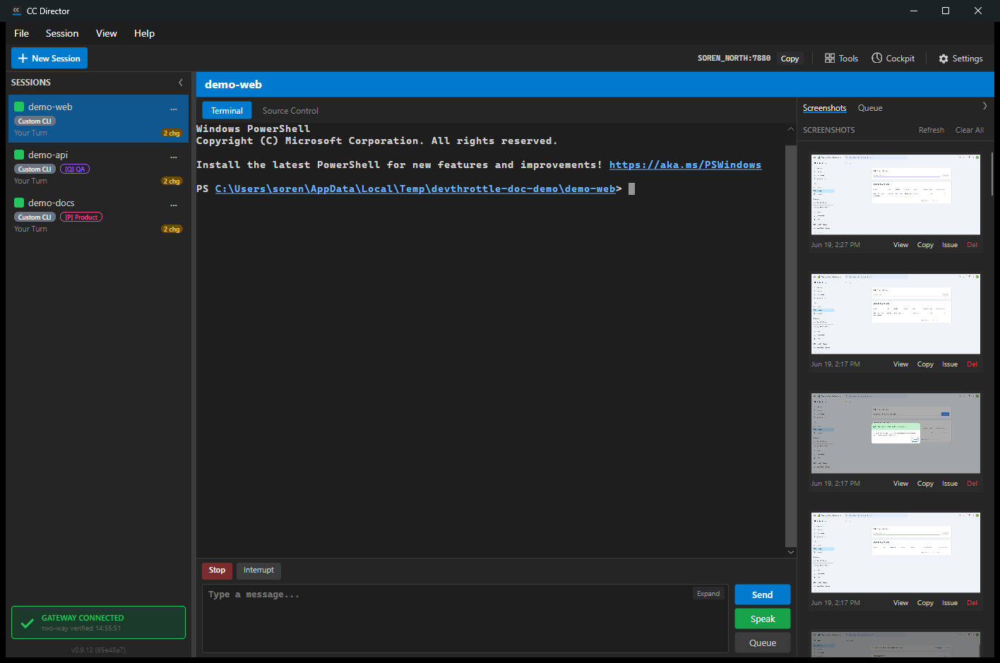

# Sessions and Console

The main window is the cockpit: a sessions sidebar on the left, a tabbed content
area in the middle, a toolbar across the top, and a prompt bar along the bottom.

## Session list sidebar

The left sidebar lists every running session. Each row shows a status dot
(idle / working / needs you), the session name, the agent and identity badges, an
activity label, and a "changes" count when the working tree is dirty. You can
drag rows to reorder them, and collapse the sidebar to a slim strip of status
dots.

The sidebar footer shows this Director's gateway connection, auto-update status,
Control API status, and the build version.

_The sidebar is the left column of the main window screenshot above._

## Embedded console tab

Each session has a native Windows console embedded directly in the app (a real
ConPTY terminal - not a log view). Type a prompt in the bar at the bottom and
press Ctrl+Enter to submit. The Capture and Refresh buttons re-read the terminal.

## Prompt input bar

The prompt bar accepts multi-line text and pasted/dragged images. It includes an
Expand button (a larger editor), an Explain button (a wingman read of the current
screen), and a Send / Speak / Queue action stack, plus Stop and Clear-context
controls for the active session.

_Visible at the bottom of the main window screenshot above._

## Main toolbar

The top toolbar carries this Director's identity (machine name and Control API
port, with a Copy button so other agents can reach it), plus Tools, Cockpit,
Settings, New Session, and Start FIFO.

_Visible at the top of the main window screenshot above._
