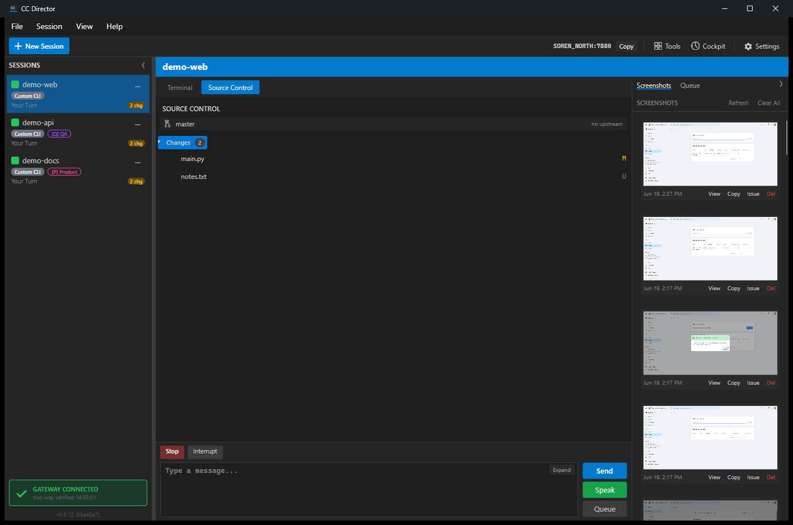

# Source Control and Repositories

DevThrottle keeps git front-and-center so you can see what each session changed
without leaving the app.

## Source control tab

The Source Control tab shows the uncommitted changes for the active session's
repository as a tree of folders and files, each tagged with its git status
(modified, added, deleted, and so on). Right-click a file for View File, Copy
Path, and Add to .gitignore.

## Repository manager

The Repository Manager lists the repositories DevThrottle knows about and lets
you quick-launch a session against any of them.

_Screenshot pending - open from the toolbar / repositories area to capture._

## Clone a repository

Clone from a URL with the Clone Repository dialog, or browse your GitHub
repositories and clone one directly.

_Screenshot pending - open the Clone Repository dialog to capture._
