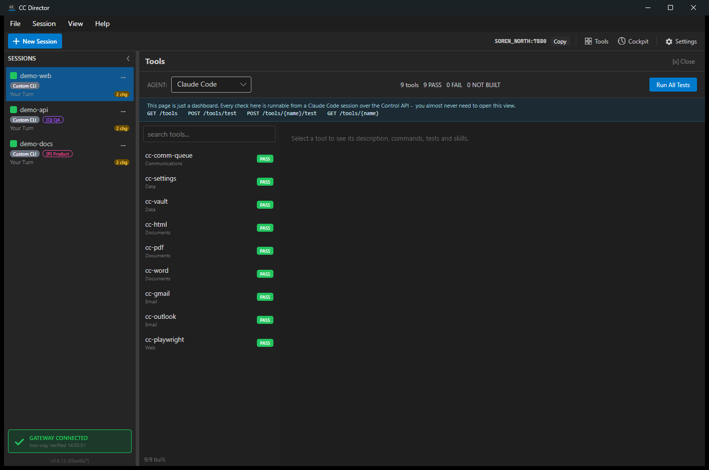

# Built-in Panels

Beyond the per-session console, DevThrottle ships several full-width panels for
status, tooling, connections, and scheduling.

## Home / status view

The Home view is the landing panel: the DevThrottle wordmark with an "All systems
go" or "Needs attention" summary, plus a New Session button.

_Screenshot pending - shown when no session is selected._

## Tools catalog

The Tools panel is a searchable catalog of the bundled `cc-*` command-line tools.
Pick a tool on the left to see its details on the right; status badges show which
tools are installed and ready, and there is a Run-All-Tests action.

## Connections

The Connections panel shows cards for external service connections (browser
profiles, accounts, and so on) with their status, and add / connect / disconnect
/ delete actions.

_Screenshot pending - open the Connections panel to capture._

## Scheduler

The Scheduler panel lists the registered cron runners with the current leader
status, each runner's pending count, a Run-now button, and an expandable box
showing the last result.

_Screenshot pending - open the Scheduler panel to capture._

## Communications Manager (partial)

The Communications Manager is a compose-and-preview surface for LinkedIn,
Twitter/X, and Reddit, with scheduling. The preview system is in place; the full
send pipeline is still being completed.

_Screenshot pending - open the Communications Manager to capture._
