# Setup Wizard Walkthrough

This page walks through the **DevThrottle Setup wizard** on Windows, one screen at a
time, with a screenshot of every step. It covers all three things the wizard does:

- **[Uninstalling or updating](#updating-or-uninstalling-an-existing-install)** an install that is already on the machine
- **[Installing a Workstation](#workstation-installation)** (the everyday role)
- **[Installing a Gateway](#gateway-installation)** (the single hub machine)

The screenshots were captured against **v0.9.13**. The wizard is self-contained, so
nothing needs to be installed before you can run it. It does **not** install your
prerequisites for you — it checks for them and tells you what is missing.

> Looking for the command-line install instead of the graphical wizard? See
> [Installation](02-installation.md). Both front-ends share one install engine and
> produce exactly the same per-user layout under `%LOCALAPPDATA%\cc-director`.

---

## Getting the installer

1. Open the [latest release](https://github.com/thefrederiksen/devthrottle/releases/latest)
   on GitHub.
2. Download two files: **`devthrottle-setup-win-x64.exe`** and **`release-manifest.json`**.
3. **Verify the download** before running it. Compare the installer's SHA-256 hash to
   the value recorded for it in the manifest — if they do not match, stop and download
   again:

   ```powershell
   $expected = (Get-Content release-manifest.json -Raw | ConvertFrom-Json).assets.'devthrottle-setup-win-x64.exe'.sha256
   $actual   = (Get-FileHash devthrottle-setup-win-x64.exe -Algorithm SHA256).Hash.ToLower()
   if ($actual -eq $expected.ToLower()) { "MATCH - safe to run" } else { "MISMATCH - do not run" }
   ```

4. Double-click `devthrottle-setup-win-x64.exe`. It is unsigned today, so Windows
   SmartScreen may warn once — choose **More info → Run anyway**. No administrator
   rights are required at any point.

---

## The five steps

Every run of the wizard moves left-to-right through the same rail:

| Step | What happens |
|------|--------------|
| **1. Welcome** | On a first install, you choose the role (Workstation or Gateway). On an existing install, this becomes the Update / Uninstall screen. |
| **2. Prerequisites** | The wizard checks for the .NET 10 Runtime, Claude Code, Python, Node.js, and (optionally) Brave. You cannot continue until the required ones are found. |
| **3. Skills** | Shows the Claude Code skills that will be installed. |
| **4. Install** | Downloads and places each component, verifying every file against the manifest's SHA-256. The Gateway role adds a Gateway + Cockpit phase here. |
| **5. Complete** | Confirms what was installed and offers to launch the app. |

---

## Choosing a role

The first screen of a fresh install asks **how you will use this machine**. The picture
explains the model: you install **one** Gateway, and every other machine is a
Workstation that connects to it.

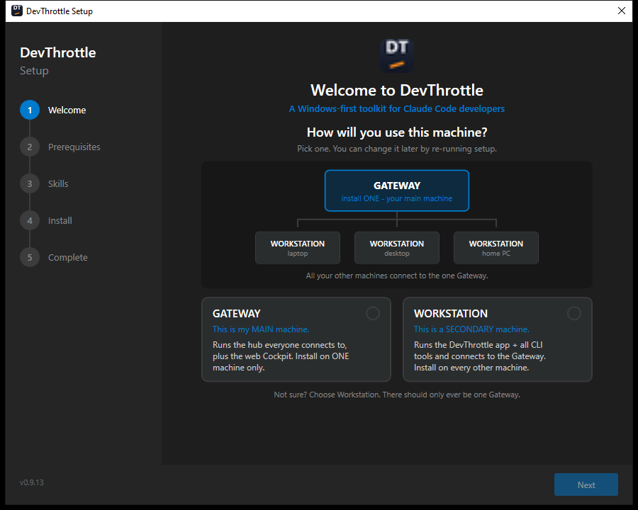

| Role | What it installs | Install it on |
|------|------------------|---------------|
| **Workstation** | The DevThrottle app + all command-line tools, entirely per-user. Connects to a Gateway. | Every machine. |
| **Gateway** | Everything a Workstation installs, **plus** the always-on Gateway tray app and the web Cockpit it supervises. | One machine only. |

Neither card is pre-selected — you must pick one before **Next** turns on (there is no
silent default). If you are unsure, choose **Workstation**; there should only ever be
one Gateway on a network.

---

## Updating or uninstalling an existing install

If DevThrottle is already on the machine, the wizard opens in **Update** mode instead.
The Welcome screen now shows the installed version, the version available, and the
**install type it detected from disk** (it does not re-ask the role). The same screen
is where you start an uninstall.

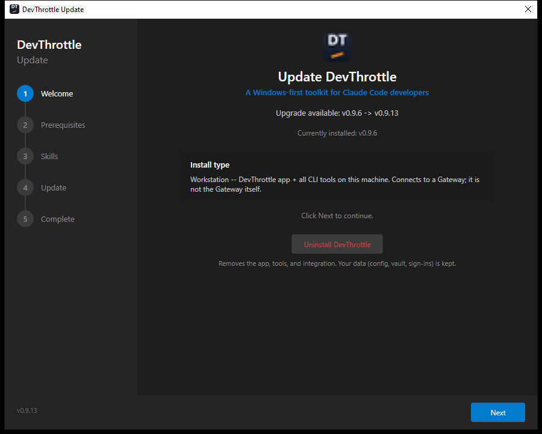

Clicking **Next** here updates only the components that are behind. Clicking
**Uninstall DevThrottle** opens the in-wizard uninstall flow.

### Uninstall — confirm

The confirm screen lists exactly what will be removed and, importantly, what is **kept**.
Your data — configuration, vault secrets, signed-in browser sessions, and recordings —
is preserved under `%LOCALAPPDATA%\cc-director` unless you tick **Also delete my data**.

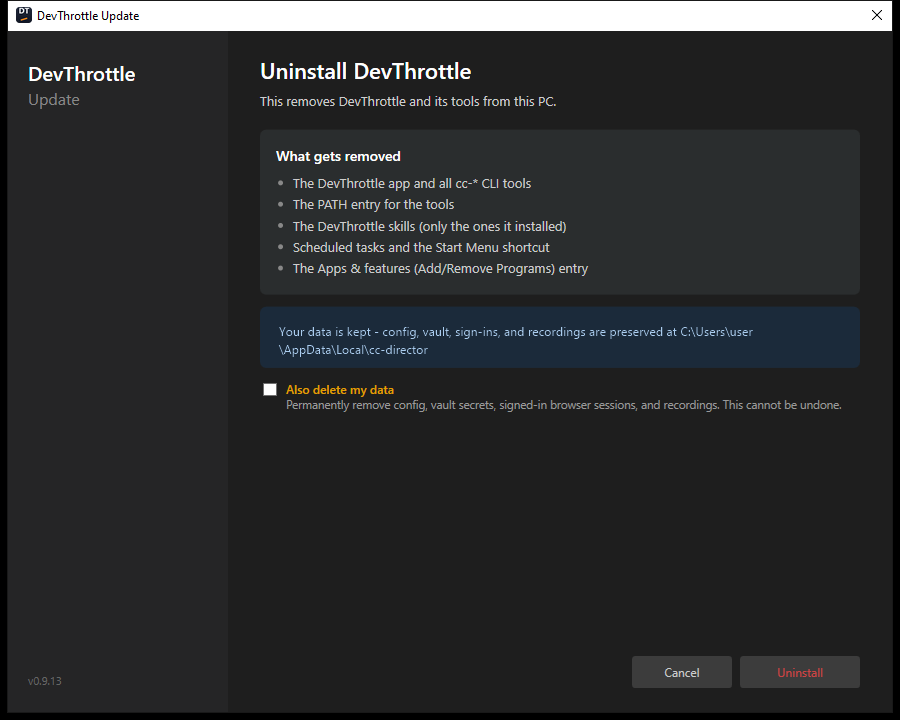

### Uninstall — progress and completion

The uninstall runs in place with a live checklist, then confirms it is done. The data
notice is shown again so it is clear nothing personal was touched.

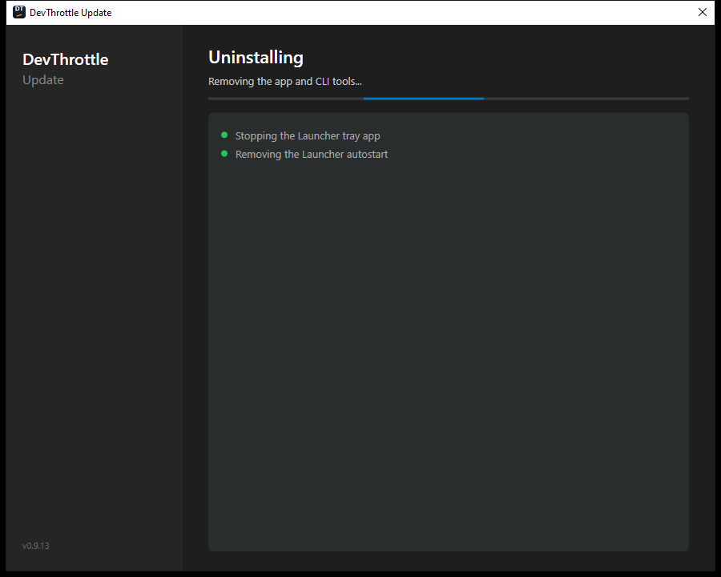

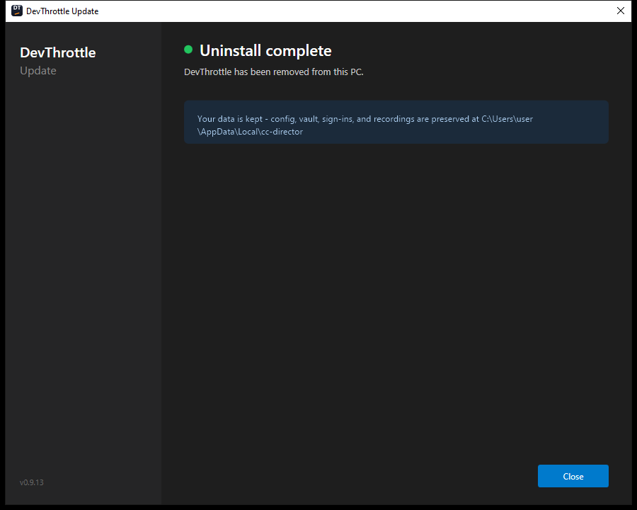

---

## Workstation installation

This is the role you install on every machine. The steps below assume a fresh install
(if one already exists, uninstall it first, or just let the wizard update it).

### 1. Pick the Workstation role

On the Welcome screen, click the **Workstation** card. It highlights and shows a
**SELECTED** tag, and **Next** turns on.

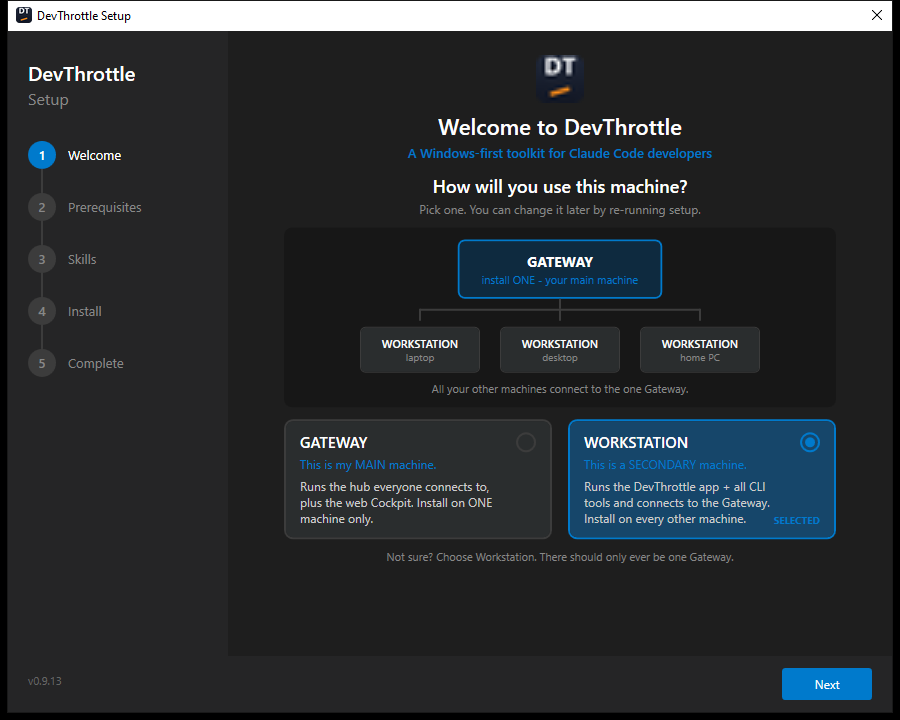

### 2. Prerequisites

The wizard checks each prerequisite and shows the version it found. The four required
tools (.NET 10 Runtime, Claude Code, Python, Node.js) must all be **Found**; Brave is
optional. If something is missing, install it, then click **Re-check**. When everything
required is present you see **All prerequisites met — ready to install** and **Next**
turns on.


### 3. Skills

Shows the Claude Code skills the wizard will install (for example, the `cc-director`
skill). These add the DevThrottle slash-commands to Claude Code.

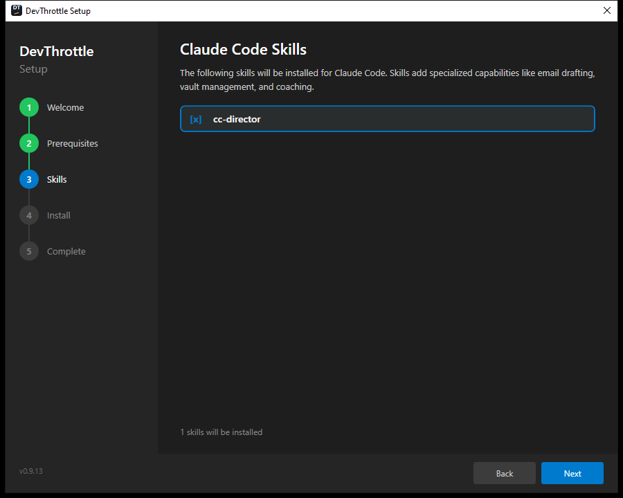

### 4. Install

Installation starts automatically. Each component shows its own progress: the
**cc-director** app, the **Tools** (the `cc-*` command-line tools), and the **Skills**.
Every downloaded file is verified against the manifest before it is placed.

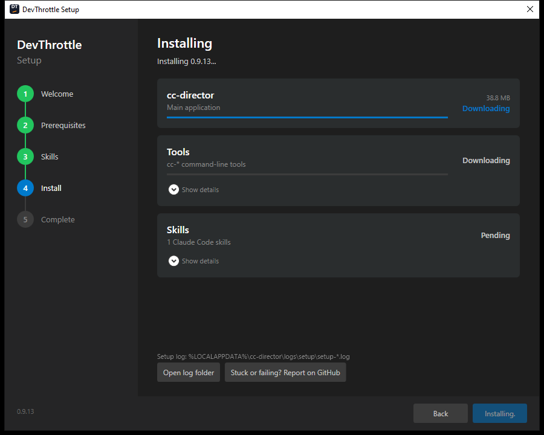

When it finishes, each row reads **Done** / **installed**, and the wizard starts the
always-on Launcher tray app.

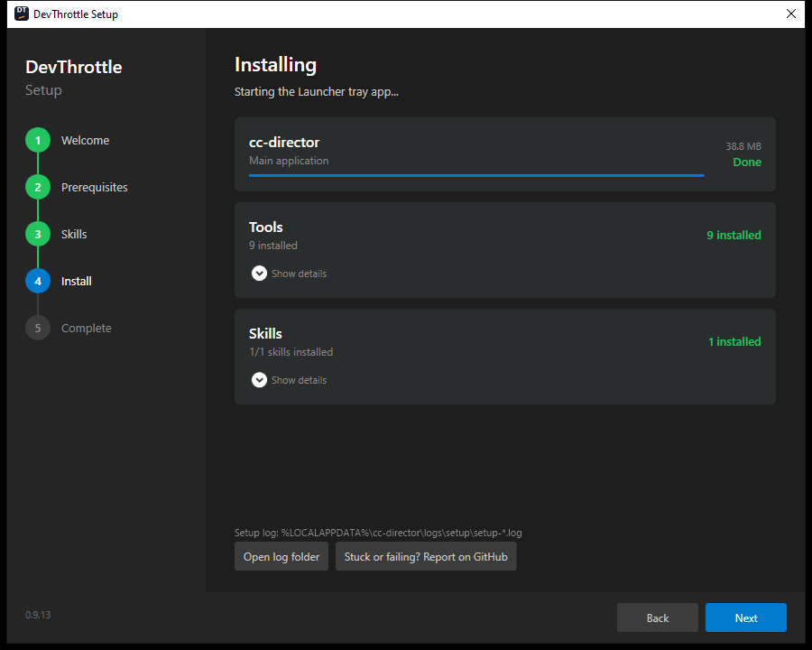

### 5. Complete

A success summary with the number of components installed and the version. **Open a new
terminal** for the `cc-*` commands to be available on your `PATH`. You can launch the
app from here, or close the wizard.

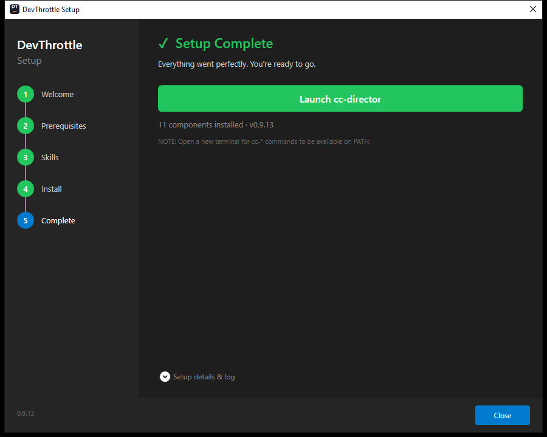

After this, the machine has `app\cc-director.exe`, the `cc-*` tool shims in `bin\`, and
the Launcher tray app set to start at logon — all under `%LOCALAPPDATA%\cc-director`.
To make it part of a fleet, set the Gateway address in the app's Settings (see
[Multi-Machine Setup](02-installation.md#multi-machine-setup-remote-access)).

---

## Gateway installation

The Gateway role installs everything a Workstation does, **plus** the Gateway tray app
and the Cockpit. Install it on **one** machine only — usually your main workstation.

> **One requirement first.** A Gateway install needs an OpenAI API key in your user
> environment **before** you start. The install checks for it and stops loudly if it is
> missing, rather than half-installing. Set it once, then run the wizard:
>
> ```powershell
> setx OPENAI_API_KEY "sk-...your key..."
> ```
>
> This is a one-time bootstrap: on first start the Gateway seeds its central key vault
> from this value, and from then on the vault (managed from the Cockpit's **API Keys**
> page) is the live source of truth.

### 1. Pick the Gateway role

On the Welcome screen, click the **Gateway** card.

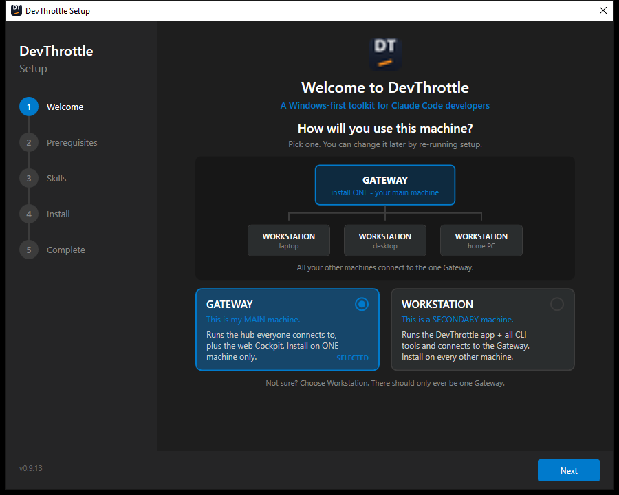

### 2. Prerequisites

The prerequisite checks are the same as for a Workstation — the OpenAI key gate is
enforced later, during the Gateway phase of the install, not here.

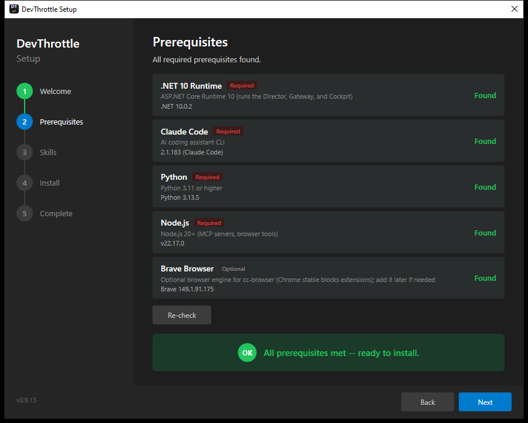

### 3. Skills

Identical to the Workstation flow.


### 4. Install

The install list now includes an extra card: **Gateway & Cockpit — Always-on tray app +
fleet dashboard**. This phase extracts the Cockpit, starts the Gateway tray app in
managed mode, registers its logon autostart, and opens the machine's secure remote
front door.

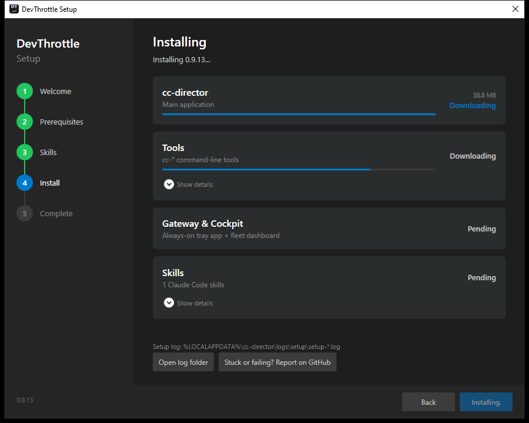

When the Gateway phase finishes it reports **Done**, and the setup log records the live
Cockpit address (for example `https://your-machine.your-tailnet.ts.net/`).

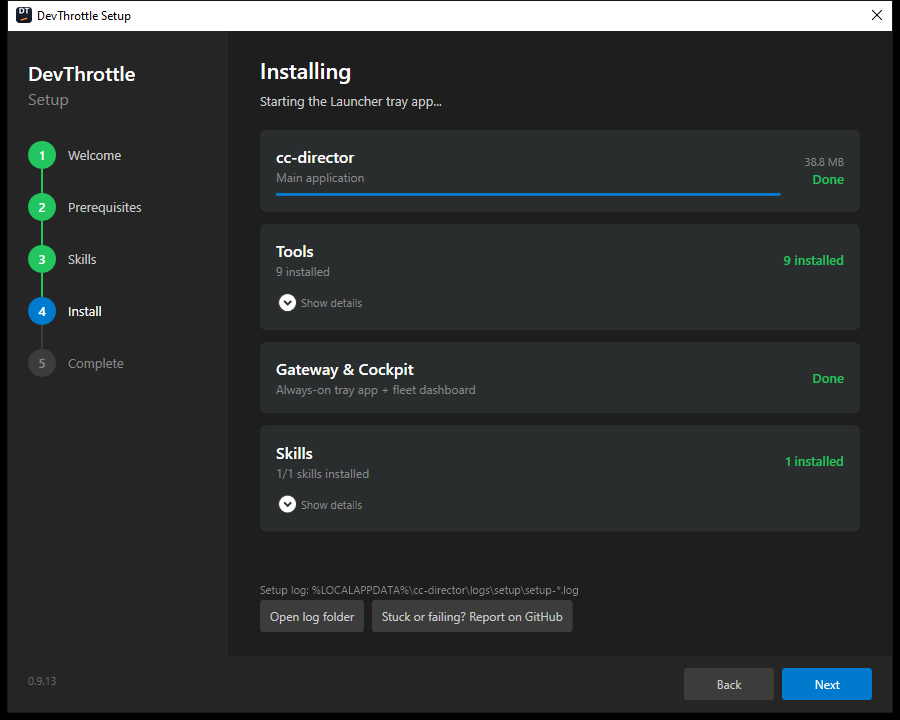

### 5. Complete

The same success screen. The machine is now a live Gateway: the tray app and Cockpit
are running, ports 7878 (Gateway) and 7470 (Cockpit) are listening, and the Gateway
starts again at every logon.


### Uninstalling a Gateway

When you uninstall a machine that was installed as a Gateway, the confirm screen lists
two extra removals compared with a Workstation — **the Gateway tray app and the
Cockpit**, and **the Gateway autostart entry and the remote-access mapping**. As always,
your data is kept.

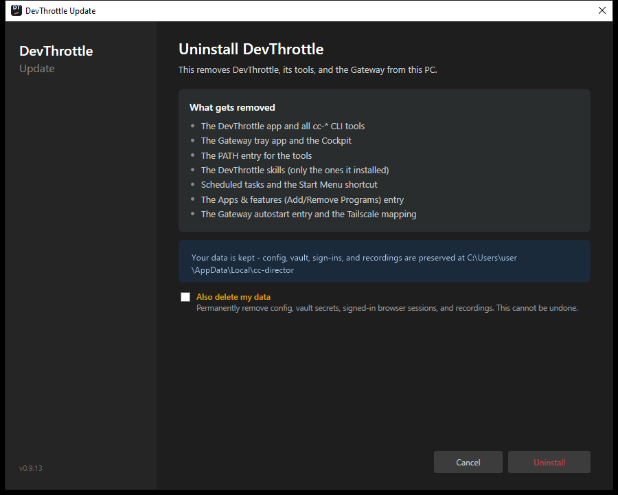

---

## After installation — verifying

Open a **new** terminal (so the updated `PATH` is loaded) and confirm the tools are
available:

```powershell
cc-pdf --version
cc-html --version
```

The wizard writes a detailed log next to the install for troubleshooting:

```
%LOCALAPPDATA%\cc-director\logs\setup\setup-<timestamp>.log
```

Updates are automatic and silent from here on — the app and the Gateway tray app keep
every component current in the background, with no prompts and no administrator rights.
See [Installation → Auto-update](02-installation.md) for the details.
